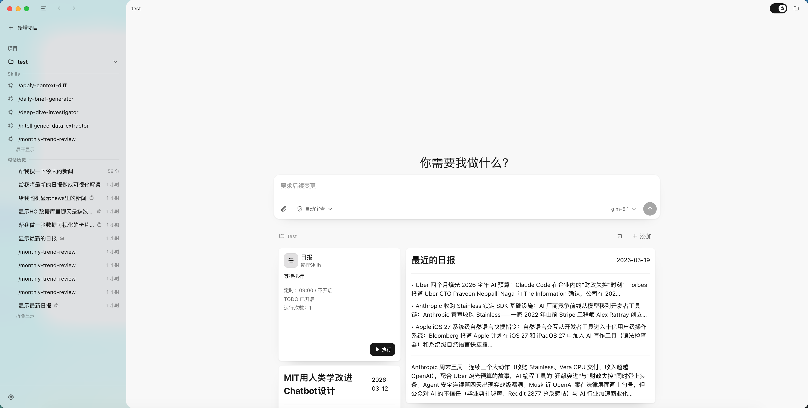
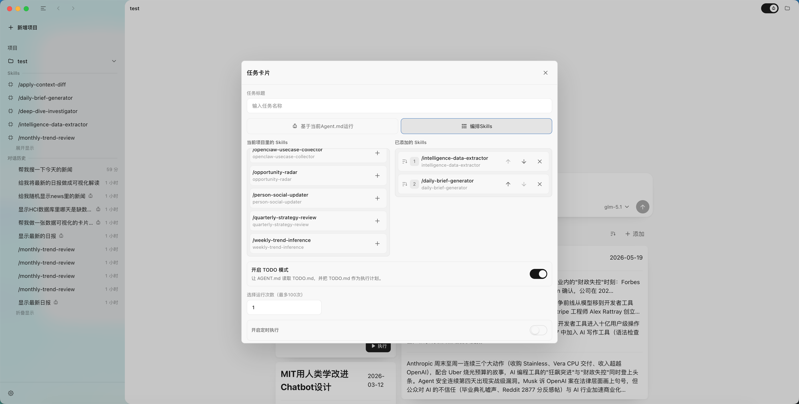
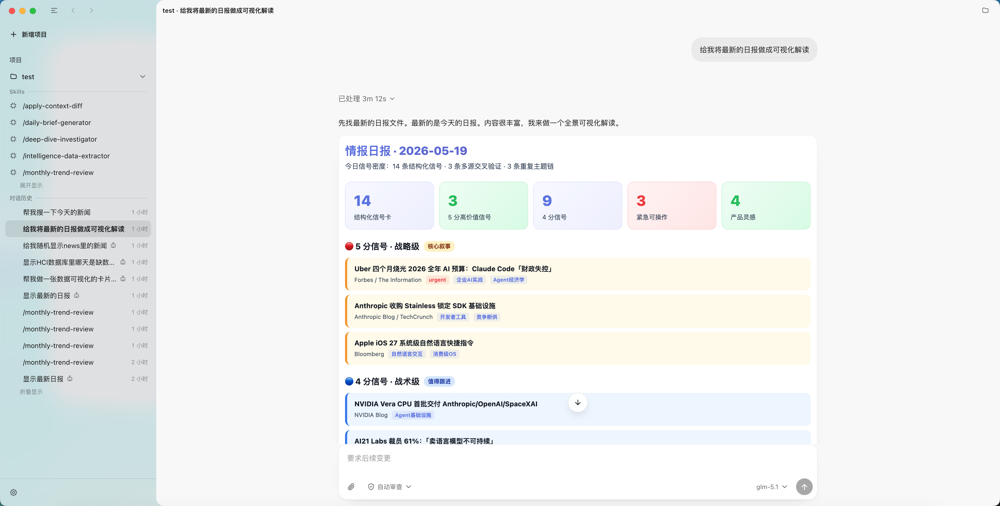
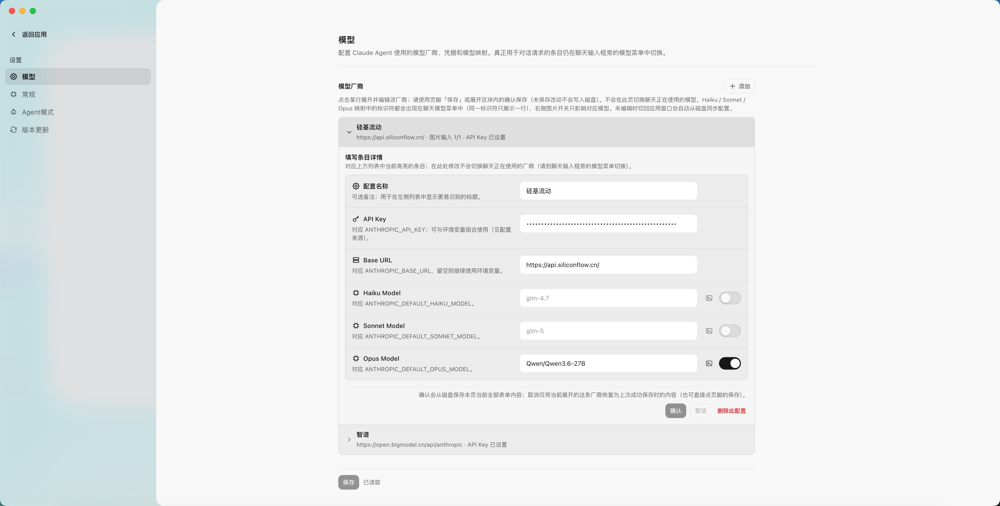
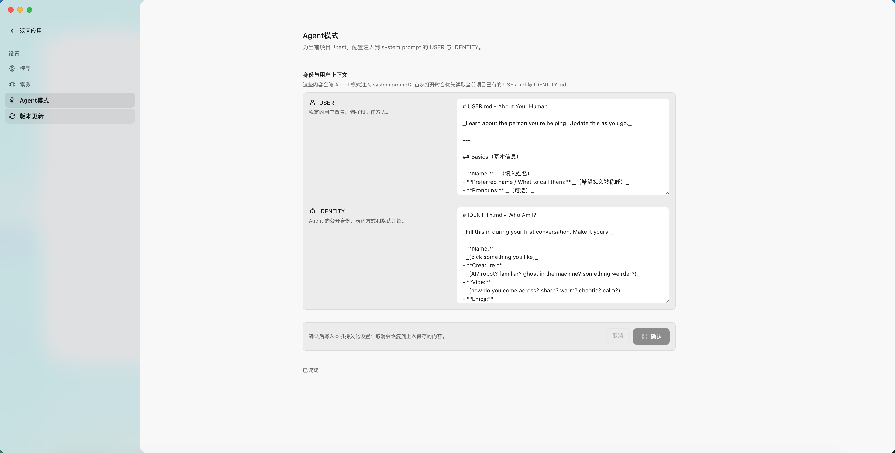

# AgentOS

**默认中文 / English version: [README_EN.md](./README_EN.md)**

AgentOS 是一个面向本地项目与长期任务的桌面 Agent 工作台。它不是把大模型包装成一个聊天窗口，而是把「项目文件夹」变成 Agent 的运行空间：对话、技能、可视化卡片、任务编排、项目记忆和本地文件上下文，都围绕同一个文件夹组织起来。

项目的后台运行层由 Electron 主进程中的 **Claude Agent SDK** 驱动，负责会话流式输出、会话恢复、权限请求、工具调用和任务执行；前端只负责呈现和交互。

我们的愿景是让每个项目都拥有自己的 Agent 操作系统。用户不需要先理解复杂的 Agent 框架，也不需要把项目资料搬到云端；只要选择一个本地文件夹，AgentOS 就可以围绕这个文件夹建立上下文、沉淀记忆、运行 Skills、展示数据面板，并逐步形成一个可以长期协作的智能工作区。



## 界面预览






## 目录

- [项目愿景](#项目愿景)
- [项目分支](#项目分支)
- [项目特点](#项目特点)
- [当前功能](#当前功能)
- [下载安装](#下载安装)
- [开发运行](#开发运行)
- [项目约定](#项目约定)
- [未来方向](#未来方向)
- [联系方式](#联系方式)
- [感谢清单](#感谢清单)

## 项目愿景

AgentOS 想解决的问题是：Agent 不应该只存在于一次性的聊天里。

真正有用的 Agent 需要知道它正在服务哪个项目，需要记得项目里的约定，需要能把运行结果变成可读、可点、可继续操作的界面，也需要能把多个技能按顺序或按时间执行。AgentOS 因此把 Agent 的边界放回到用户最熟悉的地方：文件夹。

在 AgentOS 里，一个文件夹可以逐渐长出自己的指令、记忆、技能、任务卡片、数据卡片和会话历史。你可以把它当作一个个人工作台，也可以把它当作开发自己 Agent 产品的框架基础。

## 项目分支

这个项目有三个定位不同的分支：

| 分支 | 定位 | 适合谁 |
| --- | --- | --- |
| `main` | 产品分支。这里会持续加入更多人性化、面向普通用户的功能，稳定版本会通过 GitHub Releases 发布。 | 想直接安装和使用 AgentOS 的用户。 |
| `AgentOS-Framework` | 框架分支。这里保留更清晰的框架结构，适合基于 AgentOS 的桌面框架开发自己的 Agent 产品。 | 想二次开发、改造成自己产品的开发者。 |
| `AgentOS-Experimental` | 实验分支。这里会更激进地探索人机协作、Agent 记忆、可视化交互和自动化编排的可能性。 | 想关注早期实验、参与共创的人。 |

如果你只是想使用产品，请优先下载 `main` 分支发布的 Release。  
如果你想研究代码或做自己的产品，请从 `AgentOS-Framework` 开始。  
如果你想看最新想法和不稳定实验，可以关注 `AgentOS-Experimental`。

## 项目特点

### 文件夹即 Agent

AgentOS 的核心不是「新建一个机器人」，而是「选择一个项目文件夹」。项目文件夹里的 `AGENT.md`、`SOUL.md`、`MEMORY.md`、`memory/`、`.agents/skills/`、`.agents/home-plugins/` 等内容，会共同构成这个 Agent 的身份、长期记忆、技能和可视化界面。

这意味着 Agent 不再是孤立的对话窗口，而是和你的项目文件、项目规则、历史记录、任务计划绑定在一起。

### Agent = Chat + 数据可视化 + 可交互内容 + 记忆

在 AgentOS 里，Agent 不只是会回复文字：

- **Chat**：通过对话理解需求、执行任务、解释过程。
- **数据可视化**：通过 Home Plugin 和 A2UI 卡片展示项目状态、数据结果、任务进度和自定义面板。
- **可交互内容**：卡片可以带按钮、状态、刷新、打开文件、执行任务等交互。
- **记忆**：通过项目级指令、记忆文件和每日记忆目录，让 Agent 逐渐理解项目背景和协作方式。

这也是 AgentOS 与普通聊天工具最大的区别：它关心 Agent 如何长期住在一个项目里，而不只是完成一次问答。

## 当前功能

### 1. 多 Agent / 多项目 / 多会话

- 支持添加多个本地项目文件夹，每个文件夹都可以成为独立 Agent 工作区。
- 支持每个项目下创建多个会话线程。
- 支持会话置顶、归档、排序和持久化。
- 支持恢复 Claude Agent SDK 的会话 `sessionId`，应用重启后可以继续上下文。
- 侧边栏会按项目组织会话，并可显示项目级 Skills。

### 2. 多 Skills 定时 / 循环编排

- 支持扫描项目中的 `.agents/skills/`、`.claude/skills/` 等 Skill 目录。
- 支持在侧边栏直接运行项目 Skill。
- 支持通过任务卡片选择「基于当前 Agent.md 运行」或「编排多个 Skills」。
- Skill 编排可以重复运行，当前支持最多 100 次。
- 支持定时执行和循环执行，间隔包含 1 小时、2 小时、3 小时、6 小时、12 小时和 1 天。
- 任务运行会映射到独立会话线程，并可以在运行中停止。

说明：当前定时任务依赖 Electron 进程存活，不是系统级后台守护进程。

### 3. 内容可视化

- 项目首页支持 Home Plugin 卡片系统。
- 支持数据卡片和任务卡片两类卡片。
- 卡片输出使用 A2UI v0.9，可展示结构化、可交互的内容。
- 支持 small / medium / large 三种卡片尺寸。
- 支持卡片排序、尺寸调整、刷新和单卡片编辑。
- 支持从卡片动作打开项目文件、刷新内容、执行任务或停止任务。

### 4. Agent Mode 项目脚手架

- 可为项目自动生成或补齐 `AGENT.md`、`SOUL.md`、`MEMORY.md`、`memory/`。
- 可开启 TODO 模式，生成并维护 `TODO.md`。
- 支持在设置中编辑项目级 USER / IDENTITY 文案，让 Agent 更明确地理解用户和自身角色。
- Agent Mode 的上下文会被注入到 Agent 运行环境中。

### 5. 本地文件上下文

- 支持选择本地项目目录。
- 支持项目文件树浏览、展开、刷新和文件预览。
- 支持预览 Markdown、JSON、普通文本和图片。
- 输入框支持 `@` 搜索并引用项目文件、文件夹或子 Agent。
- 输入框支持添加文本附件和图片附件，图片能力会根据当前模型配置判断是否可用。

### 6. Slash Commands、Skills 与子 Agent

- 输入 `/` 可以唤起内置命令、项目 Skills、项目 Commands。
- 支持全局和项目级上下文来源，包括 `.claude`、`.agent`、`.agents`、`.cursor`。
- 支持读取 `AGENT.md` / `AGENTS.md` 作为项目指令。
- 支持发现子 Agent 定义，并在输入框中通过 `@` 引用。

### 7. Agent 运行过程可见

- 对话时间线会展示模型响应、工具调用、thinking、活动状态和运行耗时。
- 支持权限模式选择，包括 Plan、Auto、Default、Accept Edits、Bypass Permissions。
- Agent 需要用户确认或补充信息时，会在界面中弹出交互式确认。
- 支持展示文件变更 diff，并提供文件回滚入口。

### 8. 模型配置与应用体验

- 支持多模型提供商配置，可在设置页维护 API Key、Base URL、模型和模型档位映射。
- 支持通过聊天输入框旁的模型菜单切换当前对话使用的配置。
- 支持中文 / English 双语界面，默认中文。
- 支持 macOS 隐藏标题栏、侧栏 vibrancy、托盘菜单、关闭到托盘和开机启动偏好。
- 支持 GitHub Releases 应用内更新检查、下载和安装。

## 下载安装

### 普通用户

1. 打开 [AgentOS Releases](https://github.com/xue160709/AgentOS/releases)。
2. 下载适合你系统的安装包：
   - macOS：`AgentOS-Mac-x.y.z-Installer.dmg`
   - Windows：`AgentOS-Windows-x.y.z-Setup.exe`
   - Linux：`AgentOS-Linux-x.y.z.AppImage`，如果当前 Release 提供该文件
3. 安装并启动 AgentOS。
4. 在设置页配置模型服务，或使用默认环境配置。
5. 选择一个本地项目文件夹，开始创建会话、运行 Skill 或添加 Agent 卡片。

### 开发者

如果你想基于 AgentOS 框架开发自己的产品，建议使用 `AgentOS-Framework` 分支：

```bash
git clone https://github.com/xue160709/AgentOS.git
cd AgentOS
git checkout AgentOS-Framework
npm install
npm run dev
```

如果你想体验产品分支：

```bash
git checkout main
npm install
npm run dev
```

如果你想查看实验分支：

```bash
git checkout AgentOS-Experimental
npm install
npm run dev
```

## 开发运行

### 环境要求

- Node.js 18+
- npm

### 常用命令

| 命令 | 说明 |
| --- | --- |
| `npm run dev` | 启动 Vite + Electron 开发环境 |
| `npm run typecheck` | 运行 TypeScript 类型检查 |
| `npm run test:electron` | 运行 Electron 相关测试 |
| `npm run test:home-plugin` | 校验 Home Plugin 结构 |
| `npm run build:local` | 本地打包，不发布到 GitHub |
| `npm run build` | 构建并通过 electron-builder 打包 |
| `npm run release` | 构建并发布到 GitHub Releases |

### 模型环境变量

开发模式下可以复制 `.env.example`：

```bash
cp .env.example .env.local
```

常见变量：

| 变量 | 说明 |
| --- | --- |
| `ANTHROPIC_API_KEY` | Claude API Key |
| `ANTHROPIC_BASE_URL` | 兼容 Anthropic 的 API Base URL |
| `ANTHROPIC_MODEL` | 默认请求模型 |
| `ANTHROPIC_DEFAULT_HAIKU_MODEL` | Haiku 档位模型 |
| `ANTHROPIC_DEFAULT_SONNET_MODEL` | Sonnet 档位模型 |
| `ANTHROPIC_DEFAULT_OPUS_MODEL` | Opus 档位模型 |
| `ANTHROPIC_AUTH_TOKEN` | 可选鉴权 Token |

已安装应用的普通用户也可以直接在「设置」里维护模型配置。

## 项目约定

AgentOS 会围绕项目目录读取和生成上下文。一个典型项目可以长这样：

```text
your-project/
├── AGENT.md                  # 项目 Agent 指令
├── SOUL.md                   # 项目愿景、价值观、长期身份
├── MEMORY.md                 # 项目级记忆
├── TODO.md                   # TODO 模式任务文件
├── memory/                   # 每日记忆
├── .agents/
│   ├── skills/               # 项目 Skills
│   ├── agents/               # 项目子 Agent
│   └── home-plugins/         # 项目首页卡片
├── .claude/                  # Claude 原生上下文，可选
└── .cursor/                  # Cursor 规则或兼容上下文，可选
```

其中 `.agents/home-plugins/` 是项目首页卡片系统的核心目录。每张卡片可以读取项目文件、生成 A2UI 输出，并在 AgentOS 首页渲染为数据卡片或任务卡片。

## 技术栈

- Electron
- React
- TypeScript
- Vite
- Claude Agent SDK
- A2UI
- electron-builder
- marked + DOMPurify

## 未来方向

### 产品分支

- 自动生成 SKILL 和 Agent。
- 预置更多模型厂商数据。

### 框架分支

- 融入记忆模块。
- 加强 Chat 和数据卡片的关联。
- 自主优化 SKILL。

### 实验分支

- 将所有 UI 组件重构，支持意图理解。

## 联系方式

如果想交流想法、反馈问题或参与共创，可以加微信：

**xuezhirong233**

## 感谢清单

- 感谢 Anthropic 提供 Claude Code 的二进制文件，不然这个项目很难把本地 Agent 运行层真正落到桌面工作台里。
- 感谢 歸藏 分享 chat 里交互式 UI 的技术方案，https://x.com/op7418/status/2033113845120807170，不然我们很难把对话里的互动体验做得这么顺。
- 感谢 OpenClaw 提供 SOUL.md、USER.md、Identify.md 的灵感，https://openclaw.ai/，不然我们很难把项目的身份、用户和边界梳理得这么清楚。
- 感谢 Codex APP 在 UI 框架上给了很多参考和启发，不然我们很难把这个桌面壳和交互结构做得这么顺。

## 许可证

[MIT](LICENSE)
