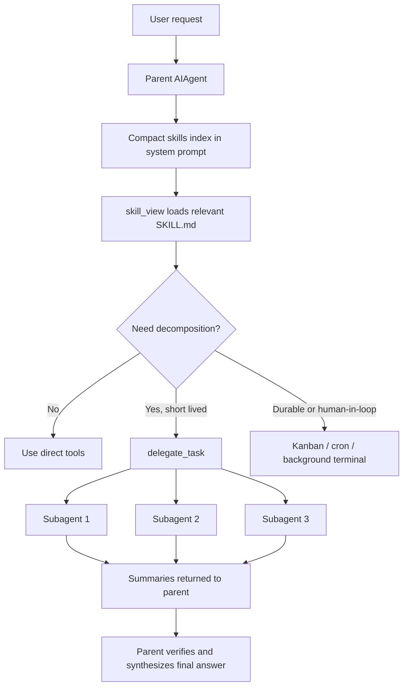

# Hermes Skills 与 Subagent 总结

更新日期: 2026-05-28

范围: 当前仓库 `/Volumes/macOS/Github/hermes-agent`。计数口径为仓库内的 `SKILL.md` 文件数量；运行时实际可见数量还会受用户目录、外部技能目录、禁用配置、平台兼容性影响。

## 一句话结论

Hermes 当前仓库随代码分发 174 个官方 skill，其中 90 个在 `skills/` 作为默认内置技能，84 个在 `optional-skills/` 作为官方可选技能。Subagent 不是固定内置的一组角色或模板，而是通过 `delegate_task` 动态生成的子 `AIAgent` 实例: 默认一次最多并行 3 个，默认不允许子代理继续嵌套委派。

## Skill 数量

| 类型 | 目录 | 数量 | 默认状态 |
|---|---:|---:|---|
| 默认内置 skills | `skills/` | 90 | 默认随仓库分发，安装/同步后进入 Hermes skills 体系 |
| 官方可选 skills | `optional-skills/` | 84 | 官方维护，但默认不激活，需要通过 Skills Hub 安装 |
| 官方总数 | `skills/` + `optional-skills/` | 174 | 仓库随附总量 |

### 默认内置 skills 分类

| 分类 | 数量 |
|---|---:|
| creative | 20 |
| software-development | 12 |
| productivity | 9 |
| mlops | 9 |
| github | 6 |
| autonomous-ai-agents | 5 |
| apple | 5 |
| media | 5 |
| research | 5 |
| devops | 3 |
| gaming | 2 |
| data-science | 1 |
| dogfood | 1 |
| email | 1 |
| mcp | 1 |
| note-taking | 1 |
| red-teaming | 1 |
| smart-home | 1 |
| social-media | 1 |
| yuanbao | 1 |

### 官方可选 skills 分类

| 分类 | 数量 |
|---|---:|
| mlops | 28 |
| research | 11 |
| finance | 8 |
| productivity | 7 |
| creative | 5 |
| devops | 4 |
| security | 4 |
| autonomous-ai-agents | 3 |
| blockchain | 3 |
| health | 2 |
| mcp | 2 |
| software-development | 2 |
| communication | 1 |
| dogfood | 1 |
| email | 1 |
| migration | 1 |
| web-development | 1 |

## Skill 如何工作

Hermes 的 skill 是可加载的任务说明包。一个 skill 以 `SKILL.md` 为入口，可以带 `references/`、`templates/`、`assets/`、`scripts/` 等支持文件。

运行时的核心机制是渐进披露:

1. 系统提示里只放紧凑索引: skill 名称、分类、描述。
2. 当任务相关时，模型必须调用 `skill_view(name)` 加载完整说明。
3. 需要更多材料时，再按路径读取 skill 内的引用文件。
4. slash command 或预加载 skill 时，Hermes 会把 skill 内容作为用户消息注入，并附上 skill 目录和配置值。

相关工具与入口:

| 入口 | 作用 |
|---|---|
| `skills_list` | 列出可用 skill 的轻量元数据 |
| `skill_view` | 加载完整 `SKILL.md` 或 skill 内某个支持文件 |
| `skill_manage` | 创建、补丁、管理 skill |
| `/skill-name` | CLI/Gateway slash command 方式加载 skill |
| `hermes skills install official/...` | 安装 `optional-skills/` 中的官方可选技能 |

重要边界:

- `skills/` 是仓库里的默认内置 skill 来源。
- `optional-skills/` 是官方可选 skill 来源，默认不进入提示词。
- 运行时主目录通常是 `~/.hermes/skills/`，仓库内置技能会被安装/同步到这里，与用户安装的技能共存。
- skill 是否显示还会经过平台过滤、用户禁用配置、条件过滤和外部目录合并。

## Subagent 数量

Hermes 没有固定内置的 subagent 名册。内置的是一个委派工具集和一个工具:

| 项 | 数量或默认值 | 说明 |
|---|---:|---|
| 静态内置 subagent 模板/角色名册 | 0 | 没有默认 specialist roster |
| 委派 toolset | 1 | `delegation` |
| 委派工具 | 1 | `delegate_task` |
| 单次 batch 默认并发子代理 | 3 | `delegation.max_concurrent_children`，最小值 1，无硬上限 |
| 子代理角色类型 | 2 | `leaf` 与 `orchestrator` |
| 默认嵌套深度 | 1 | 默认 parent -> child，child 不能再委派 |
| 最大可配嵌套深度 | 3 | `delegation.max_spawn_depth` 会被限制在 1 到 3 |
| 默认子代理超时 | 600 秒 | `delegation.child_timeout_seconds`，下限 30 秒 |
| 每个子代理迭代预算 | 配置决定 | `delegation.max_iterations` 是权威值；持久配置默认值为 50，经典 CLI 的内置默认片段当前为 45，模型传入值会被配置值覆盖 |

因此，如果问“内置了多少 subagent”，准确回答是: 固定内置 subagent 为 0；运行时可由 `delegate_task` 动态生成，默认一次最多 3 个并行直接子代理。若用户把 `max_spawn_depth` 提高并显式使用 `role="orchestrator"`，子代理还能继续生成下一层 worker，但深度最多 3。

## Subagent 如何工作

`delegate_task` 支持两种模式:

- 单任务: 传 `goal`、可选 `context`、可选 `toolsets`。
- 批任务: 传 `tasks=[{goal, context, toolsets, role}, ...]`，并行执行，数量受 `max_concurrent_children` 限制。

每个子代理都是一个新的 `AIAgent`:

- 新对话: 不继承父代理的聊天历史。
- 新任务上下文: 有自己的 `task_id`、终端会话和文件状态。
- 新 system prompt: 由目标、上下文、工作区路径、角色生成。
- 工具受限: 默认继承父代理可用工具集，再按请求缩窄，并剥离危险或不合适工具。
- 默认无记忆: `skip_memory=True`，也跳过父会话上下文文件。
- 同步返回: 父代理阻塞等待子代理完成，最终只拿到 summary 数组。

默认 leaf 子代理不能调用:

- `delegate_task`
- `clarify`
- `memory`
- `send_message`
- `execute_code`

orchestrator 子代理在配置允许且深度未触底时，可以保留 `delegate_task`，用于继续拆分任务；但仍不能使用 `clarify`、`memory`、`send_message`、`execute_code`。

## Skills 与 Subagent 如何配合

二者是上下两层:

- Skill 负责“应该怎么做”: 提供领域流程、检查清单、坑点、命令和质量标准。
- Subagent 负责“并行/隔离地做某一块”: 在父代理控制下处理独立子任务，返回摘要。

典型流程:

几个仓库内的具体配合模式:

| Skill | 配合方式 |
|---|---|
| `subagent-driven-development` | 按计划逐个任务派实现子代理，再派 spec reviewer 和 quality reviewer，最后做整体集成 review |
| `research-paper-writing` | 将章节草稿、引用核验、并行检索等工作拆给多个 `delegate_task` 子代理，再由父代理整合 |
| `kanban-orchestrator` | 面向持久、多 profile 的任务板，把长期或多人协作任务拆成 Kanban card |
| `kanban-worker` | 被 dispatcher 作为 worker 启动时加载，指导 worker 如何接任务、汇报、阻塞、完成 |

决策规则可以简化成:

| 场景 | 优先机制 |
|---|---|
| 有明确领域流程或用户偏好 | 先加载相关 skill |
| 单步或少量机械操作 | 直接调用工具 |
| 多步但主要是脚本化机械工作 | `execute_code` 或终端脚本 |
| 独立、推理重、容易污染上下文的短任务 | `delegate_task` |
| 多个互不依赖的短任务 | `delegate_task(tasks=[...])` 并行 |
| 需要长期运行、可恢复、人类介入、多 profile 协作 | Kanban、cronjob 或后台 terminal |

## 关键安全与协作设计

- 父代理必须把文件路径、错误信息、语言要求、输出格式等放进 `context`，因为子代理没有父对话历史。
- 子代理 summary 是自述，不等于已验证事实；涉及文件写入、上传、发布、远程副作用时，父代理应读取文件、检查 URL、核验 ID 或状态码。
- 子代理中的危险命令审批默认非交互式拒绝，避免 worker 线程卡住父 CLI。
- 父代理被中断时会向活跃子代理传播 interrupt；`delegate_task` 不是后台任务。
- TUI/Gateway 可以通过活跃 subagent registry 查看、暂停新 spawn 或中断指定子代理。
- 子代理成本会向父代理汇总，避免多子代理任务低估花费。

## 参考代码位置

- `skills/`: 默认内置 skill 来源。
- `optional-skills/`: 官方可选 skill 来源。
- `tools/skills_tool.py`: `skills_list`、`skill_view`、skill 解析与平台过滤。
- `agent/prompt_builder.py`: 构建 system prompt 中的 skills 索引。
- `agent/skill_commands.py`: slash command 与预加载 skill 注入。
- `tools/skills_hub.py`: optional skill 的官方来源适配器与安装流程。
- `toolsets.py`: `skills` 与 `delegation` toolset 定义。
- `tools/delegate_tool.py`: subagent 架构、并发、深度、角色、工具剥离、超时、schema。
- `run_agent.py`: `delegate_task` 调度入口和并发调用保护。
- `skills/software-development/subagent-driven-development/SKILL.md`: 基于子代理的开发流程范例。
- `skills/devops/kanban-orchestrator/SKILL.md`: 持久多代理编排范例。
- `skills/devops/kanban-worker/SKILL.md`: Kanban worker 行为范例。
