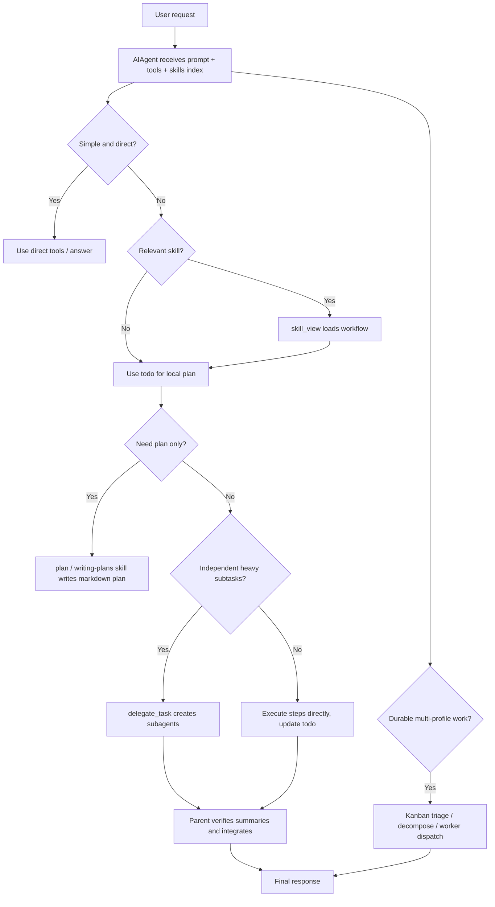

# Hermes 任务规划与拆解机制

更新日期: 2026-05-28

范围: 当前仓库 `/Volumes/macOS/Github/hermes-agent`。本文解释 Hermes 现在如何规划任务、拆解任务，以及这些流程是否使用 subagent 或 skills。

## 结论

Hermes 没有一个硬编码的“中央 Planner”在每轮对话前固定生成计划。它的规划是模型主导、工具支撑的分层机制:

- 普通对话中，模型根据 system prompt、tool schema 和 skills index 决定是否需要先规划。
- 多步骤任务通常用 `todo` 工具维护当前会话的任务清单。
- 领域/流程型任务通过 skill 指导，例如 `plan`、`writing-plans`、`spike`、`subagent-driven-development`。
- 短期、独立、推理重的子任务可以用 `delegate_task` 动态生成 subagent。
- 长期、可恢复、多 profile、人类可介入的任务走 Kanban；Kanban triage 默认有自动 decomposer，会调用辅助 LLM 拆成任务图。

所以答案是: Hermes 确实会用 skills，也支持用 subagent，但不是每个任务都会自动用 subagent。skills 是常规规划入口之一；subagent 是复杂任务拆解后的执行/并行化手段；Kanban 是更持久的多代理拆解与调度系统。

## 普通会话中的规划链路

普通 `AIAgent` 对话循环本身主要负责:

1. 组装 system prompt。
2. 暴露可用工具 schema。
3. 接收模型输出。
4. 执行工具调用。
5. 把工具结果放回消息历史。
6. 循环直到模型给出最终回复。

它不会在 Python 代码里强制先跑一个独立 planner。规划行为主要来自这些输入:

| 层 | 作用 |
|---|---|
| System prompt | 要求模型使用工具、检查前置条件、验证结果，不要只说计划不行动 |
| Skills index | 把可用 skills 的名称和描述放进 prompt，要求相关时加载 `skill_view` |
| Tool schema | `todo`、`delegate_task`、`kanban_*` 等工具 schema 自带使用时机说明 |
| Skills 内容 | 具体流程、拆解粒度、检查清单、验证要求 |
| 用户请求 | 明确要求“先计划”“拆分任务”“并行做”“交给 agent”等会触发不同路径 |

## `todo`: 当前会话内的轻量规划

`todo` 是 Hermes 普通会话里最直接的规划/跟踪工具。

特点:

- 每个 `AIAgent` 会话有一个内存中的 `TodoStore`。
- schema 要求复杂任务、3 步以上任务、多任务请求时使用。
- todo item 只有三个核心字段: `id`、`content`、`status`。
- 状态为 `pending`、`in_progress`、`completed`、`cancelled`。
- 列表顺序就是优先级。
- 同一时间只应有一个 `in_progress`。
- 上下文压缩后，会把未完成 todo 注入回会话，避免压缩后忘记任务。
- Gateway 这类每条消息新建 agent 的入口，会从历史里恢复最近一次 todo 工具结果。

它适合“这轮/这个会话里我要按步骤做完”的规划，不适合跨进程、跨天、多人协作的长期任务。

## Skills: 规划方法与领域流程

Hermes 的 skills 是“如何做事”的可复用流程包。它们不是子代理，而是模型加载后要遵循的说明文档。

当前与规划/拆解最相关的内置 skills:

| Skill | 作用 |
|---|---|
| `plan` | 当用户只要计划、不希望执行时，保存 `.hermes/plans/...md`，禁止实现和副作用 |
| `writing-plans` | 为多步骤实现写可执行计划，强调 bite-sized task、TDD、文件路径、验证命令 |
| `spike` | 把不确定想法拆成 2-5 个可验证实验，先研究再原型，再给 verdict |
| `subagent-driven-development` | 按计划逐项派 subagent 实现，再做 spec review 和 quality review |
| `kanban-orchestrator` | 指导 orchestrator profile 把长期任务拆成 Kanban card |
| `kanban-worker` | 指导 dispatcher-spawned worker 如何接任务、汇报、阻塞、完成 |

Skills 的触发方式:

- system prompt 中有可用 skill 索引，相关时模型应调用 `skill_view(name)`。
- 用户显式用 `/skill-name` 或 CLI `--skills` 时，skill 内容会被注入为当前会话指导。
- cron job 也可以配置 skills，使定时任务启动时预加载对应流程。

关键点: skill 负责给出方法论和流程约束；它本身不自动执行任务。执行仍由模型调用工具完成。

## Subagent: 短期并行拆解

Hermes 的 subagent 由 `delegate_task` 动态创建，不是固定内置的一组角色。

`delegate_task` 适合:

- 推理重的子问题。
- 中间资料会污染父上下文的任务。
- 多个互相独立、可以并行的工作流。
- 需要新上下文隔离的 review、研究、验证任务。

它不适合:

- 单个工具调用。
- 纯机械脚本化工作，这类更适合 `execute_code` 或终端脚本。
- 需要向用户提问的任务，因为 subagent 不能用 `clarify`。
- 需要跨 turn 持续运行的任务，这类应使用 Kanban、cronjob 或后台 terminal。

每个 subagent:

- 有新的对话历史，不知道父代理之前的上下文。
- 需要父代理通过 `goal` 和 `context` 显式传入所有必要信息。
- 有自己的 task id、终端会话和工具状态。
- 默认继承父代理工具集后再缩窄，并剥离危险/不适合的工具。
- 最终只把 summary 返回给父代理。
- 默认是同步的，父代理会等它结束。

角色:

- `leaf`: 默认角色，不能继续调用 `delegate_task`。
- `orchestrator`: 在配置允许且深度没触底时，可以继续拆分给下一层 worker。

默认限制:

- `delegation.max_concurrent_children`: 默认 3。
- `delegation.max_spawn_depth`: 默认 1，也就是 parent -> child，默认不嵌套。
- 深度最大可配到 3。

## Kanban: 持久多代理拆解

Kanban 是另一条任务拆解路径，目标不是“当前 turn 内并行一下”，而是“让任务可以跨会话、跨 profile、跨时间运行”。

普通 chat 默认看不到 `kanban_*` 工具。Kanban 工具只在两类场景出现:

- dispatcher 生成的 worker 进程，环境变量 `HERMES_KANBAN_TASK` 已设置。
- 当前 profile 显式启用了 `kanban` toolset，作为 orchestrator 使用。

Kanban worker 的 system prompt 会注入 `KANBAN_GUIDANCE`，要求:

1. 先 `kanban_show()` 读取任务、父任务 handoff、评论、重试记录。
2. 在 `$HERMES_KANBAN_WORKSPACE` 内工作。
3. 长任务用 `kanban_heartbeat()`。
4. 不确定时 `kanban_block()` 等人类输入。
5. 完成时用 `kanban_complete(summary, metadata)` 结构化交接。
6. 发现后续工作时用 `kanban_create()` 创建新任务，而不是自己 scope creep。

### Kanban 自动拆解

Kanban 的 triage 任务有专门 decomposer:

- 配置项 `kanban.auto_decompose` 默认是 `true`。
- gateway dispatcher 每个 tick 会自动处理 triage 任务。
- 每 tick 默认最多拆解 3 个 triage 任务: `kanban.auto_decompose_per_tick = 3`。
- decomposer 使用 `auxiliary.kanban_decomposer` 辅助模型。
- 输入包括原任务标题/正文、可用 profile roster、默认 assignee。
- 输出是 JSON task graph。
- 如果 `fanout=true`，创建 2-6 个子任务，并用 `parents` 表达依赖关系。
- 如果 `fanout=false`，把 triage 任务收紧为单个具体任务。
- 如果 LLM 选了不存在的 assignee，会改写为默认 assignee，避免任务无人认领。

这套机制不是 `delegate_task`。它更像持久化的多代理调度: decomposer 负责拆任务图，dispatcher 负责启动 worker profile，worker 用 `kanban_*` 工具回写状态。

## 两种拆解方式的区别

| 维度 | `delegate_task` subagent | Kanban |
|---|---|---|
| 生命周期 | 当前父代理 turn 内同步完成 | 持久化到 SQLite board，可跨 turn |
| 状态 | 父代理只收到 summary | board 保存任务、评论、metadata、运行记录 |
| 并行 | 同一次 `delegate_task(tasks=[...])` 内并行 | dispatcher 根据 ready 任务和 profile 调度 |
| 适合 | 短期、独立、推理重、隔离上下文 | 长期、多 profile、人类介入、可恢复协作 |
| 子任务来源 | 父代理模型调用 `delegate_task` | triage decomposer 或 orchestrator profile 创建 card |
| 是否自动 | 不自动全局触发，由模型按需调用 | triage 默认自动 decomposes，前提是 gateway dispatcher 与 aux model 可用 |

## 实际决策路径

可以把 Hermes 当前的规划拆解策略理解为下面这张图:

## 直接回答“是否用了 subagent 或 skills”

| 问题 | 回答 |
|---|---|
| Hermes 是否用 skills 做规划？ | 是。skills index 会进入 system prompt，相关任务应加载 `skill_view`；`plan`、`writing-plans`、`spike` 等 skill 直接定义规划流程。 |
| Hermes 是否每次都自动加载 skill？ | 不是。代码不强制自动调用 `skill_view`；模型按 system prompt 和任务相关性调用。用户也可以通过 `/skill` 或 `--skills` 显式加载。 |
| Hermes 是否用 subagent 拆任务？ | 是，但按需。普通会话中由模型调用 `delegate_task` 创建短期 subagent；`subagent-driven-development` skill 会明确要求这样做。 |
| Hermes 是否每个复杂任务都会自动 spawn subagent？ | 不是。`todo` 和 skills 可能只让父代理直接执行；subagent 用于独立、并行、推理重或需要隔离上下文的工作。 |
| Kanban 自动拆解是否等同于 subagent？ | 不等同。Kanban decomposer 用辅助 LLM 生成持久任务图，dispatcher 再启动 worker profile；这是持久多代理调度，不是当前 turn 内的 `delegate_task`。 |

## 源码位置

- `agent/system_prompt.py`: system prompt 分层组装，注入 tool guidance、skills prompt、Kanban guidance。
- `agent/prompt_builder.py`: `build_skills_system_prompt`、`KANBAN_GUIDANCE`、工具使用纪律。
- `tools/todo_tool.py`: `todo` 规划工具和 `TodoStore`。
- `agent/agent_init.py`: 每个 agent 初始化 `TodoStore`。
- `agent/conversation_compression.py`: 压缩后重新注入未完成 todo。
- `run_agent.py`: 从历史恢复 todo、调度 `delegate_task`。
- `tools/delegate_tool.py`: subagent 创建、并发、角色、深度和工具限制。
- `toolsets.py`: `todo`、`skills`、`delegation`、`kanban` toolset 定义。
- `skills/software-development/plan/SKILL.md`: 只写计划、不执行的 plan mode。
- `skills/software-development/writing-plans/SKILL.md`: 实现计划写法。
- `skills/software-development/spike/SKILL.md`: 实验型拆解流程。
- `skills/software-development/subagent-driven-development/SKILL.md`: subagent 执行和 review 流程。
- `skills/devops/kanban-orchestrator/SKILL.md`: Kanban orchestrator 拆解策略。
- `skills/devops/kanban-worker/SKILL.md`: Kanban worker 执行协议。
- `hermes_cli/kanban_decompose.py`: triage 自动/手动 decomposer。
- `gateway/run.py`: gateway dispatcher 的 auto-decompose tick。
- `hermes_cli/config.py`: `kanban.auto_decompose`、`auto_decompose_per_tick`、`auxiliary.kanban_decomposer` 默认配置。
