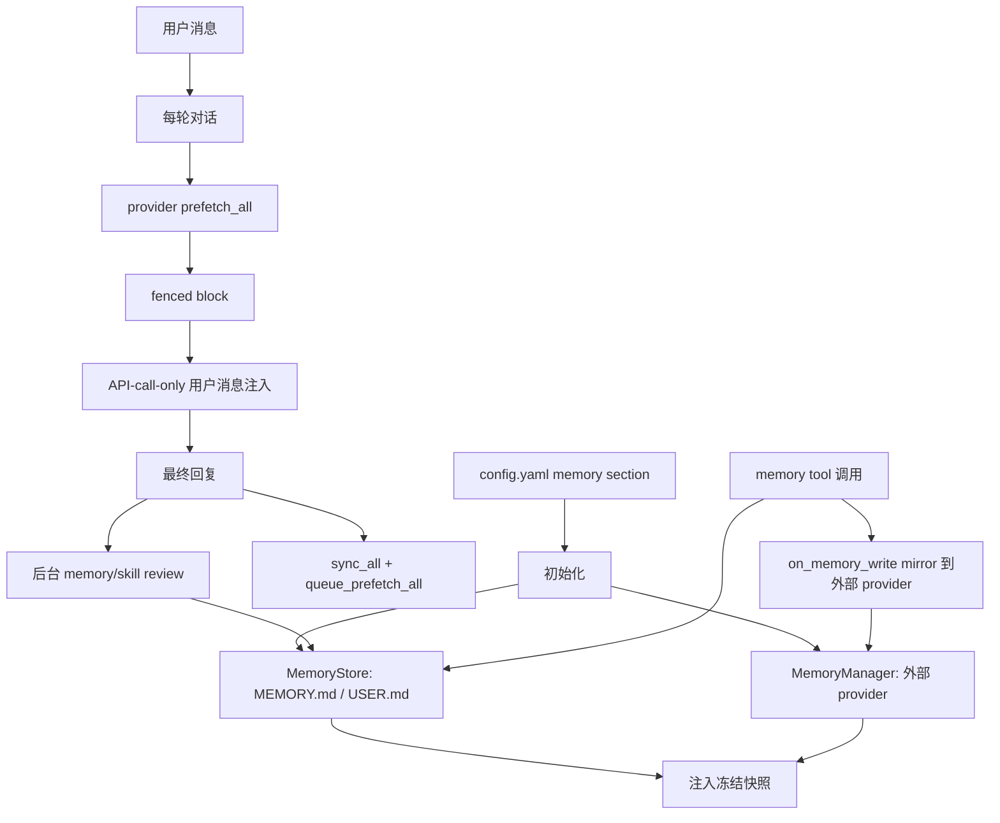

# Hermes 记忆系统结构说明

本文梳理 Hermes Agent 当前的记忆系统实现，重点说明它由哪些组件构成、一次对话中记忆如何被读取/注入/写入，以及外部记忆 provider 如何接入。所有涉及代码的判断都附带文件名和行号。

## 总览

Hermes 的记忆系统分成两层：

1. **内置文件记忆**：`MEMORY.md` 和 `USER.md`，由 `MemoryStore` 管理，存放在 profile 作用域的 `$HERMES_HOME/memories/` 下。它是短小、人工筛选、始终可注入系统提示词的核心记忆。
2. **外部记忆 provider**：Honcho、Mem0、Hindsight、OpenViking、Supermemory 等插件，通过 `MemoryProvider` 抽象和 `MemoryManager` 接入。它们提供更重的语义搜索、自动抽取、知识图谱或用户建模能力，但同一时间只允许启用一个外部 provider。

简化调用链：

## 配置与工具面

默认配置在 `hermes_cli/config.py:1319-1329`：

- `memory.memory_enabled` 默认 `true`。
- `memory.user_profile_enabled` 默认 `true`。
- `memory.memory_char_limit` 默认 `2200` 字符。
- `memory.user_char_limit` 默认 `1375` 字符。
- `memory.provider` 默认空字符串，表示只使用内置文件记忆。

`memory` 工具属于核心工具面：

- `_HERMES_CORE_TOOLS` 包含 `memory`，见 `toolsets.py:49-50`。
- 单独的 `memory` toolset 定义见 `toolsets.py:213-216`。
- ACP/API server 等平台工具集合也显式包含 `memory`，例如 `toolsets.py:341-356` 和 `toolsets.py:360-385`。
- `model_tools.py:491-495` 把 `memory` 标为 agent-loop 工具，表示它不走普通 registry dispatch，而是在 agent 执行器里拿到当前 `AIAgent._memory_store` 后执行。

## 内置文件记忆

### 存储位置与数据模型

内置记忆由 `tools/memory_tool.py:52-720` 实现：

- `get_memory_dir()` 返回 `get_hermes_home() / "memories"`，因此记忆按 Hermes profile 隔离，见 `tools/memory_tool.py:52-58`。
- 两个文件分别是 `MEMORY.md` 和 `USER.md`，路径选择逻辑在 `tools/memory_tool.py:246-251`。
- 条目分隔符是 `\n§\n`，定义在 `tools/memory_tool.py:60`。
- `MemoryStore` 维护两份状态：活的 `memory_entries/user_entries`，以及系统提示词用的冻结快照 `_system_prompt_snapshot`，见 `tools/memory_tool.py:114-132`。

两个目标的含义由工具 schema 明确告诉模型：

- `target="memory"`：环境事实、项目约定、工具经验、工作流教训。
- `target="user"`：用户身份、偏好、沟通风格、明确纠正。
- 这部分 schema 描述在 `tools/memory_tool.py:653-702`，尤其是何时保存、何时跳过和两个 target 的说明在 `tools/memory_tool.py:655-676`。

### 读取与冻结快照

启动时，`MemoryStore.load_from_disk()` 会：

1. 创建 `$HERMES_HOME/memories/`。
2. 读取 `MEMORY.md` 和 `USER.md`。
3. 去重，保留首次出现顺序。
4. 对准备注入系统提示词的条目做威胁扫描。
5. 渲染为冻结快照，保存到 `_system_prompt_snapshot`。

代码位置：

- 读取、去重、生成快照：`tools/memory_tool.py:133-171`。
- 对快照进行 threat-pattern 扫描，命中时用 `[BLOCKED: ...]` 占位替换，但活状态保留原文供用户删除：`tools/memory_tool.py:173-207`。
- `format_for_system_prompt()` 返回冻结快照，不返回会话中刚写入的活状态：`tools/memory_tool.py:444-455`。
- 渲染块头包含容量信息，例如 `MEMORY (your personal notes) [67% ...]`：`tools/memory_tool.py:476-492`。

这个“冻结快照”设计很关键：记忆文件会在工具调用时立即落盘，但系统提示词不会在同一 session 中跟着变化。这是为了保持 LLM prefix cache 稳定，相关说明写在模块头部 `tools/memory_tool.py:11-14`，实现体现在 `tools/memory_tool.py:444-455`。

### 写入、替换、删除

`memory_tool()` 是单入口，支持 `add`、`replace`、`remove`：

- 入口分发：`tools/memory_tool.py:603-641`。
- `add()`：去空白、威胁扫描、文件锁、重新从磁盘载入、去重、容量检查、落盘，见 `tools/memory_tool.py:298-346`。
- `replace()`：用 `old_text` 做唯一子串匹配，检查新内容威胁和容量，见 `tools/memory_tool.py:348-406`。
- `remove()`：同样用 `old_text` 做唯一子串匹配，见 `tools/memory_tool.py:408-442`。

并发与数据安全：

- 文件锁使用独立 `.lock` 文件，Unix 下用 `fcntl`，Windows 下尝试 `msvcrt`，见 `tools/memory_tool.py:209-245`。
- 每次写前 `_reload_target()` 会在锁内重读磁盘，避免覆盖其他 session 刚写入的内容，见 `tools/memory_tool.py:253-269`。
- `_detect_external_drift()` 检测手工编辑、shell append、patch 工具写入等不能安全 round-trip 的内容；发现后写 `.bak.<ts>` 并拒绝本次 mutation，见 `tools/memory_tool.py:516-569`。
- `_write_file()` 使用同目录临时文件加 atomic replace，读者只会看到旧完整文件或新完整文件，见 `tools/memory_tool.py:571-600`。

### 工具调用如何执行

普通 registry 中虽然注册了 `memory` schema，但真正执行在 agent 执行器：

- `tools/memory_tool.py:708-720` 注册 `memory` 工具 schema。
- `agent/tool_executor.py:630-639` 捕获 `function_name == "memory"`，把 `agent._memory_store` 传给 `memory_tool()`。
- 当内置记忆工具收到 `add` 或 `replace` 调用后，执行器还会调用 `agent._memory_manager.on_memory_write(...)`，把这次显式写入尝试镜像给外部 provider；当前代码只看 action，不解析 `memory_tool()` 返回值里的 `success`，见 `agent/tool_executor.py:640-653`。

注意：当前 schema 不暴露 `read` action。成功写入响应会返回当前 entries 和 usage，容量超限错误也会返回 current entries；但模型通常通过系统提示词看到记忆。

## 系统提示词中的记忆

系统提示词构建在 `agent/system_prompt.py:277-348`：

- 内置 `MEMORY.md` 快照在 `agent._memory_enabled` 为真时加入 volatile parts，见 `agent/system_prompt.py:277-281`。
- 内置 `USER.md` 快照在 `agent._user_profile_enabled` 为真时加入 volatile parts，见 `agent/system_prompt.py:282-286`。
- 外部 provider 的静态 system prompt block 通过 `agent._memory_manager.build_system_prompt()` 加入，见 `agent/system_prompt.py:288-295`。
- `build_system_prompt()` 把 stable、context、volatile 三层合并，且注释明确说明每个 session 构建一次并缓存，见 `agent/system_prompt.py:321-337`。
- `invalidate_system_prompt()` 会清空缓存并重新从磁盘加载内置记忆，用于压缩等边界事件，见 `agent/system_prompt.py:340-348`。

在对话循环里，系统提示词不是每轮重建：

- `_restore_or_build_system_prompt()` 会优先从 SessionDB 读取已存系统提示词，继续 session 时复用字节完全相同的 prompt，见 `agent/conversation_loop.py:130-183`。
- 如果没有可复用 prompt，才调用 `agent._build_system_prompt(...)`，见 `agent/conversation_loop.py:198-200`。
- 新构建的系统提示词会写回 SessionDB，见 `agent/conversation_loop.py:216-223`。
- 每轮对话如果 `agent._cached_system_prompt` 为空才触发 restore/build，见 `agent/conversation_loop.py:482-496`。

这解释了为什么同一 session 里刚写入的 `MEMORY.md/USER.md` 不会马上出现在系统提示词：系统提示词被缓存并复用，内置记忆的快照也是 load 时冻结的。

## 外部记忆 provider 抽象

外部 provider 的接口是 `agent/memory_provider.py:42-280` 里的 `MemoryProvider`：

- 模块注释列出生命周期：`initialize()`、`system_prompt_block()`、`prefetch()`、`sync_turn()`、`get_tool_schemas()`、`handle_tool_call()`、`shutdown()` 等，见 `agent/memory_provider.py:15-22`。
- 必须实现 `name`、`is_available()`、`initialize()`、`get_tool_schemas()`，见 `agent/memory_provider.py:45-61` 和 `agent/memory_provider.py:122-130`。
- `initialize()` 的 kwargs 包括 `hermes_home`、`platform`，以及可选的 `agent_context`、`agent_identity`、`agent_workspace`、`parent_session_id`、`user_id` 等，见 `agent/memory_provider.py:67-82`。
- `prefetch()` 用于每轮前召回，`queue_prefetch()` 用于为下一轮预热，见 `agent/memory_provider.py:93-114`。
- `sync_turn()` 用于写入完整的 user/assistant turn，要求最好非阻塞，见 `agent/memory_provider.py:115-120`。
- 可选 hook 包括 `on_turn_start()`、`on_session_end()`、`on_session_switch()`、`on_pre_compress()`、`on_delegation()`、`on_memory_write()`，见 `agent/memory_provider.py:143-280`。

`MemoryManager` 是外部 provider 的运行时编排器：

- 类定义和约束说明在 `agent/memory_manager.py:244-249`。
- `add_provider()` 只允许一个非 builtin provider，第二个会被拒绝并写 warning，见 `agent/memory_manager.py:258-280`。
- 同时建立 tool name 到 provider 的路由索引，见 `agent/memory_manager.py:282-297`。
- 聚合 provider system prompt：`agent/memory_manager.py:318-335`。
- 聚合 prefetch：`agent/memory_manager.py:339-356`。
- 为下一轮 queue prefetch：`agent/memory_manager.py:358-367`。
- 同步完整 turn：`agent/memory_manager.py:371-380`。
- 聚合 provider tool schemas：`agent/memory_manager.py:384-400`。
- 路由 provider tool call：`agent/memory_manager.py:410-428`。
- session/turn/compression/memory-write/delegation/shutdown 生命周期分发：`agent/memory_manager.py:432-609`。

实现细节提示：`MemoryManager` 的 docstring 仍写着 “built-in provider is always first”，但当前 agent 初始化路径只把配置里的外部 provider 加进 manager；内置文件记忆单独存在于 `agent._memory_store`。实际初始化代码见 `agent/agent_init.py:1066-1085` 和 `agent/agent_init.py:1091-1154`。

## 外部 provider 的发现与配置

provider 发现系统在 `plugins/memory/__init__.py:51-407`：

- 发现来源有两个：仓库内 `plugins/memory/<name>/` 和用户 `$HERMES_HOME/plugins/<name>/`，见 `plugins/memory/__init__.py:1-13`。
- `_iter_provider_dirs()` 先扫 bundled providers，再扫用户 providers；同名时 bundled 优先，见 `plugins/memory/__init__.py:67-98`。
- 用户 provider 目录用 `__init__.py:1` 起始的源码里是否包含 `register_memory_provider` 或 `MemoryProvider` 做轻量判断，见 `plugins/memory/__init__.py:51-64`。
- `discover_memory_providers()` 返回 `(name, description, is_available)`，见 `plugins/memory/__init__.py:123-157`。
- `load_memory_provider(name)` 解析目录并加载 provider，见 `plugins/memory/__init__.py:160-182`。
- `_load_provider_from_dir()` 支持两种插件写法：`register(ctx)` 注册，或直接查找 `MemoryProvider` 子类实例化，见 `plugins/memory/__init__.py:185-285`。
- provider 自带 CLI 命令只会在它是当前 active `memory.provider` 时注册，见 `plugins/memory/__init__.py:323-407`。

CLI 配置入口在 `hermes_cli/memory_setup.py:217-459` 和 `hermes_cli/main.py:12799-12897`：

- `hermes memory setup|status` 的模块职责说明在 `hermes_cli/memory_setup.py:1-6`。
- setup 会发现 provider、读取 config schema、安装 plugin.yaml 声明的 pip 依赖、写 `config.yaml` 和 `.env`，核心流程见 `hermes_cli/memory_setup.py:217-351`。
- provider 可通过 `post_setup()` 接管自己的配置向导，见 `hermes_cli/memory_setup.py:254-259`。
- status 会显示当前 provider、provider config、插件是否安装/可用，见 `hermes_cli/memory_setup.py:389-444`。
- `hermes memory off` 会把 `memory.provider` 清空，见 `hermes_cli/main.py:12835-12846`。
- `hermes memory reset` 会删除内置 `MEMORY.md` 和/或 `USER.md`，见 `hermes_cli/main.py:12847-12891`。

## Agent 初始化如何装配记忆

初始化代码在 `agent/agent_init.py:1047-1187`：

1. 读 config，准备 tool guardrails 等共享配置，见 `agent/agent_init.py:1047-1060`。
2. 如果没有 `skip_memory`，读取 `memory` 配置；当 `memory_enabled` 或 `user_profile_enabled` 为真时创建 `MemoryStore` 并 `load_from_disk()`，见 `agent/agent_init.py:1066-1087`。
3. 如果 `memory.provider` 非空，则创建 `MemoryManager`，通过 `plugins.memory.load_memory_provider()` 加载 provider，检查 `is_available()` 后注册，见 `agent/agent_init.py:1091-1105`。
4. 初始化外部 provider 时传入 session、platform、`hermes_home`、`agent_context="primary"`，见 `agent/agent_init.py:1105-1111`。
5. 如果有 session DB，会把 session title 传给 provider，见 `agent/agent_init.py:1112-1120`。
6. gateway 场景会传 `user_id/user_id_alt/user_name/chat_id/chat_name/chat_type/thread_id/gateway_session_key`，用于 per-user/per-chat 作用域，见 `agent/agent_init.py:1121-1138`。
7. profile 场景会传 `agent_identity` 和 `agent_workspace`，见 `agent/agent_init.py:1139-1146`。
8. `initialize_all()` 真正调用每个 provider 的 `initialize()`，见 `agent/agent_init.py:1147` 和 `agent/memory_manager.py:592-609`。
9. provider 的 tool schemas 会注入 `agent.tools`，但只有在 `enabled_toolsets is None` 或显式包含 `"memory"` 时注入，见 `agent/agent_init.py:1156-1187`。

`skip_memory=True` 会跳过内置 `MemoryStore` 和外部 `MemoryManager`。CLI 的 ignore rules 会把它传给 `AIAgent`，见 `cli.py:4991`；后台 review fork 也显式使用 `skip_memory=True`，避免污染外部 provider，见 `agent/background_review.py:384-416`。

## 每轮对话的数据流

每轮对话入口是 `agent/conversation_loop.py:415-4336`：

### 1. 计数与后台 review 触发条件

- gateway 可能每条消息都新建 `AIAgent`，所以会从 conversation history 还原 `_user_turn_count` 和 `_turns_since_memory`，见 `agent/conversation_loop.py:415-435`。
- 每轮用户消息使 `_user_turn_count` 加一，见 `agent/conversation_loop.py:442-443`。
- 如果 `memory.nudge_interval` 到了、`memory` 工具可用、且存在 `_memory_store`，就设置 `_should_review_memory=True`，见 `agent/conversation_loop.py:460-470`。

### 2. provider turn start 与 prefetch

- 在进入工具循环前，先调用 `agent._memory_manager.on_turn_start(...)`，让 provider 更新 turn counter 或 cadence 状态，见 `agent/conversation_loop.py:638-646`。
- 随后只调用一次 `prefetch_all()`，查询使用干净的 `original_user_message`，避免把 skill 注入内容带给 provider，见 `agent/conversation_loop.py:648-659`。

### 3. 将外部召回内容注入当前 API 请求

- 构造 API messages 时，只在当前 turn 的 user message 上做 API-call-time 注入，不修改持久化的 `messages` 列表，见 `agent/conversation_loop.py:819-840`。
- 外部 prefetch 结果先用 `build_memory_context_block()` 包成 `<memory-context>` fenced block，见 `agent/conversation_loop.py:830-833`。
- fenced block 的格式由 `agent/memory_manager.py:227-241` 生成，包含系统说明：这是持久记忆召回，不是新用户输入。
- provider 输出在包裹前会被 `sanitize_context()` 去掉已有的 `<memory-context>` 和内部 system note，见 `agent/memory_manager.py:54-59` 和 `agent/memory_manager.py:231-233`。
- 流式输出侧还有 `StreamingContextScrubber`，防止模型把 memory context 原样泄露到 UI，见 `agent/memory_manager.py:62-225`。

### 4. 回复结束后写入外部 provider

- 完整最终回复出来后，`conversation_loop` 调用 `_sync_external_memory_for_turn()`，见 `agent/conversation_loop.py:4319-4324`。
- `_sync_external_memory_for_turn()` 会跳过被中断的 turn，避免把半截工具链或用户未看到的回复写进外部记忆，见 `run_agent.py:2140-2174`。
- 正常完成时调用 `sync_all(original_user_message, final_response)`，再调用 `queue_prefetch_all(original_user_message)` 为下一轮预热，见 `run_agent.py:2175-2185`。
- 这些外部 provider 操作都被视作 best-effort，异常不会阻止用户看到回复，见 `run_agent.py:2168-2171` 和 `run_agent.py:2186-2187`。

### 5. 后台 memory/skill review

记忆 review 是另一个机制：它不是每轮同步外部 provider，而是定期 fork 一个安静的 review agent，判断是否需要把用户偏好或持久事实写入内置 `memory` tool。

- review prompt 的目标和原则在 `agent/background_review.py:30-43`。
- 对话结束后，如果 `_should_review_memory` 或 `_should_review_skills` 为真，会调用 `_spawn_background_review()`，见 `agent/conversation_loop.py:4326-4336`。
- fork 继承父 agent 的 provider/model/base_url/api_key/api_mode 等运行时，见 `agent/background_review.py:360-383`。
- fork 使用 `skip_memory=True`，避免重建外部 `_memory_manager` 并把 review harness prompt 写入真实外部记忆命名空间，见 `agent/background_review.py:384-398`。
- 但 fork 会把 `_memory_store` 重新绑定到父 agent 的 store，因此 `memory(action="add")` 仍写入内置 `MEMORY.md/USER.md`，见 `agent/background_review.py:417-422`。
- review 运行时只白名单 memory/skills 工具，见 `agent/background_review.py:453-472`。

## 会话边界、压缩与切换

记忆 provider 不会在 `run_conversation()` 每轮结束时 shutdown：

- `conversation_loop` 明确注释 `on_session_end()` 和 `shutdown_all()` 不在每 turn 调用，见 `agent/conversation_loop.py:4338-4343`。

真正边界：

- CLI 进程退出时，`cli.py:935-955` 会把 agent 自己的 transcript 传给 `shutdown_memory_provider()`。
- `shutdown_memory_provider()` 先调用 `_memory_manager.on_session_end(messages)`，再 `shutdown_all()`，见 `run_agent.py:2088-2104`。
- `/new` 前会调用 `commit_memory_session()`，让 provider 对旧 session 做 end extraction，但不 teardown，见 `cli.py:6405-6414` 和 `run_agent.py:2115-2123`。
- `/new` 创建新 session 后调用 `on_session_switch(..., reset=True, reason="new_session")`，见 `cli.py:6483-6498`。
- `/resume` 调用 `on_session_switch(..., reset=False, reason="resume")`，见 `cli.py:6767-6781`。
- `/branch` 调用 `on_session_switch(..., reset=False, reason="branch")`，见 `cli.py:6932-6945`。

上下文压缩时：

- 压缩前会调用 `_memory_manager.on_pre_compress(messages)`，让 provider 有机会在内容被丢弃前提取信息，见 `agent/conversation_compression.py:308-313`。
- 当前调用点没有使用 `on_pre_compress()` 的返回值；而 `MemoryProvider.on_pre_compress()` 的接口文档说返回文本可加入压缩摘要，见 `agent/memory_provider.py:203-213`。这是一个值得注意的实现差异。
- 压缩成功后会 `agent._invalidate_system_prompt()` 并重新构建系统提示词，所以内置记忆会重新从磁盘加载，见 `agent/conversation_compression.py:371-373` 和 `agent/system_prompt.py:340-348`。
- 压缩切换 session id 后调用 provider `on_session_switch(..., reason="compression")`，见 `agent/conversation_compression.py:428-443`。

## 内置记忆与外部 provider 的关系

这两层不是互斥关系：

- 内置文件记忆由 `agent._memory_store` 管理，负责短小且确定要始终注入的核心事实。
- 外部 provider 由 `agent._memory_manager` 管理，负责召回、搜索、自动捕获、知识库或用户建模等扩展能力。
- 外部 provider 是 additive：初始化外部 provider 不会替换 `MEMORY.md/USER.md`。用户文档也明确说外部 provider 与内置 memory 并行运行，见 `website/docs/user-guide/features/memory.md:214-225` 和 `website/docs/user-guide/features/memory-providers.md:7-39`。
- 内置 `memory` tool 的 `add/replace` 写入尝试会通过 `MemoryManager.on_memory_write()` 镜像给外部 provider；这个桥接当前不检查内置写入是否成功，见 `agent/tool_executor.py:640-653` 和 `agent/memory_manager.py:537-565`。

## 现有 provider 示例

仓库内现有 provider 都在 `plugins/memory/<name>/`，并实现 `MemoryProvider`：

| Provider | 代码位置 | 主要能力 |
| --- | --- | --- |
| Honcho | `plugins/memory/honcho/__init__.py:191-248` | AI-native 用户建模、peer card、semantic search、dialectic reasoning；工具 schema 在 `plugins/memory/honcho/__init__.py:36-184`。 |
| Mem0 | `plugins/memory/mem0/__init__.py:119-167` | Mem0 Platform API，profile/search/conclude 工具；系统提示词和 prefetch 在 `plugins/memory/mem0/__init__.py:229-240`。 |
| Hindsight | `plugins/memory/hindsight/__init__.py:1-27` 和 `plugins/memory/hindsight/__init__.py:518-595` | knowledge graph、entity resolution、多策略 retrieval，支持 cloud/local。 |
| OpenViking | `plugins/memory/openviking/__init__.py:412-490` | context database、session commit 后自动抽取多类记忆；prefetch/sync/session_end 在 `plugins/memory/openviking/__init__.py:521-627`。 |
| Supermemory | `plugins/memory/supermemory/__init__.py:420-526` | container-based recall/capture；prefetch、sync、session ingest、memory write mirror 在 `plugins/memory/supermemory/__init__.py:546-637`。 |

其他 provider（ByteRover、Holographic、RetainDB）也遵循同一接口；可通过 `plugins/memory/__init__.py:123-182` 的发现/加载路径接入。

## 关键设计取舍

1. **短记忆始终注入，长记忆按需召回。** `MEMORY.md/USER.md` 字符数很小，适合作为每个 session 的固定上下文；外部 provider 适合更大规模语义召回。
2. **冻结系统提示词保护 prefix cache。** 内置记忆 load 时冻结，系统提示词在 session DB 中复用；这减少了每轮 prompt 变化。
3. **外部 provider best-effort。** prefetch、sync、queue、hook 都被 try/except 包住，provider 故障不应该阻塞主对话。
4. **显式写入和自动 review 分离。** 模型可以前台调用 `memory` tool；后台 review 会定期检查是否有用户偏好/持久事实需要写入。
5. **单外部 provider 限制。** `MemoryManager` 拒绝第二个外部 provider，避免工具 schema 膨胀和多个后端对同一事实产生冲突。
6. **profile 与 gateway 作用域是第一等参数。** `hermes_home`、`agent_identity`、`user_id`、`chat_id`、`thread_id`、`gateway_session_key` 都在初始化时传给 provider，便于隔离用户、profile、群聊和 session。

## 读代码时最值得看的文件

- `tools/memory_tool.py:52-720`：内置 `MEMORY.md/USER.md` 的读写、容量、锁、威胁扫描、工具 schema。
- `agent/memory_provider.py:42-280`：外部 provider 的接口契约。
- `agent/memory_manager.py:244-609`：provider 注册、tool 路由、prefetch/sync/hook 编排、context fencing。
- `agent/agent_init.py:1066-1187`：如何从配置创建 `MemoryStore` 和加载外部 provider。
- `agent/system_prompt.py:277-348`：内置记忆和 provider block 如何进入系统提示词。
- `agent/conversation_loop.py:415-496`、`agent/conversation_loop.py:638-659`、`agent/conversation_loop.py:819-840`、`agent/conversation_loop.py:4319-4336`：每轮 prefetch、API-call-time 注入、post-turn sync、后台 review 触发。
- `agent/background_review.py:360-472`：后台记忆复盘 fork 的隔离策略。
- `plugins/memory/__init__.py:51-407`：外部 provider 发现、加载和 CLI 命令注册。
- `hermes_cli/memory_setup.py:217-459` 与 `hermes_cli/main.py:12799-12897`：`hermes memory setup/status/off/reset`。
