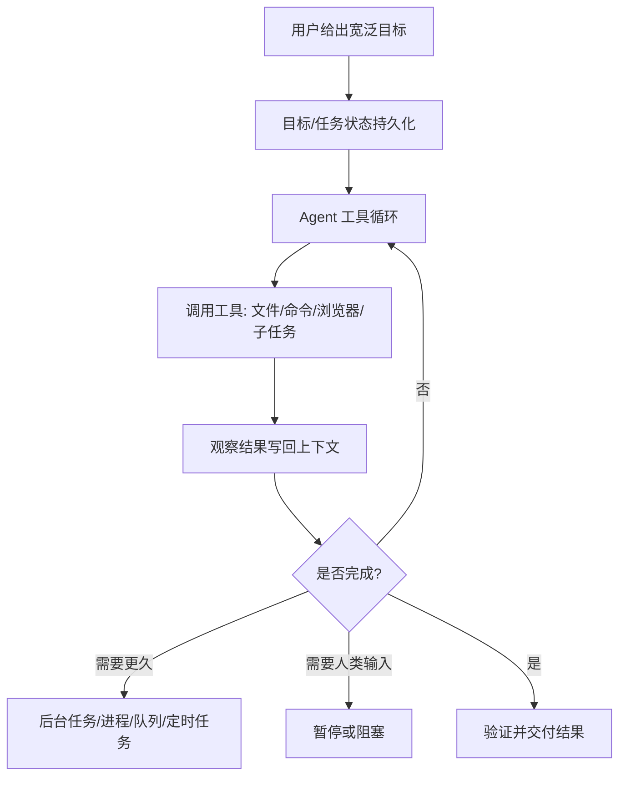
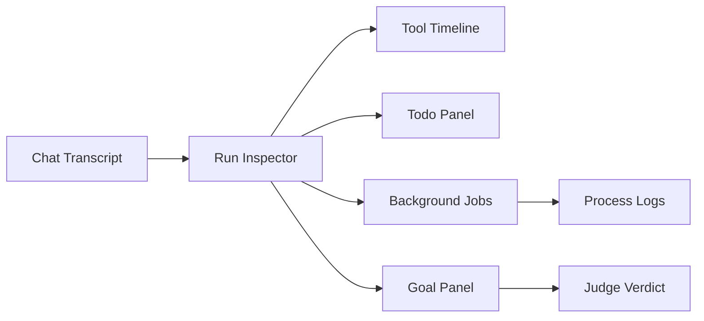

# 面向 CodeX-UI-Template 的长任务 Agent 架构参考

本文整理 Hermes Agent 里“长时间运行”和“宽泛目标自主完成”的实现思路，并转化成对 CodeX-UI-Template 有指导意义的产品与工程设计建议。

核心判断：长任务 Agent 不应该依赖一次模型回复“想得更久”，而应该把目标拆成可恢复、可观察、可中断、可验证的运行状态。Hermes 的做法可以概括为：



## 1. Hermes 如何让任务长时间运行

Hermes 不是用一个无限循环硬跑，而是把“长时间”拆成几种不同层级。

### 1.1 单次 Agent 回合内的工具循环

Hermes 的主循环是：

1. 模型读当前上下文。
2. 如果模型返回工具调用，就执行工具。
3. 工具结果作为 `tool` 消息写回上下文。
4. 再次调用模型。
5. 直到模型给最终回答、用户打断、或达到预算。

建议阅读：

- `agent/conversation_loop.py`
  - 看 `run_conversation()` 主循环。
  - 重点看 `while (api_call_count < agent.max_iterations...)`。
  - 这里体现了模型-工具-观察-继续的核心 agent loop。
- `agent/iteration_budget.py`
  - 看 `IterationBudget`。
  - 重点理解“长任务不是无限制运行，而是由 iteration budget 控制”。
- `agent/tool_executor.py`
  - 看工具是如何串行/并行执行、如何处理 interrupt、如何把工具结果写回消息历史。

对 CodeX-UI-Template 的启发：

- 前端不要只显示“AI 正在思考”，而要显示当前处于第几轮、正在调用什么工具、最近一次工具结果是什么。
- 后端需要有 `run_id`、`turn_id`、`iteration_count`、`status` 这些运行态字段。
- 每一轮 agent loop 都应该能发事件给 UI，例如 `model_started`、`tool_started`、`tool_finished`、`iteration_finished`、`run_completed`。

### 1.2 任务内计划：todo 工具

Hermes 用 `todo` 工具让模型把复杂任务拆成状态化任务列表：

- `pending`
- `in_progress`
- `completed`
- `cancelled`

建议阅读：

- `tools/todo_tool.py`
  - 看 `TodoStore`。
  - 看 `TODO_SCHEMA` 的描述文本。
- `agent/conversation_compression.py`
  - 看 `todo_snapshot = agent._todo_store.format_for_injection()`。
  - 重点理解：上下文压缩后，未完成 todo 会被重新注入，防止模型忘记长任务进度。

对 CodeX-UI-Template 的启发：

- UI 应该有一个“任务清单/执行计划”面板，而不是只展示聊天气泡。
- todo 不应该只是前端展示，它应该是后端可恢复状态。
- 当 agent 更新 todo 时，UI 应该实时更新，例如：
  - 当前正在做哪一步。
  - 哪些步骤完成。
  - 哪些步骤取消并替换为新方案。

### 1.3 后台 Agent：`/background`

Hermes CLI 的 `/background <prompt>` 会启动一个新的 `AIAgent`，在后台线程里跑一个独立 session。当前对话可以继续，后台任务完成后再把结果显示回来。

建议阅读：

- `cli.py`
  - 看 `_handle_background_command()`。
  - 重点看它如何创建新的 `AIAgent`、新的 `session_id`、后台线程，以及完成后如何把结果展示给用户。

对 CodeX-UI-Template 的启发：

- UI 可以支持“发送到后台运行”。
- 后台任务应该有独立卡片，而不是混在当前聊天流里。
- 后台任务卡片至少包含：
  - 任务标题/用户 prompt。
  - 状态：running、paused、blocked、failed、completed。
  - 当前 activity。
  - 最近输出。
  - 取消/查看详情/继续按钮。

### 1.4 后台进程：`terminal(background=true)` + `process`

长命令不应该一直阻塞 agent loop。Hermes 的方式是：

1. 用 `terminal(background=true)` 启动可追踪进程。
2. 返回 `session_id`。
3. 后续用 `process` 工具轮询、看日志、等待、杀掉、写 stdin。

建议阅读：

- `tools/terminal_tool.py`
  - 看 `background`、`notify_on_complete`、`watch_patterns` 的 schema 描述。
  - 重点理解 Hermes 对长命令的约束：长命令应该被登记为后台进程，而不是 shell 里 `nohup`/`&` 乱跑。
- `tools/process_registry.py`
  - 看 `ProcessRegistry`。
  - 看 `PROCESS_SCHEMA`。
  - 看 `poll`、`log`、`wait`、`kill`、`write`、`submit`。

对 CodeX-UI-Template 的启发：

- 如果你的模板支持跑命令，必须有“后台进程管理器”。
- UI 应该有 Background Jobs 面板，显示：
  - 命令。
  - 运行时长。
  - stdout/stderr tail。
  - exit code。
  - kill / wait / open logs。
- 对长命令要区分：
  - 有终点的任务：测试、构建、部署，适合 `notify_on_complete`。
  - 无终点的任务：dev server、watcher，适合显示 readiness 和健康检查。

### 1.5 持久目标：`/goal`

Hermes 的 `/goal` 是更高一层的自主循环。它把一个宽泛目标保存起来，每个回合结束后让一个 judge 判断目标是否已完成。如果未完成，就自动把 continuation prompt 送回同一个 session 继续执行。

建议阅读：

- `hermes_cli/goals.py`
  - 看文件开头的设计说明。
  - 看 `GoalManager.evaluate_after_turn()`。
  - 看 `CONTINUATION_PROMPT_TEMPLATE`。
  - 看 `JUDGE_SYSTEM_PROMPT`。
- `cli.py`
  - 看 `_handle_goal_command()`。
  - 看 `_maybe_continue_goal_after_turn()`。
- `gateway/run.py`
  - 搜索 `_post_turn_goal_continuation`。
  - 这里是消息平台里如何继续 goal loop。

对 CodeX-UI-Template 的启发：

- 宽泛目标不应该只存在于 prompt 中，应该有 `Goal` 实体。
- 每次 agent 交付后，都应该能用 judge 检查：
  - 是否满足原始目标。
  - 是否满足用户追加的 subgoals。
  - 如果没完成，下一步 continuation prompt 是什么。
- UI 可以有 Goal 面板：
  - 当前目标。
  - 完成标准。
  - 已用回合数/最大回合数。
  - judge verdict。
  - pause/resume/clear。

### 1.6 子 Agent 与 Kanban

Hermes 有两种拆分：

1. `delegate_task`
   - 用于单次运行内的短子任务。
   - 子 agent 有独立 iteration budget。
2. Kanban worker
   - 用于跨运行、跨 profile、可恢复的多 agent 协作。
   - worker 通过 `kanban_show`、`kanban_heartbeat`、`kanban_block`、`kanban_complete` 协调。

建议阅读：

- `tools/delegate_tool.py`
  - 看创建 child `AIAgent` 的部分。
  - 重点看每个子 agent 如何拿到独立预算。
- `agent/prompt_builder.py`
  - 搜索 `KANBAN_WORKER_GUIDANCE` 或 `Kanban task execution protocol`。
  - 这是 Hermes 给 worker 的执行协议。
- `tools/kanban_tools.py`
  - 看 `kanban_complete`、`kanban_block`、`kanban_heartbeat`。
- `hermes_cli/kanban_db.py`
  - 看任务表、claim、heartbeat、reclaim、spawn worker 的逻辑。

对 CodeX-UI-Template 的启发：

- 如果只是“帮我查三件事”，可以用 subagent delegation。
- 如果是“持续推进一个项目”，应该用 board/task system。
- Kanban UI 不应该只是普通看板，而应该暴露 agent runtime 语义：
  - claimed by 哪个 worker。
  - last heartbeat。
  - blocked reason。
  - handoff summary。
  - child tasks。
  - retry / reclaim。

### 1.7 定时任务与自动化：cron

Hermes 的 cron 可以定时唤起 agent，也可以只跑脚本。Agent cron 使用“无活动超时”，不是简单固定超时。只要 agent 持续有工具调用、API 调用或流式输出，就认为还活着；长时间无活动才中断。

建议阅读：

- `cron/scheduler.py`
  - 看 `_run_job_impl()`。
  - 看创建 `AIAgent(platform="cron")` 的部分。
  - 看 `HERMES_CRON_TIMEOUT` 和 activity tracker。
- `tools/cronjob_tools.py`
  - 看 cronjob 工具如何创建、更新、暂停、恢复任务。

对 CodeX-UI-Template 的启发：

- 自动化任务应该区分：
  - 一次性后台 run。
  - 定时 run。
  - 长期 watch/monitor。
- UI 需要显示“上次运行结果”和“下次运行时间”。
- cron agent 应该有更严格的安全边界，例如禁用会递归创建 cron 的工具。

## 2. CodeX-UI-Template 可以抽象出的核心模块

建议把模板里的 agent runtime 抽成以下后端模块。

### 2.1 AgentRun

表示一次 agent 运行。

建议字段：

```ts
type AgentRun = {
  id: string
  sessionId: string
  goalId?: string
  userPrompt: string
  status: "queued" | "running" | "paused" | "blocked" | "failed" | "completed" | "cancelled"
  iterationCount: number
  maxIterations: number
  currentTool?: string
  lastActivityAt: string
  startedAt: string
  completedAt?: string
}
```

### 2.2 TurnLoop

负责模型-工具循环。

职责：

- 构建 messages。
- 调用模型。
- 解析 tool calls。
- 调用 ToolExecutor。
- 把 tool result 追加回上下文。
- 判断是否继续。
- 处理 iteration budget。
- 处理 interrupt。

### 2.3 ToolExecutor

负责工具执行与事件上报。

职责：

- 工具调用前发 `tool_started`。
- 工具调用后发 `tool_finished`。
- 工具异常转成可给模型看的 observation。
- 支持串行/并行策略。
- 支持 interrupt。

### 2.4 TodoStore

负责长任务计划。

职责：

- 保存任务清单。
- 只允许一个 `in_progress`。
- 支持 merge update。
- 在上下文压缩或恢复 session 后重新注入 active todos。

### 2.5 GoalManager

负责宽泛目标的持续推进。

职责：

- 保存目标、subgoals、turn budget。
- 回合结束后调用 judge。
- judge 未完成时生成 continuation prompt。
- 用户新消息优先级高于 continuation。
- 支持 pause/resume/clear。

### 2.6 ProcessRegistry

负责后台命令。

职责：

- spawn background command。
- 记录 stdout/stderr tail。
- poll/log/wait/kill/write stdin。
- 进程结束后发通知。

### 2.7 Board/Kanban

负责跨运行、跨 agent 的项目级协作。

职责：

- task claim。
- heartbeat。
- block reason。
- complete summary。
- child task dependencies。
- stale reclaim。
- retry policy。

## 3. CodeX-UI-Template 的推荐 UI 信息架构

建议 UI 不要只有 Chat，而应该是“Chat + Run Inspector + Task State”。



### 3.1 Chat Transcript

展示用户和 agent 的最终交流，但不要把所有工具细节都塞进聊天气泡。

### 3.2 Run Inspector

展示当前 agent run 的实时状态：

- 当前 iteration。
- 当前工具。
- 最近 activity。
- token/cost/耗时。
- stop/interrupt/steer。

### 3.3 Tool Timeline

展示工具调用时间线：

- tool name。
- 参数摘要。
- 状态。
- 耗时。
- 结果摘要。
- 可展开原始结果。

### 3.4 Todo Panel

展示 agent 的执行计划：

- pending。
- in_progress。
- completed。
- cancelled。

这会让用户相信 agent 不是“随机行动”，而是在持续推进一条可见路径。

### 3.5 Background Jobs

展示 dev server、build、test、crawl、deploy 等长命令。

必须有：

- 查看日志。
- 等待完成。
- 终止。
- 标记 readiness。

### 3.6 Goal Panel

展示宽泛目标的持续状态：

- goal。
- subgoals。
- judge verdict。
- turns used。
- pause/resume/clear。

## 4. 宽泛目标的推荐执行协议

当用户说“帮我把这个项目做好”“持续优化这个 UI 模板”“实现一个完整功能”时，不要只让模型自由发挥。建议后端生成或要求 agent 维护如下协议：

```md
当前目标：
<用户目标>

完成标准：
1. <可验证条件>
2. <可验证条件>
3. <可验证条件>

当前计划：
- [ ] 调研现状
- [ ] 拆分实现任务
- [ ] 修改代码
- [ ] 运行验证
- [ ] 总结交付

阻塞规则：
- 如果缺少关键人类决策，进入 blocked。
- 如果工具失败，记录失败原因并尝试替代路径。
- 如果预算耗尽，输出当前状态、已完成事项、下一步建议。
```

对 UI 来说，最重要的是把这些状态外显：

- 目标是什么。
- agent 认为完成标准是什么。
- 当前在做哪一步。
- 为什么继续。
- 为什么停下。

## 5. 不建议照搬的地方

Hermes 是一个功能非常完整的 CLI/gateway agent，CodeX-UI-Template 不一定要完整复制。

不建议一开始就照搬：

- 全量 gateway 多平台适配。
- 完整 memory provider 插件体系。
- 所有 provider fallback 与 credential pool。
- 完整 kanban dispatcher。
- 所有 terminal backend。

建议优先实现最小闭环：

1. AgentRun 状态。
2. 模型-工具循环。
3. Tool Timeline。
4. TodoStore。
5. Background Process Registry。
6. GoalManager + judge。
7. Pause/resume/interrupt。

## 6. Hermes 源码阅读路线

如果目标是学习“长任务 agent runtime”，按这个顺序看。

### 第一层：主循环

- `run_agent.py`
  - 看 `AIAgent` 的初始化参数。
  - 了解 agent 持有哪些状态。
- `agent/conversation_loop.py`
  - 看 `run_conversation()`。
  - 重点理解模型调用、工具调用、消息追加、预算耗尽。
- `agent/iteration_budget.py`
  - 看预算控制。

### 第二层：工具系统

- `model_tools.py`
  - 看工具发现、工具 schema、`handle_function_call()`。
- `toolsets.py`
  - 看默认暴露哪些工具。
- `agent/tool_executor.py`
  - 看工具执行、并行、interrupt、结果写回。

### 第三层：长任务状态

- `tools/todo_tool.py`
  - 看任务拆解状态。
- `agent/conversation_compression.py`
  - 看 todo 如何跨压缩恢复。
- `hermes_state.py`
  - 看 SessionDB 如何保存会话。

### 第四层：后台与进程

- `cli.py`
  - 看 `_handle_background_command()`。
- `tools/terminal_tool.py`
  - 看 `background`、`notify_on_complete`、`watch_patterns`。
- `tools/process_registry.py`
  - 看后台进程生命周期。

### 第五层：宽泛目标

- `hermes_cli/goals.py`
  - 看 `GoalManager`、judge、continuation prompt。
- `cli.py`
  - 看 `_handle_goal_command()`、`_maybe_continue_goal_after_turn()`。
- `gateway/run.py`
  - 看 gateway 场景下如何 post-turn continuation。

### 第六层：多 agent 协作

- `tools/delegate_tool.py`
  - 看子 agent 创建、预算、结果汇总。
- `tools/kanban_tools.py`
  - 看 worker 如何 complete/block/heartbeat。
- `hermes_cli/kanban_db.py`
  - 看 board、claim、reclaim、spawn。
- `agent/prompt_builder.py`
  - 看 Kanban worker 协议提示。

### 第七层：定时与自动化

- `cron/scheduler.py`
  - 看 cron 如何创建 agent、如何监控 inactivity。
- `tools/cronjob_tools.py`
  - 看 agent 如何创建和管理 cron job。

## 7. 给 CodeX-UI-Template 的一句架构原则

把 agent 看成一个“可观察的任务运行时”，而不是一个聊天框。

聊天框只是入口；真正的产品能力来自：

- 持久目标。
- 可恢复计划。
- 可视化工具调用。
- 可管理后台进程。
- 可暂停/继续/中断。
- 可验证完成标准。
- 可扩展的子任务和调度机制。

如果 CodeX-UI-Template 能把这些抽象成通用模板组件，它就不仅是一个 AI Chat UI，而会是一个可以承载真实开发任务、自动化任务、研究任务和项目任务的 agent workbench。
