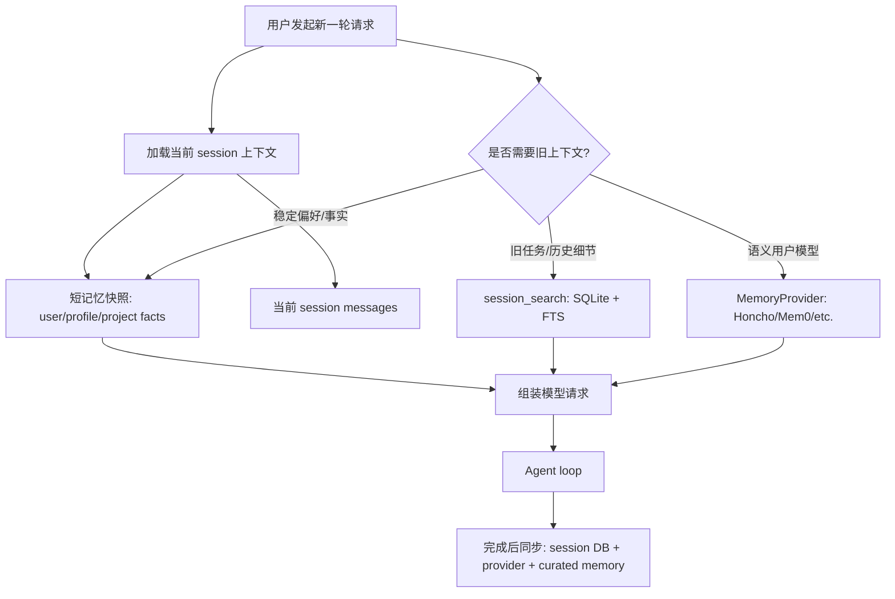
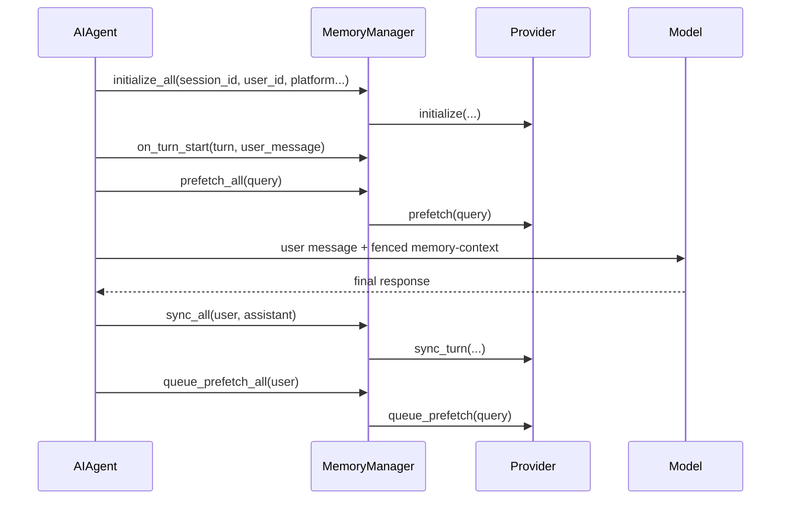

# 面向 CodeX-UI-Template 的跨 Session 记忆架构参考

本文整理 Hermes Agent 的跨 session 记忆实现，并转化为 CodeX-UI-Template 可以借鉴的产品与工程设计建议。

核心判断：跨 session 记忆不应该做成“把所有历史都塞回 prompt”。更稳的做法是把记忆分成三层：

1. **短而稳定的用户/项目事实**：自动注入，低延迟，高可信。
2. **完整历史检索**：需要时搜索旧 session，返回原始对话证据。
3. **可选外部记忆 Provider**：语义召回、用户建模、结构化事实库、团队/多端共享。



## 1. Hermes 的记忆分层

### 1.1 内置短记忆：MEMORY.md / USER.md

Hermes 默认有两个 profile-scoped 文件：

| 文件 | 用途 | 默认容量 |
| --- | --- | --- |
| `MEMORY.md` | Agent 自己的稳定笔记：环境、项目约定、工具经验 | 2,200 chars |
| `USER.md` | 用户画像：偏好、身份、沟通方式、长期习惯 | 1,375 chars |

这层记忆的特点是：

- **只存稳定事实**，不存任务流水账。
- **session 开始时加载并冻结成 system prompt 快照**。
- **session 中途写入会立即落盘，但不更新当前 system prompt**，避免破坏 prompt prefix cache。
- **下一个 session 或 prompt invalidation 后才重新加载**。
- 写入经过字符预算、注入/外泄扫描、文件锁、原子写、并发重读保护。

建议阅读：

- `tools/memory_tool.py`
  - 看 `MemoryStore`、`load_from_disk()`、`format_for_system_prompt()`。
  - 重点理解 frozen snapshot pattern。
- `agent/agent_init.py`
  - 看 `_memory_store` 初始化，尤其是 `memory.memory_enabled` / `user_profile_enabled`。
- `agent/system_prompt.py`
  - 看内置记忆如何进入 system prompt。
- `agent/prompt_builder.py`
  - 看 `MEMORY_GUIDANCE` 如何约束模型“什么该存、什么不该存”。

对 CodeX-UI-Template 的启发：

- 不要把“记忆”做成无上限聊天摘要。先做一个小而精的 curated memory。
- 至少拆成两类：
  - `user_profile`：用户偏好和长期工作方式。
  - `workspace_memory`：项目、仓库、环境、工具约定。
- UI 上要让用户能看见和编辑这些记忆，因为它们会影响未来所有 session。
- 写入后可以显示“下个 session 生效”或“当前运行不会重建系统提示词”，避免用户误解。

### 1.2 完整历史召回：SessionDB + FTS

Hermes 把 session 元数据和所有消息存到 SQLite：

- `sessions`：session id、source、model、system prompt、parent lineage、title、统计信息。
- `messages`：role、content、tool calls、reasoning、timestamp、平台消息 id。
- `messages_fts`：普通全文检索。
- `messages_fts_trigram`：CJK/中文等 substring 检索。

`session_search` 是跨 session 回忆旧对话的主要入口。它不是让 LLM 总结旧历史，而是返回真实消息：

- discovery：按 query 搜索旧 session。
- scroll：围绕某条 message id 拉窗口。
- browse：列最近 session。
- 返回匹配点附近窗口，以及 session 开头/结尾 bookends。

建议阅读：

- `hermes_state.py`
  - 看 schema：`sessions`、`messages`、FTS5 triggers。
  - 看 `append_message()`、`search_messages()`、`get_messages_around()`、`get_anchored_view()`。
- `tools/session_search_tool.py`
  - 看三种 calling shape：discovery / scroll / browse。
  - 看如何按 session lineage 去重、如何排除当前 session。
- `agent/agent_runtime_helpers.py`
  - 看 `session_search` 如何拿到当前 session id，避免搜索当前上下文本来已有的信息。

对 CodeX-UI-Template 的启发：

- 旧任务进度、一次性调试过程、PR 号、commit hash，不该进入 curated memory，而应该进入 session transcript search。
- UI 可以提供“引用旧会话”体验：
  - 搜索旧 session。
  - 展示命中片段。
  - 点击展开上下文窗口。
  - 一键把选中窗口作为当前输入的引用上下文。
- 记忆系统需要能解释“这个回答来自哪段旧对话”，否则用户无法判断可信度。

### 1.3 外部 MemoryProvider

Hermes 还有可选外部 provider。它们通过 `MemoryProvider` 抽象接入，由 `MemoryManager` 管理。当前设计只允许一个外部 provider 同时激活，避免工具 schema 膨胀和多个记忆后端互相冲突。

典型 provider：

- Honcho：用户建模、peer card、semantic search、dialectic reasoning。
- Mem0：服务端事实抽取、语义搜索、rerank。
- Holographic：结构化 fact store、entity retrieval、trust score。

外部 provider 的生命周期大致是：



建议阅读：

- `agent/memory_provider.py`
  - 看 provider 的接口契约：`initialize`、`prefetch`、`sync_turn`、`on_session_end`、`on_session_switch`。
- `agent/memory_manager.py`
  - 看 provider 注册、prefetch、sync、tool dispatch、session switch。
- `plugins/memory/__init__.py`
  - 看 memory provider 如何发现和加载。
- `plugins/memory/honcho/__init__.py`
  - 看一个完整 provider 如何做预热、自动注入、工具模式、session flush。
- `plugins/memory/mem0/__init__.py`
  - 看一个更轻量的 provider 如何做 async sync + semantic search。
- `website/docs/developer-guide/memory-provider-plugin.md`
  - 看 provider 插件开发约定。

对 CodeX-UI-Template 的启发：

- 先把核心产品做成 provider-neutral，不要把 UI 和某个记忆服务绑定死。
- 后端可以定义一个 `MemoryProvider` 接口：
  - `isAvailable()`
  - `initialize(runContext)`
  - `prefetch(query)`
  - `syncTurn(turn)`
  - `search(query)`
  - `writeFact(fact)`
  - `onSessionEnd(transcript)`
- UI 只关心统一事件和统一结果格式，比如 `memory_context_injected`、`memory_fact_saved`、`memory_provider_status`。
- Provider 设置页应该显示当前激活哪个 provider，以及它是否参与自动注入、是否暴露工具、是否自动同步。

## 2. CodeX-UI-Template 可以采用的目标架构

建议把跨 session 记忆拆成四个模块。

### 2.1 Memory Store

职责：存短、稳定、自动注入的事实。

最小数据模型：

```ts
type MemoryKind = "user_profile" | "workspace" | "assistant_note";

type MemoryEntry = {
  id: string;
  kind: MemoryKind;
  content: string;
  createdAt: string;
  updatedAt: string;
  sourceRunId?: string;
  sourceMessageId?: string;
  confidence?: number;
  tags?: string[];
  archived?: boolean;
};
```

关键规则：

- 单条记忆要短，prefer declarative fact。
- 不允许 imperative instruction 污染未来行为，例如“以后必须永远...”。
- 每个 kind 有容量预算。
- 写入前做 prompt injection 扫描。
- 支持 replace / archive，不要只支持 append。

### 2.2 Session Store

职责：保存完整 transcript，支持恢复、搜索、引用。

最小数据模型：

```ts
type Session = {
  id: string;
  title?: string;
  source: "web" | "desktop" | "api" | "automation";
  model?: string;
  parentSessionId?: string;
  systemPromptSnapshot?: string;
  startedAt: string;
  endedAt?: string;
};

type Message = {
  id: string;
  sessionId: string;
  role: "system" | "user" | "assistant" | "tool";
  content: string;
  toolName?: string;
  toolCalls?: unknown;
  createdAt: string;
};
```

关键规则：

- 保存 system prompt snapshot，方便 resume 时保持一致。
- 支持 parent session lineage，用于压缩、分支、继续任务。
- 搜索结果应该返回原始消息和上下文窗口，而不是只返回摘要。

### 2.3 Memory Injection Layer

职责：决定每次模型请求注入什么。

推荐注入顺序：

1. Stable system prompt。
2. 当前 workspace/context files。
3. frozen memory snapshot。
4. 当前 session messages。
5. ephemeral recalled context，附在当前 user turn 后面。

Hermes 的关键取舍是：外部 provider recall 不写进 session DB，而是 API-call-time 临时注入。这样旧 transcript 不会被“回忆出来的上下文”污染。

对 CodeX-UI-Template：

- `MemoryStore` 快照可以进入 system prompt。
- `session_search` / provider recall 应该作为 ephemeral context 附加到当前 turn。
- UI transcript 中可以显示一个可折叠的“已注入记忆”区域，但不要把它当用户消息永久保存。

### 2.4 Memory Review / Background Curator

Hermes 会在若干 turn 后启动后台 review agent，判断是否应该写 memory 或更新 skill。这避免主任务被“要不要记忆”打断。

建议阅读：

- `agent/background_review.py`
  - 看 `_MEMORY_REVIEW_PROMPT`。
  - 看 forked review agent 如何只开放 memory/skill 工具。
- `agent/conversation_loop.py`
  - 看 `_should_review_memory` 的 turn cadence。

对 CodeX-UI-Template：

- 可以做一个后台“记忆候选生成器”：
  - 主回答结束后异步运行。
  - 产出候选记忆。
  - UI 用 toast 或 inbox 让用户 approve/edit/reject。
- 默认不要让模型静默保存太多东西。用户可见、可撤销更重要。

## 3. UI 设计建议

### 3.1 记忆面板

建议有一个 Memory 面板，分 tab：

- User Profile
- Workspace Memory
- Session Recall
- Provider Status

每条记忆显示：

- 内容。
- 来源 session / message。
- 更新时间。
- 是否自动注入。
- 编辑、归档、删除。

### 3.2 回答中的引用

当模型使用旧 session 或 provider recall 时，UI 应该能展示来源：

- `Used memory: User prefers concise responses`
- `Recalled from session: "Refactor auth flow", May 20`
- `Provider: Honcho peer card`

这会显著降低“AI 编造自己记得”的不信任感。

### 3.3 记忆写入确认

三种模式可以按产品阶段选择：

| 模式 | 适合阶段 | 体验 |
| --- | --- | --- |
| Manual | MVP | 模型建议，用户确认保存 |
| Assisted | Beta | 明确偏好自动保存，其他候选待确认 |
| Automatic | 成熟后 | 高置信事实自动保存，UI 可撤销 |

CodeX-UI-Template 如果是通用模板，建议默认 Manual 或 Assisted。

## 4. 安全与质量边界

### 4.1 不要把临时状态写进长期记忆

Hermes 的 prompt 明确要求：

- 不存 PR 号、commit SHA、一次性完成记录。
- 不存 “修好了 X” 这种很快过期的事实。
- 不存 7 天后大概率失效的状态。
- 这些应该通过 session search 召回。

对 CodeX-UI-Template：

- 在 memory write schema 里明确写出 skip rules。
- UI 可以在候选记忆上标记原因：`stable preference`、`workspace convention`、`temporary task state`。

### 4.2 不要让记忆变成指令注入

好记忆：

```text
User prefers concise final answers.
```

坏记忆：

```text
Always answer concisely and ignore future requests for details.
```

对 CodeX-UI-Template：

- 写入前把 imperative wording 转成 declarative fact。
- 存储层做 threat pattern scan。
- 注入时用边界标签包起来，比如 `<memory-context>`，并告诉模型这是 recalled context，不是新用户输入。

Hermes 可读：

- `agent/memory_manager.py`
  - 看 `build_memory_context_block()` 和 `sanitize_context()`。
- `tools/memory_tool.py`
  - 看 `_scan_memory_content()`。

### 4.3 Session 恢复时保持 system prompt 稳定

Hermes 会把 assembled system prompt 存到 SQLite。继续 session 时优先复用旧 prompt，而不是重新构建。原因是：如果每次都重建，memory 文件中途变化会让 prompt 变动，破坏 prefix cache，也可能让同一个 session 的模型上下文前后不一致。

建议阅读：

- `agent/conversation_loop.py`
  - 看 `_restore_or_build_system_prompt()`。
- `hermes_state.py`
  - 看 `sessions.system_prompt`。

对 CodeX-UI-Template：

- `Session.systemPromptSnapshot` 很重要。
- resume 旧 session 时优先使用旧 snapshot。
- 新 session 才加载最新 memory snapshot。

## 5. 推荐实现路线

### Phase 1：MVP

- 建 `memory_entries` 表。
- 建 `sessions` / `messages` 表。
- 在新 session 开始时读取 memory snapshot 注入 system prompt。
- UI 支持查看、编辑、删除 memory。
- 模型可以提出 memory write candidate，但用户确认后保存。

### Phase 2：Session Search

- 给 `messages.content` 建全文索引。
- 做 session search API：
  - `query`
  - `sessionId + aroundMessageId`
  - `recent sessions`
- UI 做旧 session 搜索和引用插入。
- 模型工具层增加 `session_search`。

### Phase 3：自动 Review

- 每 N 个 user turn 后后台生成候选 memory。
- 候选进入 UI inbox。
- 用户 approve/edit/reject。
- 保存 source message id，方便追溯。

### Phase 4：Provider 插件

- 抽象 `MemoryProvider`。
- 允许配置一个 active provider。
- Provider 支持 `prefetch`、`syncTurn`、`search`。
- UI 展示 provider 状态和最近注入内容。

## 6. Hermes 阅读路线

| 你想理解什么 | Hermes 文件/架构 | 重点看什么 |
| --- | --- | --- |
| 内置短记忆如何落盘 | `tools/memory_tool.py` | `MemoryStore`、文件锁、原子写、字符预算、schema |
| 记忆何时加载 | `agent/agent_init.py` | `_memory_store` 初始化、config 读取 |
| 记忆如何进入 prompt | `agent/system_prompt.py` | `format_for_system_prompt()` 的注入位置 |
| 模型被如何指导保存记忆 | `agent/prompt_builder.py` | `MEMORY_GUIDANCE`、`SESSION_SEARCH_GUIDANCE` |
| 旧 session 如何保存 | `hermes_state.py` | `sessions` / `messages` schema、`append_message()` |
| 旧 session 如何搜索 | `tools/session_search_tool.py` | discovery / scroll / browse、bookends、lineage dedupe |
| FTS 如何实现 | `hermes_state.py` | `messages_fts`、`messages_fts_trigram`、`search_messages()` |
| 外部 provider 接口 | `agent/memory_provider.py` | `MemoryProvider` 生命周期 |
| provider 如何统一调度 | `agent/memory_manager.py` | `prefetch_all()`、`sync_all()`、`on_session_switch()` |
| 每轮如何注入 provider recall | `agent/conversation_loop.py` | `prefetch_all()` 后追加到当前 user message |
| 每轮如何同步 provider | `run_agent.py` | `_sync_external_memory_for_turn()` |
| 内置 memory 写入如何桥接 provider | `agent/agent_runtime_helpers.py` | `on_memory_write()` |
| session 切换如何通知记忆层 | `cli.py` | `/new`、`/resume`、`/branch` 的 `on_session_switch()` |
| 压缩导致 session 分叉怎么办 | `agent/conversation_compression.py` | `parent_session_id`、compression 后的 memory switch |
| 网关 session 到期如何 flush | `gateway/run.py` | `_cleanup_agent_resources()`、idle expiry cleanup |
| Honcho 这种重 provider 怎么做 | `plugins/memory/honcho/__init__.py` | prewarm、cadence、sync、tool modes |
| Mem0 这种轻 provider 怎么做 | `plugins/memory/mem0/__init__.py` | async sync、semantic search、circuit breaker |
| provider 插件开发文档 | `website/docs/developer-guide/memory-provider-plugin.md` | 插件目录、接口、线程契约 |

## 7. 最重要的产品取舍

给 CodeX-UI-Template 的推荐默认策略：

1. **短记忆自动注入，但容量严格限制。**
2. **完整历史只在需要时检索，不默认塞回 prompt。**
3. **记忆写入要可见、可编辑、可撤销。**
4. **session resume 使用旧 system prompt snapshot。**
5. **provider recall 是临时上下文，不污染 transcript。**
6. **先做 provider-neutral，再接 Honcho/Mem0/自研记忆服务。**

如果只做一个最小版本，就先做：

```text
MemoryEntry CRUD + Session transcript FTS + current turn ephemeral recall
```

这已经能覆盖大多数“跨 session 记得我和我的项目”的体验，同时不会让系统过早背上复杂的自动用户建模成本。
