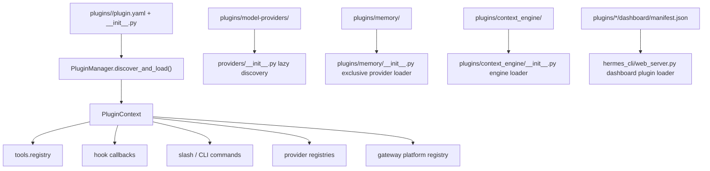

# Hermes 插件系统架构

本文说明 Hermes 的插件系统如何构建、插件在什么时候被发现和加载、插件能力如何接入工具调用、模型调用、Gateway、Dashboard 与专用后端。文中代码位置均为当前工作区行号，后续重构后请以源码为准。

## 一句话总览

Hermes 的插件体系不是一个单点加载器，而是一个分层系统：

1. **通用插件管理器**负责目录/entry point 扫描、`plugin.yaml` 解析、`register(ctx)` 调用，以及工具、hook、slash command、CLI command、技能、辅助任务、平台适配器和若干后端 provider 的注册入口。核心在 `hermes_cli/plugins.py`。
2. **专用插件注册表**处理需要独立生命周期或特殊选择规则的类别，例如模型 provider、memory provider、context engine、image/video/web/browser/TTS/STT provider。
3. **运行时调用点**分布在 agent loop、tool dispatcher、gateway、dashboard server 和 CLI argparse 启动路径中。插件不是只在启动时“挂上去”，而是在工具调用前后、LLM 调用前后、session 边界、平台适配器创建、dashboard API mount 等节点被调用。

## 通用插件管理器

通用插件系统的核心文件是 `hermes_cli/plugins.py`。文件开头就定义了四类插件来源：repo 内置插件、用户插件、项目插件、pip entry point 插件；目录插件必须有 `plugin.yaml` 和带 `register(ctx)` 的 `__init__.py`；工具注册最终委托给 `tools.registry.register()`（`hermes_cli/plugins.py:1-32`）。

### 插件来源

`PluginManager.discover_and_load()` 会按顺序扫描：

| 来源 | 路径/机制 | 说明 |
|---|---|---|
| Bundled | `<repo>/plugins/<name>/` | Hermes 仓库自带插件。通用扫描会跳过 `memory`、`context_engine`、`model-providers`，因为它们有专用 loader；`platforms` 会单独向下扫描一层。见 `hermes_cli/plugins.py:1050-1076`。 |
| User | `$HERMES_HOME/plugins/<name>/` | 用户安装插件。默认需要进入 `plugins.enabled` allow-list 才会加载。见 `hermes_cli/plugins.py:1078-1083`。 |
| Project | `./.hermes/plugins/<name>/` | 项目插件，只有 `HERMES_ENABLE_PROJECT_PLUGINS` 为 truthy 时扫描。见 `hermes_cli/plugins.py:1085-1095`。 |
| Pip | entry point group `hermes_agent.plugins` | 通过 `importlib.metadata.entry_points()` 发现。见 `hermes_cli/plugins.py:1376-1400`。 |

目录扫描支持两种布局：平铺插件 `plugins/disk-cleanup/plugin.yaml` 和分类插件 `plugins/image_gen/openai/plugin.yaml`；分类插件的 registry key 是 `image_gen/openai` 这种路径派生 key，最多递归两层（`hermes_cli/plugins.py:1200-1279`）。

### Manifest 与插件类型

`PluginManifest` 记录插件名字、版本、描述、作者、环境变量、提供的工具/hook、来源、路径、类型和 key（`hermes_cli/plugins.py:233-267`）。合法 `kind` 有：

| kind | 含义 |
|---|---|
| `standalone` | 默认。自带工具、hooks、commands 的普通插件；通常需要 `plugins.enabled` 显式启用。 |
| `backend` | 某个现有核心能力的后端，例如 `image_gen/openai`、`spotify`。内置 backend 自动加载，用户安装 backend 仍需启用。 |
| `exclusive` | 互斥后端，目前主要是 memory provider；通用 loader 只记录 manifest，由专用 discovery 激活。 |
| `platform` | Gateway 平台适配器，例如 IRC/Teams/Discord 等；内置 platform 自动加载。 |
| `model-provider` | LLM provider profile；由 `providers/__init__.py` 专用 lazy discovery 导入。 |

Manifest 解析时，未声明 `kind` 的用户插件会被启发式识别：如果 `__init__.py` 含 `register_memory_provider` 或 `MemoryProvider`，会被当作 `exclusive`；如果含 `register_provider` 和 `ProviderProfile`，会被当作 `model-provider`（`hermes_cli/plugins.py:1281-1365`）。

### 加载优先级与启用规则

加载规则是插件系统最容易误解的部分。`discover_and_load()` 先收集所有 manifest，再用 path-derived key 做一次“winner”去重；后来的来源覆盖前面的来源（`hermes_cli/plugins.py:1102-1114`）。

然后按以下规则处理：

1. `plugins.disabled` 优先级最高，命中 key 或老的 bare name 都跳过（`hermes_cli/plugins.py:1117-1124`）。
2. `kind: exclusive` 只记录，不由通用 loader 导入；激活走类似 `memory.provider` 的专用配置（`hermes_cli/plugins.py:1126-1139`）。
3. `kind: model-provider` 只记录，不导入；避免重复创建 `ProviderProfile`，真正导入由 `providers/__init__.py` 完成（`hermes_cli/plugins.py:1141-1154`）。
4. 内置 `backend` 和 `platform` 自动加载，因为它们是 Hermes 自带能力的一部分（`hermes_cli/plugins.py:1156-1166`）。
5. 其他插件必须在 `plugins.enabled` allow-list 中，命中 key 或 legacy name 才加载（`hermes_cli/plugins.py:1168-1187`）。

`plugins.enabled` 和 `plugins.disabled` 的读取在 `hermes_cli/plugins.py:180-223`；CLI 的 enable/disable 命令会维护这两个集合（`hermes_cli/plugins_cmd.py:624-704`）。从旧版本迁移到 opt-in 插件模型时，会把已经安装且未禁用的用户插件 grandfather 到 `plugins.enabled`（`hermes_cli/config.py:4011-4068`）。

### 实际导入与 register(ctx)

通用 loader 导入插件后，会查找模块级 `register` 函数并传入 `PluginContext`。如果插件没有 `register()`，只记录错误，不让宿主崩溃；如果注册过程抛异常，也记录到 `LoadedPlugin.error`（`hermes_cli/plugins.py:1406-1473`）。

目录插件会被导入到内部命名空间 `hermes_plugins.<slug>`，slug 来自 manifest key，`image_gen/openai` 会变成 `hermes_plugins.image_gen__openai`，避免不同分类下同名插件冲突（`hermes_cli/plugins.py:1475-1511`）。

## PluginContext 能注册什么

`PluginContext` 是插件与宿主之间的 facade。插件只能通过它把能力交给 Hermes，而不是直接改 core 文件。

| 能力 | 注册 API | 宿主侧结果 |
|---|---|---|
| 工具 | `ctx.register_tool(...)` | 委托到 `tools.registry.register()`，并记录为 plugin tool。见 `hermes_cli/plugins.py:317-356`。 |
| 生命周期 hook | `ctx.register_hook(...)` | 加入 `_hooks[hook_name]`，未知 hook 仅 warning，便于前向兼容。见 `hermes_cli/plugins.py:936-951`。 |
| CLI 子命令 | `ctx.register_cli_command(...)` | 注册 `hermes <plugin-command>` 的 argparse 子树。见 `hermes_cli/plugins.py:387-408`。 |
| 会话内 slash command | `ctx.register_command(...)` | 注册 `/command`，会进入 CLI/Gateway/TUI 分发与帮助菜单。见 `hermes_cli/plugins.py:412-464`。 |
| 调用宿主工具 | `ctx.dispatch_tool(...)` | 插件 slash command 可以通过 registry 调用工具，必要时自动带上 parent agent context。见 `hermes_cli/plugins.py:468-495`。 |
| Context engine | `ctx.register_context_engine(...)` | 注册一个替代 `ContextCompressor` 的 engine，最多一个。见 `hermes_cli/plugins.py:499-527`。 |
| Image/video/web/browser/TTS/STT provider | `ctx.register_*_provider(...)` | 类型检查后放入对应 provider registry。image 示例见 `hermes_cli/plugins.py:531-555`，其他 provider API 在同文件后续相邻段落。 |
| Gateway platform | `ctx.register_platform(...)` | 构造 `PlatformEntry` 并注册到 `gateway.platform_registry`。见 `hermes_cli/plugins.py:767-819`。 |
| 辅助 LLM 任务 | `ctx.register_auxiliary_task(...)` | 给 `auxiliary.<key>` 增加插件定义的可路由 LLM side task。见 `hermes_cli/plugins.py:825-934`。 |
| 插件技能 | `ctx.register_skill(...)` | 注册为 `<plugin_name>:<skill>` 的显式技能，不进入默认技能列表。见 `hermes_cli/plugins.py:955-998`。 |
| 宿主 LLM facade | `ctx.llm` | 懒创建 `agent.plugin_llm.PluginLlm`，让可信插件复用用户当前模型与凭证。见 `hermes_cli/plugins.py:298-313`。 |

## 工具插件如何进入 agent

工具插件最终共用 Hermes 的全局工具注册表。`tools/registry.py` 本身不依赖 `model_tools.py`，所有 built-in tool 和 plugin tool 都调用 `registry.register()` 注册 schema、handler、toolset 与 availability check（`tools/registry.py:1-15`）。

`registry.register()` 会拒绝不同 toolset 下的同名工具，除非插件显式传 `override=True`；这使工具替换可审计，避免无意覆盖核心工具（`tools/registry.py:234-305`）。真正执行工具时，`registry.dispatch()` 查找 handler，支持 async handler 桥接，并把异常统一转为 JSON error（`tools/registry.py:390-416`）。

插件 discovery 在 `model_tools.py` 导入阶段会尝试执行一次，因此 plugin tool 可以进入 `TOOL_TO_TOOLSET_MAP` 等后续 tool metadata（`model_tools.py:195-209`）。CLI、Gateway、TUI 也都有显式 discovery 调用，避免某些入口还没 lazy-import `model_tools.py` 时插件不可见（CLI 见 `cli.py:879-881`，Gateway 见 `gateway/run.py:4043-4055`，TUI 见 `tui_gateway/server.py:958-960`）。

运行工具时，`model_tools.handle_function_call()` 会：

1. 先触发 `pre_tool_call`，插件可返回 `{"action": "block", "message": "..."}` 阻止工具执行（`model_tools.py:774-800`，block 解析在 `hermes_cli/plugins.py:1667-1708`）。
2. 调用 `registry.dispatch()` 执行工具（`model_tools.py:831-847`）。
3. 触发 `post_tool_call`，传入 result、duration、task/session/tool_call id 等上下文（`model_tools.py:849-862`）。
4. 触发 `transform_tool_result`，第一个返回字符串的 hook 可以替换工具结果（`model_tools.py:864-889`）。

插件 toolset 还会出现在 `hermes tools` 的可配置列表中：`hermes_cli/tools_config.py` 会先 `discover_plugins()`，再用 `get_plugin_toolsets()` 追加插件提供的 toolset（`hermes_cli/tools_config.py:150-180`，`hermes_cli/plugins.py:1805-1847`）。

## LLM 与会话 hook

Hook 名称集中在 `VALID_HOOKS`，包括 `pre_tool_call`、`post_tool_call`、`transform_tool_result`、`pre_llm_call`、`post_llm_call`、`transform_llm_output`、session 边界、gateway dispatch、approval 生命周期等（`hermes_cli/plugins.py:128-168`）。Hook 调用由 `PluginManager.invoke_hook()` 执行，每个 callback 都包在 try/except 中，单个插件失败不会中断核心流程（`hermes_cli/plugins.py:1535-1569`）。

LLM 调用相关 hook 在 conversation loop 中：

1. `pre_llm_call` 每个用户 turn 调一次。插件返回 `{"context": "..."}` 或字符串时，会作为临时上下文注入当前用户消息，不写入 session DB，也不改 system prompt，保持 prompt cache 稳定（`agent/conversation_loop.py:566-600`）。
2. 临时上下文注入发生在构造 API messages 时，来源包括 memory prefetch 和 plugin `pre_llm_call`（`agent/conversation_loop.py:823-840`）。
3. `transform_llm_output` 在工具循环结束后触发，第一个非空字符串返回会替换最终回答；随后 `post_llm_call` 可观察完整 turn，用于持久化、统计或同步（`agent/conversation_loop.py:4203-4242`）。

Session 边界并不只靠普通 hook：memory provider 和 context engine 有自己的 lifecycle。`AIAgent.shutdown_memory_provider()` 会在真实 session 边界调用 memory manager 的 `on_session_end()`/`shutdown_all()`，也调用 context engine 的 `on_session_end()`（`run_agent.py:2088-2113`）。会话 id 轮转但不 teardown 时，`commit_memory_session()` 也会触发类似的 flush（`run_agent.py:2115-2136`）。

## Slash command 与 CLI command

插件有两种命令：

1. `ctx.register_command()` 注册会话内 slash command，例如 `/disk-cleanup`。命令会进入帮助、Telegram/Slack/Discord 菜单等惰性枚举（`hermes_cli/commands.py:447-475`）。
2. `ctx.register_cli_command()` 注册进程级 CLI 子命令，例如 `hermes honcho ...`。主 argparse 构建时会按需扫描 memory plugin CLI 与通用插件 CLI command，不在 `main.py` 硬编码插件命令（`hermes_cli/main.py:12732-12776`）。

CLI 会在 `process_command()` 中检查插件 slash command 并执行 handler，支持 async handler 通过 `resolve_plugin_command_result()` 同步解析（`cli.py:8687-8703`，解析逻辑见 `hermes_cli/plugins.py:1735-1778`）。Gateway 的 slash command 分发也会查插件命令，Telegram 下划线会规范化为连字符（`gateway/run.py:7732-7748`）。TUI 也走同一套 `get_plugin_command_handler()`/`resolve_plugin_command_result()`（`tui_gateway/server.py:4981-4987`）。

## 专用插件注册表

### 模型 Provider 插件

模型 provider 是独立系统，不由通用 `PluginManager` 导入。`providers/__init__.py` 会在第一次调用 `get_provider_profile()` 或 `list_providers()` 时 lazy discover：先导入内置 `plugins/model-providers/<name>/`，再导入用户 `$HERMES_HOME/plugins/model-providers/<name>/`，最后兼容旧的 `providers/*.py` 单文件 profile；后导入的同名 provider 覆盖先导入的 provider（`providers/__init__.py:1-29`，`providers/__init__.py:140-191`）。

provider plugin 的 `__init__.py` 通常创建一个 `ProviderProfile` 并调用 `register_provider()`。注册会写入 `_REGISTRY` 并记录 aliases（`providers/__init__.py:53-63`）。`ProviderProfile` 本身是声明式 profile，包含 provider 名称、api mode、aliases、env vars、base URL、模型列表、默认 headers、温度/max tokens 规则，以及可 override 的 request hooks（`providers/base.py:38-184`）。

运行时，`agent/chat_completion_helpers.py` 会通过 `get_provider_profile(agent.provider)` 获取 profile；找到 profile 后将其传给 transport 的统一 kwargs builder（`agent/chat_completion_helpers.py:712-751`）。`agent/transports/chat_completions.py` 使用 profile 来 preprocess messages、构造 top-level kwargs、`extra_body`、reasoning 配置等（`agent/transports/chat_completions.py:425-539`）。

例子：

- `plugins/model-providers/nvidia/__init__.py` 创建 `ProviderProfile(name="nvidia", aliases=("nvidia-nim",), env_vars=("NVIDIA_API_KEY",), base_url=...)` 并注册（`plugins/model-providers/nvidia/__init__.py:3-21`）。
- `plugins/model-providers/openrouter/__init__.py` 通过 `OpenRouterProfile` override `fetch_models()`、`build_extra_body()` 和 `build_api_kwargs_extras()`，用于 OpenRouter 特有 routing 与 reasoning/header 逻辑（`plugins/model-providers/openrouter/__init__.py:14-115`）。

### Memory Provider 插件

Memory provider 是 `exclusive` 类别：同一时间最多一个外部 provider。`plugins/memory/__init__.py` 扫描内置 `plugins/memory/<name>/` 和用户 `$HERMES_HOME/plugins/<name>/`，用户目录通过 `__init__.py` 文本启发式判断是否像 memory provider；同名时内置 provider 优先（`plugins/memory/__init__.py:1-20`，`plugins/memory/__init__.py:41-98`）。

加载时，memory loader 会导入模块，优先调用插件的 `register(ctx)` 并用 `_ProviderCollector` 捕获 `register_memory_provider()`；如果没有 register，则查找 `MemoryProvider` 子类并实例化（`plugins/memory/__init__.py:185-305`）。

`MemoryProvider` ABC 定义 lifecycle：`initialize()`、`system_prompt_block()`、`prefetch()`、`queue_prefetch()`、`sync_turn()`、`get_tool_schemas()`、`handle_tool_call()`、`shutdown()`，以及 session/压缩/委托等可选 hook（`agent/memory_provider.py:1-31`，`agent/memory_provider.py:42-170`）。

Agent 初始化时读取 `memory.provider`，调用 `plugins.memory.load_memory_provider()`，如果 provider 可用就加入 `MemoryManager` 并初始化（`agent/agent_init.py:1091-1154`）。Memory tool schema 不是通过全局 tool registry 注入，而是在 agent 初始化时直接追加到 agent tool surface，并受 `enabled_toolsets` 中的 `memory` gate 控制（`agent/agent_init.py:1156-1188`）。执行这些 memory tools 时，`agent/tool_executor.py` 会绕过 registry，直接路由到 `MemoryManager.handle_tool_call()`（`agent/tool_executor.py:715-728`）。

`MemoryManager` 负责“一内置 + 最多一个外部”约束、tool name 到 provider 的路由、prefetch、sync、shutdown 等容错编排（`agent/memory_manager.py:244-303`，`agent/memory_manager.py:337-430`，`agent/memory_manager.py:592-609`）。完成 turn 后，agent 会调用 `sync_all()` 和 `queue_prefetch_all()`，中断 turn 会跳过，避免把用户没看到的半成品写入外部记忆（`run_agent.py:2147-2188`）。

例子：`plugins/memory/mem0/__init__.py` 实现 `Mem0MemoryProvider`，提供 `is_available()`、`initialize()`、`get_tool_schemas()`、`handle_tool_call()`，最后在 `register(ctx)` 中 `ctx.register_memory_provider(Mem0MemoryProvider())`（`plugins/memory/mem0/__init__.py:119-144`，`plugins/memory/mem0/__init__.py:203-210`，`plugins/memory/mem0/__init__.py:297-373`）。

### Context Engine 插件

Context engine 控制接近 context limit 时如何压缩/重组对话。ABC 在 `agent/context_engine.py`，定义 token 状态、`should_compress()`、`compress()`、`update_from_response()`、可选工具和 session lifecycle（`agent/context_engine.py:1-26`，`agent/context_engine.py:32-150`）。

专用 loader 在 `plugins/context_engine/__init__.py`，扫描 `plugins/context_engine/<name>/`，支持 `register(ctx)` + collector 或直接实例化 `ContextEngine` 子类（`plugins/context_engine/__init__.py:1-17`，`plugins/context_engine/__init__.py:33-97`，`plugins/context_engine/__init__.py:100-219`）。

Agent 初始化时按 `context.engine` 选择：默认 `compressor`；非默认时先从 `plugins/context_engine/<name>/` 加载，再从通用插件系统里查 `ctx.register_context_engine()` 注册的 engine；找不到则回落内置 `ContextCompressor`（`agent/agent_init.py:1385-1424`）。Context engine 如果暴露工具，会被追加到 agent tool surface，并受 `enabled_toolsets` 中的 `context_engine` gate 控制（`agent/agent_init.py:1476-1515`）。这些工具执行时走 `agent.context_compressor.handle_tool_call()`（`agent/tool_executor.py:692-704`）。

### Image/video/web/browser/TTS/STT provider 插件

这些 provider 使用相似模式：插件通过 `ctx.register_*_provider()` 把 provider 实例注册到对应 registry，工具 wrapper 根据 config 选择 active provider 并调用。

以 image generation 为例：

- `ImageGenProvider` ABC 说明 provider 通过 `PluginContext.register_image_gen_provider()` 注册，active provider 由 `image_gen.provider` 选择；内置 backend 在 `<repo>/plugins/image_gen/<name>/`，用户 backend 在 `~/.hermes/plugins/image_gen/<name>/`（`agent/image_gen_provider.py:1-12`）。
- `agent/image_gen_registry.py` 保存 provider map，`register_provider()` 做类型检查并按 provider name 注册；`get_active_provider()` 读取 `image_gen.provider` 并处理 fallback（`agent/image_gen_registry.py:1-19`，`agent/image_gen_registry.py:36-64`，`agent/image_gen_registry.py:75-120`）。
- `tools/image_generation_tool.py` 在明确设置 `image_gen.provider` 时确保插件 discovery 已运行，然后查 registry 并调用 `provider.generate(**kwargs)`（`tools/image_generation_tool.py:896-947`）。
- 具体插件 `plugins/image_gen/openai/__init__.py` 定义 `OpenAIImageGenProvider` 并在 `register(ctx)` 中注册（`plugins/image_gen/openai/__init__.py:125-174`，`plugins/image_gen/openai/__init__.py:314-316`）；它的 `plugin.yaml` 声明 `kind: backend` 和 `requires_env: OPENAI_API_KEY`（`plugins/image_gen/openai/plugin.yaml:1-7`）。

Video、web search、browser、TTS、STT provider 的注册 API 在 `PluginContext` 中相邻定义，核心差异是对应 ABC 和 registry 不同（`hermes_cli/plugins.py:596-764`）。

### Gateway Platform 插件

Gateway 平台适配器也走通用 plugin loader，但落点是 `gateway.platform_registry`。`PlatformEntry` 描述平台名、label、adapter factory、依赖检查、config 校验、setup 函数、auth env vars、message limit、privacy、cron delivery 等元数据（`gateway/platform_registry.py:1-29`，`gateway/platform_registry.py:38-120`）。

插件调用 `ctx.register_platform()` 后，`PlatformEntry` 会注册到 `platform_registry`；同名 entry 后注册覆盖先注册（`hermes_cli/plugins.py:767-819`，`gateway/platform_registry.py:170-208`）。Gateway 启动时显式 `discover_plugins()`，确保平台插件在创建 adapter 前注册好（`gateway/run.py:4043-4055`）。创建 adapter 时，Gateway 先查 `platform_registry`，有插件平台就优先使用，再 fall through 到 legacy 内置路径（`gateway/run.py:6249-6260`）。

例子：IRC 插件的 `register(ctx)` 调用 `ctx.register_platform(name="irc", label="IRC", adapter_factory=..., check_fn=..., required_env=..., setup_fn=..., env_enablement_fn=..., standalone_sender_fn=...)`（`plugins/platforms/irc/adapter.py:927-960`）；manifest 声明 `kind: platform` 和相关 env metadata（`plugins/platforms/irc/plugin.yaml:1-54`）。

### Dashboard 插件

Dashboard 插件不是通过 `PluginContext` 注册，而是由 web server 扫描 `dashboard/manifest.json`。`_discover_dashboard_plugins()` 扫描用户插件、内置插件、内置 memory 插件，以及 gated project plugins；manifest 可声明 tab、slots、前端 entry/css 和可选 backend api 文件（`hermes_cli/web_server.py:4270-4371`）。

静态资源通过 `/dashboard-plugins/{plugin_name}/{file_path}` 提供，路径必须在插件的 `dashboard/` 目录内，且后缀必须在浏览器资源 allow-list 中，避免泄漏 Python 源码或私有文件（`hermes_cli/web_server.py:4673-4739`）。

Backend API 通过 `_mount_plugin_api_routes()` 导入，manifest 的 `api` 字段必须是 dashboard 目录内的相对路径；project plugin 的 Python API 不会自动导入，只允许静态 UI，降低打开不可信仓库时的 RCE 风险（`hermes_cli/web_server.py:4233-4267`，`hermes_cli/web_server.py:4742-4816`）。

例子：`plugins/hermes-achievements/dashboard/manifest.json` 声明 tab、前端 bundle、css 和 `plugin_api.py`（`plugins/hermes-achievements/dashboard/manifest.json:1-10`）；`plugin_api.py` 暴露 `router = APIRouter()`，会被挂载到 `/api/plugins/hermes-achievements/`（`plugins/hermes-achievements/dashboard/plugin_api.py:1-32`）。

## 典型插件形态

| 形态 | 示例 | 关键代码 |
|---|---|---|
| Tool backend | Spotify | `plugins/spotify/__init__.py` 注册 7 个 Spotify 工具到 `spotify` toolset（`plugins/spotify/__init__.py:1-23`，`plugins/spotify/__init__.py:56-66`）；manifest 为 `kind: backend` 并列出工具（`plugins/spotify/plugin.yaml:1-13`）。 |
| Hook + slash command | disk-cleanup | `post_tool_call` 自动追踪临时文件，`on_session_end` 自动 cleanup，slash command 提供手动入口（`plugins/disk-cleanup/__init__.py:1-19`，`plugins/disk-cleanup/__init__.py:128-188`，`plugins/disk-cleanup/__init__.py:191-240`）；manifest 声明 hooks（`plugins/disk-cleanup/plugin.yaml:1-7`）。 |
| Model provider | NVIDIA/OpenRouter | NVIDIA 是纯声明式 `ProviderProfile`（`plugins/model-providers/nvidia/__init__.py:3-21`）；OpenRouter override profile hooks（`plugins/model-providers/openrouter/__init__.py:14-115`）。 |
| Memory provider | Mem0 | 实现 `MemoryProvider` 并通过 `register_memory_provider()` 暴露给专用 memory loader（`plugins/memory/mem0/__init__.py:119-144`，`plugins/memory/mem0/__init__.py:297-373`）。 |
| Image backend | OpenAI image_gen | 实现 `ImageGenProvider.generate()` 并调用 `ctx.register_image_gen_provider()`（`plugins/image_gen/openai/__init__.py:125-174`，`plugins/image_gen/openai/__init__.py:314-316`）。 |
| Gateway platform | IRC | `ctx.register_platform()` 注册 adapter factory 与平台元数据（`plugins/platforms/irc/adapter.py:927-960`）。 |
| Dashboard tab/API | Hermes Achievements | `dashboard/manifest.json` + `plugin_api.py`，由 web server 扫描和 mount（`plugins/hermes-achievements/dashboard/manifest.json:1-10`，`plugins/hermes-achievements/dashboard/plugin_api.py:1-32`）。 |

## 安全与隔离设计

Hermes 插件系统的几个关键防线：

1. **用户插件 opt-in**：普通用户插件默认不加载，必须进入 `plugins.enabled`；`plugins.disabled` 显式拒绝优先（`hermes_cli/plugins.py:196-223`，`hermes_cli/plugins.py:1117-1187`）。
2. **项目插件 gated**：`./.hermes/plugins` 只有 `HERMES_ENABLE_PROJECT_PLUGINS` 为 truthy 时扫描（`hermes_cli/plugins.py:1085-1095`）。
3. **工具覆盖显式化**：不同 toolset 的同名工具默认拒绝，只有 `override=True` 才允许覆盖，并写日志（`tools/registry.py:251-289`）。
4. **插件失败 fail-open/fail-soft**：插件加载异常记录到 `LoadedPlugin.error`，hook callback 异常只 warning，不破坏核心流程（`hermes_cli/plugins.py:1466-1473`，`hermes_cli/plugins.py:1555-1569`）。
5. **Dashboard API 路径校验**：`api` 字段必须是 dashboard 目录内相对路径；project plugin 的 Python API 不自动导入；静态资源有后缀 allow-list（`hermes_cli/web_server.py:4233-4267`，`hermes_cli/web_server.py:4673-4739`，`hermes_cli/web_server.py:4742-4816`）。
6. **专用 loader 避免重复导入**：model provider manifest 在通用 loader 中只记录，不导入，避免破坏 user override 的 last-writer-wins 语义（`hermes_cli/plugins.py:1141-1154`）。

## 选择哪条扩展路径

| 需求 | 推荐路径 |
|---|---|
| 新增一个工具、hook、slash command、CLI 子命令或插件技能 | 通用插件：`~/.hermes/plugins/<name>/plugin.yaml` + `__init__.py register(ctx)` |
| 新增 LLM provider 或改 provider 请求行为 | `plugins/model-providers/<name>/`，实现/实例化 `ProviderProfile` 并 `register_provider()` |
| 接入外部长期记忆系统 | memory provider：实现 `MemoryProvider`，通过 `memory.provider` 激活 |
| 替换 context 压缩/检索策略 | context engine：实现 `ContextEngine`，通过 `context.engine` 激活 |
| 新增 image/video/web/browser/TTS/STT 后端 | 对应 provider ABC + `ctx.register_*_provider()` |
| 新增 Telegram/Discord 之外的消息平台 | platform plugin：实现 adapter 并 `ctx.register_platform()` |
| 给 Dashboard 加 tab、slot 或 backend API | `dashboard/manifest.json` + 前端 bundle，可选 `plugin_api.py` |

## 结论

Hermes 插件系统的核心设计是：普通插件走 `PluginManager + PluginContext`，高复杂度或互斥能力走专用 registry。这样做的好处是，工具、hook、命令这类通用扩展可以统一注册；而模型 provider、memory provider、context engine、平台适配器、Dashboard API 这些有特殊生命周期和安全边界的能力，可以各自保持更严格的加载和选择规则。

