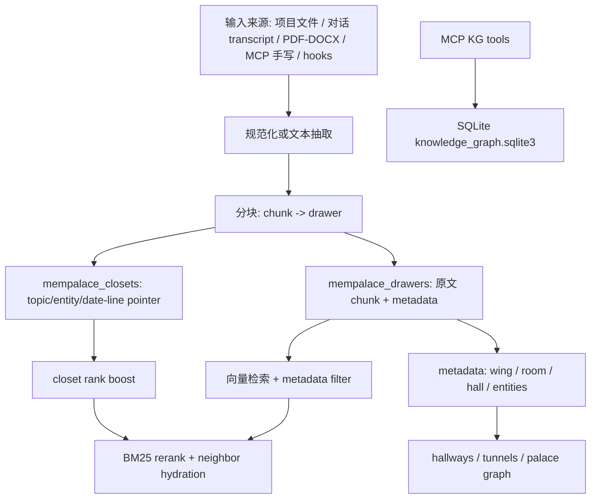

# MemPalace 记忆系统构建说明

本文按当前代码实现解释 MemPalace 的记忆系统。核心结论是：MemPalace 不是只做向量检索，而是把“原文抽屉”、“压缩指针索引”、“实体时态知识图谱”、“房间/通道导航”和“后台 hook 写入”组合成一套本地记忆系统。

## 一句话总览

MemPalace 的主存储是本地 ChromaDB：`mempalace_drawers` 存放可检索的原文 chunk，也就是 drawer；`mempalace_closets` 存放更短的 pointer/index 文本，也就是 closet。检索时直接查 drawers 是底线，closets 只作为加权信号，不会成为过滤门槛。关系型事实另存到本地 SQLite 知识图谱，用实体和时间窗口来回答“某个事实在某天是否成立”。

关键代码：

- `mempalace/palace.py:61-80`：统一打开 drawers collection 和 closets collection。
- `mempalace/backends/chroma.py:1418-1485`：Chroma backend 创建/读取 collection，默认使用 cosine HNSW 和显式 embedding function。
- `mempalace/searcher.py:822-829`：搜索时 drawers 永远先查，closets 只做 boost。
- `mempalace/knowledge_graph.py:129-178`：知识图谱用本地 SQLite 建表。



## 1. 存储层：drawer 是原文，closet 是索引

### Drawers

Drawer 是最重要的存储单位。项目文件、对话、格式文档和 MCP 写入最终都会变成 document text + metadata 写入 `mempalace_drawers`。默认 collection 名是 `mempalace_drawers`，默认 palace 路径是 `~/.mempalace/palace`。

关键代码：

- `mempalace/config.py:192-209`：默认 palace path、collection 名和 chunk 参数。
- `mempalace/backends/base.py:185-230`：所有后端必须实现 `add`、`upsert`、`query`、`get`、`delete`、`count`。
- `mempalace/backends/chroma.py:914-994`：ChromaCollection 的写操作会包一层 palace 写锁。
- `mempalace/backends/chroma.py:1456-1468`：创建 collection 时设置 `hnsw:space=cosine` 和 `hnsw:num_threads=1`。

### Closets

Closet 是搜索辅助层。当前主路径中，closet 不是代替原文的压缩存储，而是由原文生成的一组短 pointer 行，例如：

```text
topic|entities|YYYY-MM-DD:Lstart-Lend|->drawer_id_a,drawer_id_b
```

它的作用是让模型或检索器更快发现“哪个 drawer 值得打开”。真正回答时仍回到 drawer 原文。

关键代码：

- `mempalace/palace.py:241-326`：从 drawer 内容生成 closet pointer lines。
- `mempalace/palace.py:329-367`：把 `content_date` 和 `line_start/line_end` 编进 closet locator。
- `mempalace/palace.py:383-420`：把 pointer lines 贪心打包进多个 closet 文档。
- `mempalace/searcher.py:841-867`：搜索时额外查 closets，建立 `source_file -> boost`。

## 2. 入口层：init 先建分类框架，mine 再写入记忆

### `mempalace init`

`init` 做的是“建宫殿结构”：识别 corpus 来源、发现实体、检测 rooms、写 config，然后询问是否立即 mine。

关键代码：

- `mempalace/cli.py:230-244`：`init` 入口，并让 `--palace` 影响后续配置读取。
- `mempalace/cli.py:255-323`：LLM 辅助默认尝试本地 Ollama；外部 API 会提示风险并要求显式同意。
- `mempalace/cli.py:325-333`：Pass 0 检测语料来源。
- `mempalace/cli.py:335-376`：发现并确认 people/projects/topics，写入 `entities.json` 和全局 registry。
- `mempalace/cli.py:380-392`：检测 rooms、初始化 config、保护 gitignore，并可立即 mine。
- `mempalace/cli.py:409-488`：`init` 后的 mine 提示和复用预扫描文件列表。

### `mempalace mine`

CLI 的 `mine` 支持三种模式：

- `projects`：代码、Markdown、JSON、文本等项目文件。
- `convos`：Claude Code、Codex、Gemini、ChatGPT、Slack、纯文本对话导出。
- `extract`：PDF、DOCX、RTF 等格式文件，先抽取成文本。

关键代码：

- `mempalace/cli.py:489-544`：根据 `--mode` 分派到 project/convo/format miner。
- `mempalace/cli.py:1292-1342`：`mine` 的 CLI 参数定义。
- `mempalace/cli.py:1358-1407`：`sweep`、`sync`、`search` 等后续命令入口。

## 3. 项目文件 ingest：扫描、分房间、分块、写 drawer、建 closet

项目文件 miner 的流程是：

1. 扫描可读文件，跳过 `.git`、`node_modules`、大文件、符号链接和不支持扩展名。
2. 根据路径、文件名、内容关键词判断 room。
3. 按约 800 字符 chunk，保留 line range。
4. 写入 drawers collection。
5. 生成 closets pointer index。
6. 计算 topic tunnels、entity hallways、entity tunnels。

关键代码：

- `mempalace/miner.py:48-70`：项目 miner 支持的文本扩展名。
- `mempalace/miner.py:425-464`：room 检测优先级：路径、文件名、内容关键词、`general`。
- `mempalace/miner.py:472-566`：`chunk_text` 分块，并记录 `line_start/line_end`。
- `mempalace/miner.py:1193-1241`：drawer metadata：`wing`、`room`、`source_file`、`chunk_index`、`filed_at`、`hall`、`entities` 等。
- `mempalace/miner.py:1274-1320`：单文件处理：读文件、判 room、chunk。
- `mempalace/miner.py:1341-1409`：按 source file 加锁，删除旧 drawer，批量 upsert 新 drawer。
- `mempalace/miner.py:1411-1446`：为同一源文件生成 closet pointer，并写入 `mempalace_closets`。
- `mempalace/miner.py:1456-1527`：项目扫描逻辑，尊重 `.gitignore`。
- `mempalace/miner.py:1535-1589`：mine 外层包 `mine_palace_lock`，防止多个进程同时写同一个 palace。
- `mempalace/miner.py:1702-1749`：mine 结束后生成 topic tunnels、hallways、entity tunnels，并做 SQLite/FTS 校验。

## 4. 对话 ingest：先规范化，再按 exchange 或记忆类型写入

对话 miner 的目标是把各种聊天导出统一成 transcript，然后写入同一个 drawers collection。

默认 `extract_mode="exchange"`：一个用户回合加 AI 回复作为一个单元。也支持 `extract_mode="general"`：从对话中抽取 decision、preference、milestone、problem、emotion 等类型，但保存的仍是切片原文，不是摘要。

关键代码：

- `mempalace/convo_miner.py:1-9`：模块说明：规范化格式、按 Q+A chunk，写入同一 palace。
- `mempalace/normalize.py:113-140`：普通文本原样通过；JSON 导出会转成 transcript。
- `mempalace/normalize.py:93-110`：Claude Code JSONL 的系统标签、hook UI chrome 会被行级清理。
- `mempalace/normalize.py:632-661`：消息列表转 transcript，用户消息会加 `>` 标记。
- `mempalace/convo_miner.py:138-171`：按 exchange chunk，若没有足够 `>` marker 则 fallback 到 paragraph chunk。
- `mempalace/convo_miner.py:381-453`：对话 drawer 的写入：加锁、删除旧行、批量 upsert，并标注 `ingest_mode="convos"` 和 `extract_mode`。
- `mempalace/convo_miner.py:485-507`：wing 解析规则，AI 工具路径默认归到 `wing_api`。
- `mempalace/convo_miner.py:510-562`：conversation mine 外层同样持有 per-palace lock。
- `mempalace/convo_miner.py:564-702`：完整 conversation mine pipeline：扫描、normalize、chunk、detect room、写入。
- `mempalace/general_extractor.py:365-450`：general extractor 按 marker 分类，但超长片段仍按原文切片保存。

注意：如果严格按“源文件字节级原文”理解，conversation 路径不是完全原样。它会做格式转换，Claude Code 噪声行会被清理；并且 `_messages_to_transcript` 默认会对用户文本调用 `spellcheck_user_text`。这值得在“verbatim always”的产品承诺下单独审视。相关代码是 `mempalace/normalize.py:632-651`。

## 5. 格式文件 ingest：PDF/DOCX/RTF 等先抽文本

`--mode extract` 把办公室文档转成文本后复用项目 miner 的 chunk 思路。它不会修改源文件。

关键代码：

- `mempalace/format_miner.py:313-324`：`extract_text` 把格式文件转纯文本，源文件不被修改。
- `mempalace/format_miner.py:583-687`：格式文件写入 drawers，metadata 标注 `ingest_mode="extract"`、`extract_mode="format"`。
- `mempalace/format_miner.py:690-740`：format mine 的整体说明。
- `mempalace/format_miner.py:746-780`：加载全局 chunk 配置，并为格式文档准备 rooms。

## 6. MCP 写入：手动记忆、日记、KG 都从工具进来

MCP server 暴露读写工具，让 agent 在会话中主动查、写、更新记忆。

关键代码：

- `mempalace/mcp_server.py:1967-2383`：MCP tools 注册表。
- `mempalace/mcp_server.py:2184-2214`：`mempalace_search` 工具定义，返回原文 drawer 内容。
- `mempalace/mcp_server.py:2230-2249`：`mempalace_add_drawer` 工具定义，明确写入 verbatim content。
- `mempalace/mcp_server.py:1105-1239`：`tool_add_drawer` 实现：内容 hash 得到确定性 ID，超长内容切成多个 chunk 后批量 upsert。
- `mempalace/mcp_server.py:1313-1339`：`tool_get_drawer` 根据 drawer ID 返回完整 content 和 metadata。
- `mempalace/mcp_server.py:1604-1725`：`tool_diary_write` 把 agent diary 写成 `wing/diary` 下的 drawer。
- `mempalace/mcp_server.py:386-432`：MCP 写操作先写 redacted WAL，便于审计和回滚分析。

## 7. 检索层：drawer search 是底线，closet boost 是辅助

检索主路径 `search_memories` 做了几件事：

1. 用 query 直接查 drawers collection，过量取回 `n_results * 3`。
2. 同时查 closets collection，按 source_file 建立 boost。
3. 用 closet boost 调整 drawer 的 effective distance。
4. 对候选做 BM25 + vector hybrid rerank。
5. 对 closet-boosted 的多 chunk source 做 neighbor hydration，返回更完整的上下文。
6. 如果 vector/HNSW 不可用，可以走 SQLite FTS5 的 BM25-only fallback。

关键代码：

- `mempalace/searcher.py:63-119`：BM25 评分。
- `mempalace/searcher.py:122-166`：vector similarity 和 BM25 的混合 rerank。
- `mempalace/searcher.py:169-177`：`wing`/`room` metadata filter。
- `mempalace/searcher.py:398-423`：SQLite FTS5 BM25 fallback 的设计说明。
- `mempalace/searcher.py:748-810`：`search_memories` 参数和 vector-disabled fallback。
- `mempalace/searcher.py:822-837`：直接查 drawers，这是检索底线。
- `mempalace/searcher.py:841-867`：查 closets，只作为 ranking signal。
- `mempalace/searcher.py:868-925`：根据 closet rank 计算 boost 和返回字段。
- `mempalace/searcher.py:930-985`：closet 命中后按 source file 找关键词最佳 chunk 和相邻 chunk。
- `mempalace/searcher.py:1003-1019`：最终 hybrid rerank 并返回结果。
- `mempalace/mcp_server.py:877-945`：MCP search 工具先清理 prompt contamination，再调用 `search_memories`。

## 8. 读时行号：locator 不改写原文

项目 miner 会在 drawer metadata 中记录 chunk 的源文件行号；closet pointer 会携带 `YYYY-MM-DD:Lstart-Lend`。真正显示某段内容时，行号是在读取时临时加上的，不写回 drawer。

关键代码：

- `mempalace/miner.py:472-566`：chunk 时记录 `line_start/line_end`。
- `mempalace/palace.py:329-367`：生成 date-line locator。
- `mempalace/searcher.py:1022-1029`：读时行号设计说明。
- `mempalace/searcher.py:1037-1054`：`render_with_line_numbers`。
- `mempalace/searcher.py:1057-1077`：`extract_line_range`。
- `docs/virtual-line-numbering.md:1-38`：设计文档说明为什么不把行号写进原文。

## 9. 知识图谱：事实不是 chunk，而是时态三元组

知识图谱和 drawer 搜索是两套互补系统：

- Drawer 回答“用户原话在哪里”。
- KG 回答“某个实体和事实在什么时间成立”。

KG 存在 `~/.mempalace/knowledge_graph.sqlite3`，有 entities 和 triples 两张表。Triple 包含 `subject`、`predicate`、`object`、`valid_from`、`valid_to`、`source_file`、`source_drawer_id` 等字段。

关键代码：

- `mempalace/knowledge_graph.py:1-15`：KG 的目标：实体节点、typed relationship、时间有效性、本地 SQLite。
- `mempalace/knowledge_graph.py:49-128`：日期和 datetime 的时态比较逻辑。
- `mempalace/knowledge_graph.py:129-178`：SQLite schema。
- `mempalace/knowledge_graph.py:224-235`：添加或更新 entity。
- `mempalace/knowledge_graph.py:237-326`：添加 triple，并自动创建 subject/object entity。
- `mempalace/knowledge_graph.py:328-359`：invalidate 旧事实，设置 `valid_to`。
- `mempalace/knowledge_graph.py:362-425`：按 entity 查询 outgoing/incoming/both，并支持 `as_of` 时间过滤。
- `mempalace/mcp_server.py:1475-1582`：MCP KG 查询、添加、失效工具。
- `mempalace/mcp_server.py:1998-2089`：KG 相关工具 schema。

## 10. Palace graph：从 metadata 生成 hallways 和 tunnels

Palace graph 不直接存原文，而是从 drawer metadata 里读 `wing`、`room`、`hall`、`entities`。它提供三种导航：

- Room graph：同一 room 出现在多个 wing，就形成跨 wing tunnel 候选。
- Hallways：同一 wing 内实体共现达到阈值，就形成 entity-pair hallway。
- Entity tunnels：某个实体在多个 wing 的 hallway 中出现，就形成跨 wing entity tunnel。

关键代码：

- `mempalace/miner.py:821-842`：hall 分类，描述“内容类型”，不同于 room 的“主题”。
- `mempalace/miner.py:845-870`：从内容和已知实体 registry 中提取 metadata entities。
- `mempalace/palace_graph.py:90-186`：从 Chroma metadata 构建 room graph。
- `mempalace/palace_graph.py:189-248`：从某个 room 做 BFS traversal。
- `mempalace/palace_graph.py:251-292`：找跨 wing tunnels。
- `mempalace/palace_graph.py:741-820`：根据 shared topics 自动创建 topic tunnels。
- `mempalace/hallways.py:161-245`：统计同一 wing 内实体对共现。
- `mempalace/hallways.py:249-307`：生成 hallway records，并保留 dynamics 字段。
- `mempalace/palace_graph.py:879-930`：根据 hallway 中的 shared entity 生成 entity tunnels。

## 11. Hook 后台写入：会话结束和压缩前自动保存

Hooks 的目标是把“记忆写入”从聊天窗口移到后台。

Stop hook 的 Python 实现会：

1. 读取 harness JSON，拿到 session id 和 transcript path。
2. 统计人类消息数量。
3. 达到保存间隔后，silent 模式下直接写 diary checkpoint。
4. 同时后台 spawn conversation mine，把 transcript 目录写进 palace。
5. 可选 mine `MEMPAL_DIR` 项目文件。

PreCompact hook 会在压缩上下文前同步 mine transcript，尽量避免 compaction 前的信息丢失。

关键代码：

- `mempalace/hooks_cli.py:472-510`：`_spawn_mine` 用 PID slot 防止同一 target 重复并发 mine。
- `mempalace/hooks_cli.py:512-533`：`_maybe_auto_ingest` 后台 mine 配置的项目目录。
- `mempalace/hooks_cli.py:535-567`：PreCompact 路径同步 mine 项目目录。
- `mempalace/hooks_cli.py:649-705`：silent checkpoint 直接调用 `tool_diary_write`。
- `mempalace/hooks_cli.py:708-735`：把 transcript path 转成 `mempalace mine <dir> --mode convos --wing sessions`。
- `mempalace/hooks_cli.py:877-983`：Stop hook 主流程。
- `mempalace/hooks_cli.py:1002-1025`：PreCompact hook 主流程。
- `hooks/mempal_save_hook.sh:1-12`：shell Stop hook 说明。
- `hooks/mempal_save_hook.sh:287-304`：shell Stop hook 同时后台 mine transcript 和 `MEMPAL_DIR`。
- `hooks/mempal_precompact_hook.sh:1-16`：shell PreCompact hook 说明。
- `hooks/mempal_precompact_hook.sh:188-206`：shell PreCompact 同步 mine transcript 和 `MEMPAL_DIR`。

## 12. 并发和增量安全

MemPalace 的写入路径围绕“增量、可重跑、并发安全”设计：

- 对单个 source file 使用 `mine_lock`，防止 delete+insert 交错。
- 对整个 palace 使用 `mine_palace_lock`，防止多个 mine 或 MCP 写入同时打 Chroma HNSW。
- Drawer ID 多数由 source file + chunk index 或内容 hash 生成，重跑可幂等。
- 重 mine 时先删除该 source 的旧 drawers/closets，再写新版本。
- mine 结束后做 SQLite/FTS 检查，发现错误会让 CLI 非零退出。

关键代码：

- `mempalace/palace.py:423-460`：per-source-file lock。
- `mempalace/palace.py:595-704`：per-palace non-blocking lock。
- `mempalace/palace.py:720-787`：`file_already_mined` 根据 source、mtime、normalize_version 判断是否需要重挖。
- `mempalace/palace.py:818-856`：conversation miner 的 bulk mined-set 预取。
- `mempalace/miner.py:1341-1446`：项目文件的锁、purge、批量 upsert、closet 重建。
- `mempalace/convo_miner.py:381-453`：对话文件的锁、purge、批量 upsert。
- `mempalace/palace.py:480-499`：mine 后 FTS5/SQLite quick check。
- `mempalace/backends/chroma.py:914-927`：后端写入也会拿 palace lock，保护 MCP/direct writer。

## 13. 本地优先和外部 LLM 边界

核心存储和检索不需要外部 API。embedding function 在本地进程里构造并缓存；init 的 LLM 辅助默认走 Ollama localhost，外部 endpoint 或 API key 需要显式配置，并有风险提示。

关键代码：

- `mempalace/embedding.py:227-264`：根据 config 构造并缓存 embedding function。
- `mempalace/backends/chroma.py:1213-1228`：每次打开 Chroma collection 都显式传 embedding function，避免 reader/writer embedding 不一致。
- `mempalace/llm_client.py:44-60`：判断 endpoint 是否 local/private。
- `mempalace/llm_client.py:205-238`：Ollama provider 默认 `http://localhost:11434`。
- `mempalace/llm_client.py:277-323`：OpenAI-compatible provider 需要 endpoint/API key。
- `mempalace/cli.py:255-323`：init 阶段 LLM 辅助和外部 API consent gate。

## 14. AAAK 的位置：可选压缩层，不是默认原文存储

AAAK 是一个结构化、可读的压缩/摘要格式，但它是 lossy 的，不是默认 storage。当前实现中，默认检索性能主路径是 raw drawers。`mempalace compress` 可以把 drawer 压成 AAAK 并写到 `mempalace_closets`，但这属于额外压缩层。

关键代码：

- `mempalace/dialect.py:1-15`：明确 AAAK 不是 lossless，不能从 AAAK 还原原文。
- `mempalace/dialect.py:300-348`：`Dialect` 类和 entity code 配置。
- `mempalace/cli.py:1027-1155`：`mempalace compress` 读取 drawers，生成 AAAK，并写入 closets collection。
- `mempalace/mcp_server.py:792-809`：MCP 暴露给 agent 的 AAAK spec。
- `website/concepts/aaak-dialect.md:1-20`：概念文档也说明 AAAK 不是默认存储格式。

## 15. MemoryStack：给 agent 的唤醒和分层读取

`layers.py` 是“启动时少量注入，后续按需检索”的接口：

- L0：读 `~/.mempalace/identity.txt`。
- L1：从 palace 抽重要 drawer 片段，形成短 wake-up 文本。
- L2：按 wing/room 过滤读取。
- L3：完整语义搜索。

关键代码：

- `mempalace/layers.py:1-17`：四层 memory stack 的目标。
- `mempalace/layers.py:34-68`：L0 identity。
- `mempalace/layers.py:76-179`：L1 从 drawers 中取重要片段，并截断为 wake-up 文本。
- `mempalace/layers.py:187-239`：L2 wing/room on-demand retrieve。
- `mempalace/layers.py:247-353`：L3 deep semantic search。
- `mempalace/layers.py:361-408`：MemoryStack 的 `wake_up`、`recall`、`search`。

注意：L1/L2/L3 的格式化结果可能为了显示而截断 snippet，但 drawer 本体仍在 ChromaDB 中，`mempalace_get_drawer` 会按 ID 返回完整 content。

## 16. 当前实现里最重要的边界

1. “原文”主要指 drawer document 保存的是 ingest 后的文本 chunk。项目文件路径基本直接读文件文本；conversation JSON 会被转 transcript，Claude Code UI 噪声会被去掉，且用户消息可能被 spellcheck。见 `mempalace/normalize.py:93-140` 和 `mempalace/normalize.py:632-651`。
2. Closets 不是权威事实源。它们是 pointer/index/ranking signal。真正回答应回到 drawer 或 KG。
3. KG 事实不是自动从所有 drawer 中完整抽取。KG 依赖 MCP 工具或 adapter 写入 triple。它适合放稳定事实和会变化的关系。
4. AAAK 是可选 lossy 层，不应替代 raw drawer 作为 100% recall 的基础。
5. MCP 手动写入 `tool_add_drawer` 会先经过 `sanitize_content`，默认最多 100,000 字符；超出该工具限制会被拒绝。项目/convo/format miner 不走这个手动工具路径。
6. `sync` 和 `delete_drawer` 能删除 drawer，和“增量 only”的理想存在张力，但它们是显式维护/清理操作，不是默认 ingest 行为。相关入口见 `mempalace/cli.py:1369-1399` 和 `mempalace/mcp_server.py:1242-1274`。

## 17. 端到端例子

以 `mempalace mine /path/to/project --mode projects` 为例：

1. CLI 进入 `cmd_mine`，分派到 `miner.mine`。见 `mempalace/cli.py:489-544`。
2. `mine` 拿 `mine_palace_lock`。见 `mempalace/miner.py:1535-1589`。
3. `scan_project` 找到可读文件。见 `mempalace/miner.py:1456-1527`。
4. `process_file` 读取文本，`detect_room` 分 room，`chunk_text` 分 drawer。见 `mempalace/miner.py:1274-1320`。
5. 每个 source file 拿 `mine_lock`，旧 drawer 被 purge，新 chunks 批量写入。见 `mempalace/miner.py:1341-1409`。
6. 同一 source file 的 closet pointer 被重建。见 `mempalace/miner.py:1411-1446`。
7. mine 结束后生成 tunnels/hallways，并做 integrity check。见 `mempalace/miner.py:1702-1749`。
8. 查询时 `search_memories` 直接查 drawer，并用 closet boost 和 BM25 rerank 排序。见 `mempalace/searcher.py:748-1019`。

这就是 MemPalace 的基本构建方式：所有内容最终落到本地原文 drawers；closets、metadata、graph、KG 和 hooks 都是围绕“如何更快、更安全、更有结构地找到原文”搭起来的。
