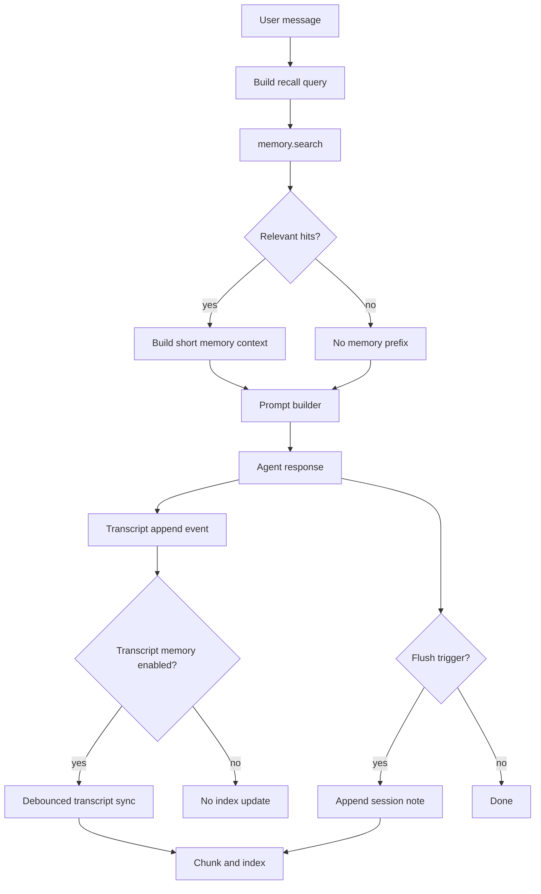

# CodeX-UI-Template 跨 Session 记忆设计参考

这份笔记把 OpenClaw 的跨 session 记忆拆成可以迁移到
CodeX-UI-Template 的设计原则、模块边界和阅读路线。它不是要求照搬
OpenClaw，而是提炼出适合 UI 模板复用的架构形状。

## 核心结论

跨 session 记忆不要设计成“模型隐藏状态”。更稳的做法是：

1. 把长期记忆写进可检查的文件或文档记录。
2. 把可搜索内容同步到索引。
3. 通过明确的 recall API 或工具召回。
4. 在 prompt 构建前注入少量相关摘要。
5. 对 session transcript 记忆保持 opt-in，因为它涉及隐私、体积和时效。

OpenClaw 的实现就是这个方向：`MEMORY.md` 和 `memory/*.md` 是持久层，
SQLite/FTS/embedding 是索引层，`memory_search` 和 `memory_get` 是召回层，
pre-compaction memory flush 是自动落盘层，`active-memory` 是可选的主动召回层。

## 给 CodeX-UI-Template 的推荐架构

### 1. 记忆不是聊天记录本身

UI 里应该区分三类东西：

| 类型 | 作用 | 是否默认召回 | UI 建议 |
| --- | --- | --- | --- |
| 长期记忆 | 用户偏好、长期项目事实、稳定决策 | 是，但只注入摘要 | Memory 页面，可编辑、可删除 |
| 工作记忆 | 当天或最近任务总结、临时观察 | 通过搜索召回 | Session Notes 页面，按日期浏览 |
| Transcript 索引 | 原始对话转成的可搜索材料 | 默认关闭 | 设置页 opt-in，显示隐私提示 |

对 CodeX-UI-Template 来说，MVP 可以先不要做 raw transcript 索引。先支持
长期记忆和工作记忆，后面再加 opt-in transcript search。

### 2. 前端 UI 要暴露记忆状态

记忆系统最容易让用户不安的点是“它到底记了什么”。模板里建议做这些 UI：

- `Memory` 面板：显示长期记忆条目，支持编辑、删除、来源查看。
- `Session Notes` 面板：显示每天的工作记忆，支持搜索和折叠。
- `Memory Search` 命令：输入 query，展示命中片段和来源。
- `Recall Debug` 状态：显示本轮是否召回、召回了几条、是否来自 transcript。
- `Transcript Memory` 开关：默认关闭，开启时说明会索引历史对话。
- `Rebuild Index` 按钮：当索引损坏或用户导入文件后手动重建。

UI 不要只显示“AI 已记住”。最好显示“写到了哪个来源”和“下次如何被召回”。

### 3. 模块边界要分清

可以把 CodeX-UI-Template 的记忆模块拆成下面这些文件或服务：

```text
src/memory/types.ts              # MemorySource, MemoryDocument, MemoryChunk
src/memory/store.ts              # 文件系统、IndexedDB、SQLite 或后端 API 适配
src/memory/indexer.ts            # chunk、hash、增量同步、删除 stale rows
src/memory/search.ts             # keyword、vector、hybrid search
src/memory/session-transcripts.ts # opt-in transcript 解析和清洗
src/memory/flush.ts              # compaction 或 token 阈值前的摘要落盘
src/memory/active-recall.ts      # prompt 前的主动召回
src/components/memory/*          # Memory 面板、搜索结果、索引状态
```

推荐先实现 `store + search + UI`，再做 transcript 和 active recall。

### 4. 先定义小而硬的接口

记忆系统可以先围绕这几个接口做：

```ts
export type MemorySource = "memory" | "sessions";

export type MemoryDocument = {
  path: string;
  source: MemorySource;
  text: string;
  updatedAt: number;
  hash: string;
};

export type MemoryHit = {
  id: string;
  source: MemorySource;
  path: string;
  startLine: number;
  endLine: number;
  score: number;
  text: string;
};

export interface MemoryRuntime {
  sync(options?: { force?: boolean; sources?: MemorySource[] }): Promise<void>;
  search(query: string, options?: {
    sources?: MemorySource[];
    maxResults?: number;
    minScore?: number;
  }): Promise<MemoryHit[]>;
  get(path: string, options?: { from?: number; lines?: number }): Promise<string>;
}
```

这个接口有两个好处：

- UI、agent runtime、索引实现可以分开演进。
- 将来从 IndexedDB 换成 SQLite、LanceDB、远程服务时，不用重写 UI。

### 5. Prompt 注入只放“最少有用内容”

不要把整份记忆、整段历史 transcript 直接塞进 prompt。更好的流程是：

1. 用户发起新消息。
2. 系统判断是否需要 recall。
3. 用最新用户消息和少量上下文生成 search query。
4. `memory.search()` 返回少量命中。
5. 只把摘要或最相关片段 prepend 到 prompt。
6. UI 记录本轮 recall 来源，便于调试。

OpenClaw 的 `active-memory` 是一个更强版本：它用一个轻量 subagent 在主回复前
调用 memory tools，并只返回一段很短的摘要。

### 6. Transcript 记忆必须清洗

如果 CodeX-UI-Template 后面要索引 session transcript，不要直接索引 JSONL 或完整消息。
需要清洗：

- 去掉系统注入的 metadata。
- 去掉 runtime/debug/tool 事件。
- 去掉 cron、heartbeat、silent reply 这类机器消息。
- 对敏感文本做 redact。
- 给每个 chunk 标 source、path、line range、timestamp。

OpenClaw 在这里很谨慎：transcript search 默认关闭，开启后也会异步索引，并且搜索结果可能稍微滞后。

### 7. 自动 flush 要 append-only

当上下文快 compaction、窗口快满、用户要结束 session，系统可以触发一次“memory flush”：

1. 让 agent 总结本轮值得保留的事实。
2. 写入当天的工作记忆文档。
3. 只允许 append，不允许覆盖长期记忆和系统说明。
4. 如果没什么值得保存，返回 silent no-op。

这对 UI 模板很有价值：用户新开 session 后还能找回上个 session 的决策和未完事项，
但不会把整段历史硬塞进下一轮上下文。

## 推荐 MVP 路线

### Phase 1：可编辑长期记忆

- 新增 Memory 页面。
- 支持新增、编辑、删除记忆条目。
- 每条记忆带 `source=memory`、更新时间、来源说明。
- prompt 构建时注入少量长期记忆摘要。

### Phase 2：本地索引和搜索

- 把长期记忆和 session notes 切 chunk。
- 存入 IndexedDB、SQLite 或后端数据库。
- 先做 keyword search，再加 embedding hybrid search。
- 搜索结果在 UI 中显示 path、分数、片段。

### Phase 3：记忆工具化

- 暴露 `memory_search` 和 `memory_get` 给 agent runtime。
- 让模型在回答历史偏好、项目决策、todo 时先 search 再 answer。
- UI 展示本轮使用了哪些 memory hit。

### Phase 4：自动 flush

- 在 token 接近阈值、session 关闭、手动“保存上下文”时运行 flush。
- 只 append 到当天 session note。
- flush 后触发 index sync。

### Phase 5：opt-in transcript memory

- 设置页加入 transcript memory 开关。
- 开启后监听 transcript append event。
- debounce 后增量索引。
- 搜索时允许用户筛选 `memory`、`sessions` 或 `all`。

### Phase 6：主动召回

- 在 prompt build 前运行轻量 recall。
- 只允许调用 memory search/get。
- 召回结果限制长度。
- 如果相关性弱，返回 `NONE`，不注入任何内容。

## OpenClaw 阅读路线

按下面顺序看，最容易把架构串起来。

| 你要理解什么 | 先看哪里 | 重点 |
| --- | --- | --- |
| 记忆产品模型 | `docs/concepts/memory.md:9`、`docs/concepts/memory.md:31`、`docs/concepts/memory.md:109` | 文件化记忆、长期层、工作层、memory tools |
| session memory 配置 | `docs/reference/memory-config.md:410`、`src/agents/memory-search.ts:124`、`src/agents/memory-search.ts:175` | transcript 索引默认关闭，sources 如何归一化 |
| memory 插件入口 | `extensions/memory-core/index.ts:48`、`extensions/memory-core/index.ts:122`、`extensions/memory-core/index.ts:174` | 何时注册工具，如何注册 memory capability |
| runtime 插件选择 | `src/plugins/memory-runtime.ts:9`、`src/plugins/memory-runtime.ts:31`、`src/plugins/memory-runtime.ts:56` | 如何从插件 slot 找到 active memory runtime |
| prompt 召回提示 | `extensions/memory-core/src/prompt-section.ts:3` | 如何告诉模型何时必须 search/get |
| 记忆文件扫描 | `packages/memory-host-sdk/src/host/internal.ts:101`、`packages/memory-host-sdk/src/host/internal.ts:148` | 哪些路径算 memory，如何扫描和去重 |
| 索引 schema | `packages/memory-host-sdk/src/host/memory-schema.ts:12`、`packages/memory-host-sdk/src/host/memory-schema.ts:59` | files、chunks、embedding cache、FTS 表 |
| search tool 执行链 | `extensions/memory-core/src/tools.ts:239`、`extensions/memory-core/src/tools.ts:312`、`extensions/memory-core/src/tools.ts:328` | corpus 参数、manager.search、空结果时 force sync |
| search 算法 | `extensions/memory-core/src/memory/manager.ts:380`、`extensions/memory-core/src/memory/manager.ts:460`、`extensions/memory-core/src/memory/manager.ts:526` | FTS-only、vector、hybrid merge、fallback |
| memory 文件同步 | `extensions/memory-core/src/memory/manager-sync-ops.ts:1131` | 扫描 memory 文件、hash 对比、索引 changed files、清 stale rows |
| transcript 事件 | `src/sessions/transcript-events.ts:23`、`src/config/sessions/transcript.ts:340` | transcript append 后如何通知索引系统 |
| transcript 增量同步 | `extensions/memory-core/src/memory/manager-sync-ops.ts:774`、`extensions/memory-core/src/memory/manager-sync-ops.ts:857`、`extensions/memory-core/src/memory/manager-sync-ops.ts:1208` | listener、debounce、delta 阈值、targeted sync |
| transcript 清洗 | `packages/memory-host-sdk/src/host/session-files.ts:460`、`packages/memory-host-sdk/src/host/session-files.ts:545` | 如何过滤机器消息、redact、生成 line map |
| compaction 前 flush | `extensions/memory-core/src/flush-plan.ts:10`、`extensions/memory-core/src/flush-plan.ts:95`、`src/auto-reply/reply/agent-runner-memory.ts:924`、`src/auto-reply/reply/agent-runner-memory.ts:1118` | 阈值、目标文件、静默 run、触发条件 |
| append-only 写保护 | `src/agents/agent-tools.read.ts:624` | memory flush 期间限制只能 append 到目标文件 |
| compaction 后 session sync | `src/agents/embedded-agent-runner/compaction-hooks.ts:20`、`src/agents/embedded-agent-runner/compaction-hooks.ts:82` | compaction 完成后如何刷新 session memory index |
| 主动召回 | `docs/concepts/active-memory.md:1`、`extensions/active-memory/index.ts:1084`、`extensions/active-memory/index.ts:2446`、`extensions/active-memory/index.ts:3039` | prompt 前 subagent、toolsAllow、prependContext |

## 可以直接借鉴的设计原则

- 记忆要可见：用户应该能看到、编辑和删除长期记忆。
- 召回要有来源：每个 hit 都要能追到文档、行号或消息范围。
- transcript 默认关闭：它是高价值信息，也是高敏感信息。
- 索引可以异步：但 UI 要显示 stale、syncing、failed、ready。
- search API 要支持 corpus：至少支持 `memory`、`sessions`、`all`。
- 写入要保守：自动 flush 只 append 工作记忆，不覆盖 curated memory。
- prompt 注入要短：用 search 和摘要控制上下文预算。
- memory 和 policy 分开：记忆可以提示行为，不能替代权限、审批、sandbox。

## 不建议照搬的部分

- 不要一上来实现完整插件系统。CodeX-UI-Template 可以先用一个内部
  `MemoryRuntime` 接口。
- 不要一开始就做多 backend。先选 IndexedDB 或 SQLite，一个稳定路径跑通。
- 不要默认索引所有 transcript。先做用户可控的长期记忆和 session notes。
- 不要让 UI 只依赖模型自觉 search。关键场景可以在 prompt build 前主动 recall。
- 不要把 OpenClaw 的 gateway、channel、provider 边界原样搬进 UI 模板。模板只需要
  `store -> index -> search -> inject -> inspect` 这一条主链路。

## 一个适合模板的最小数据流



这个流可以保持 UI 可解释，也给后续功能留足空间：你可以先实现
`memory.search` 的 keyword 版本，然后替换成 hybrid search，而不会动到 prompt builder
和 Memory 面板。
