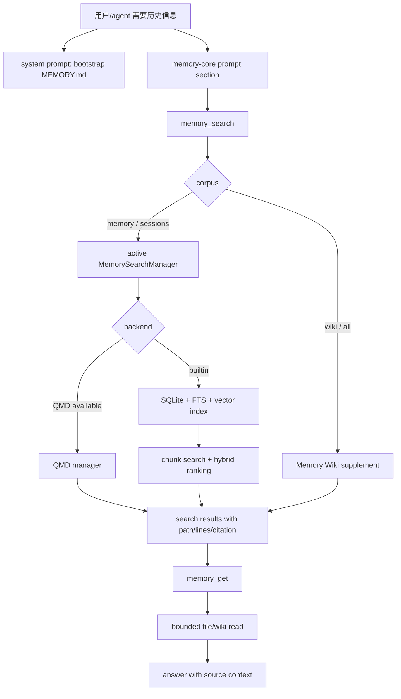

# OpenClaw 记忆系统构建说明

本文说明当前 OpenClaw 记忆系统的组成、读写链路、搜索索引、自动沉淀机制，以及 Memory Wiki 如何接入。说明基于当前本地源码和相关 docs 梳理；涉及代码处均给出 repo-root 文件名和行号。

## 一句话

OpenClaw 的记忆系统不是单个文件或单个工具，而是一组分层机制：

1. 工作区里的 `MEMORY.md`、`memory/**/*.md`、可选 `DREAMS.md` / `dreams.md` 是长期记忆和日常记忆的文件层。
2. `memory-core` 是默认 memory plugin，拥有记忆槽位、提示词、`memory_search` / `memory_get` 工具、索引运行时、flush plan、dreaming。
3. 搜索层用内置 SQLite + FTS + 向量索引，或可配置的 QMD 后端，把记忆文件切块、嵌入、检索、重排。
4. 写入层主要有三条路径：用户/agent 显式写 `memory/*.md`，上下文压缩前的 memory flush，session-memory hook 与 dreaming 的自动整理。
5. Memory Wiki 是附加 corpus，不替代文件记忆；它通过 memory plugin 的 supplement seam 给 `memory_search` / prompt 补充 wiki 结果和摘要。

## 总体层次

| 层 | 作用 | 关键代码 |
| --- | --- | --- |
| 工作区文件层 | 识别 `MEMORY.md`、`memory/`、`DREAMS.md`，控制哪些文件可被索引和读取 | `src/memory/root-memory-files.ts:4-62`, `packages/memory-host-sdk/src/host/internal.ts:101-226` |
| agent bootstrap | 把根级 `MEMORY.md` 作为启动上下文注入系统提示词 | `src/agents/workspace.ts:633-698`, `src/agents/system-prompt.ts:181-217` |
| plugin 槽位 | 默认 memory 槽位指向 `memory-core`，只允许 memory-kind plugin 注册记忆能力 | `src/plugins/slots.ts:17-20`, `src/plugins/registry.ts:2932-3028` |
| memory runtime | 解析 active memory plugin，并暴露 search manager、backend config、prompt section、flush plan | `src/plugins/memory-runtime.ts:9-70`, `src/plugins/memory-state.ts:129-299` |
| memory-core plugin | 注册记忆能力、工具、embedding provider、dreaming、slash/CLI 命令 | `extensions/memory-core/index.ts:174-228` |
| 搜索索引 | 内置索引或 QMD；文件 hash、chunk、FTS、embedding、hybrid ranking | `extensions/memory-core/src/memory/search-manager.ts:151-329`, `extensions/memory-core/src/memory/manager.ts:380-607` |
| 工具层 | `memory_search` 找片段，`memory_get` 读取文件片段 | `extensions/memory-core/src/tools.ts:239-512` |
| 自动沉淀 | compaction flush、session-memory hook、dreaming promotion | `extensions/memory-core/src/flush-plan.ts:10-139`, `src/auto-reply/reply/agent-runner-memory.ts:906-1276`, `src/hooks/bundled/session-memory/handler.ts:138-313`, `extensions/memory-core/src/dreaming.ts:149-937` |

## 1. 文件层：长期记忆与日常记忆

OpenClaw 的根级长期记忆文件是大写的 `MEMORY.md`。代码只把这个精确文件名作为 canonical root memory；小写 `memory.md` 只作为 legacy 名称被识别和排除，不会作为新的 canonical 文件使用。这个约束定义在 `src/memory/root-memory-files.ts:4-62`。

agent 工作区同样把 `MEMORY.md` 纳入 bootstrap 文件集合。`src/agents/workspace.ts:24-31` 定义默认记忆文件名，`src/agents/workspace.ts:145-153` 把它列入 bootstrap 文件名类型，`src/agents/workspace.ts:531-533` 用是否存在 canonical root memory 判断新工作区状态。实际加载时，只有精确命中的 `MEMORY.md` 会被加入 root file entries，见 `src/agents/workspace.ts:633-698`，其中 `src/agents/workspace.ts:668-680` 专门处理 `MEMORY.md`。

搜索索引层允许的记忆路径更宽一些。`packages/memory-host-sdk/src/host/internal.ts:101-110` 规定可被记忆读取/索引的路径包括：

- 根级 `MEMORY.md`
- 根级 `DREAMS.md` / `dreams.md`
- `memory/` 目录下的内容

实际列文件逻辑在 `packages/memory-host-sdk/src/host/internal.ts:148-226`：它会收集 `MEMORY.md`、`memory/` 下的 markdown 和多模态文件、配置里的 `extraPaths`，跳过 symlink，并用 realpath 去重。每个文件会规范成相对路径、stat、hash 和内容标签，见 `packages/memory-host-sdk/src/host/internal.ts:228-303`。

`memory/**/*.md` 通常承载日常、按日期、按主题沉淀的记忆；`DREAMS.md` / `dreams.md` 则是 dreaming narrative 的日记式输出位置，创建和解析逻辑在 `extensions/memory-core/src/dreaming-narrative.ts:104-108` 和 `extensions/memory-core/src/dreaming-narrative.ts:372-385`。

## 2. Bootstrap：根级 MEMORY.md 直接进 prompt

记忆系统有一条很轻的路径：根级 `MEMORY.md` 会作为 workspace bootstrap context 进入 agent 的系统提示词。

`src/agents/embedded-agent-helpers/bootstrap.ts:410-468` 构造注入的 context files，并对单文件和总字符数做 budget 控制。`src/agents/bootstrap-files.ts:326-357` 解析 bootstrap context，并调用 `buildBootstrapContextFiles` 产出上下文文件。

渲染 prompt 时，`src/agents/system-prompt.ts:181-217` 会把这些项目上下文列出来；其中 `src/agents/system-prompt.ts:199-209` 对 `MEMORY.md` 有专门说明，提示模型把它视为持续记忆，而不是普通项目说明文件。

这意味着根级 `MEMORY.md` 有双重身份：

- 作为 bootstrap 上下文，直接被 prompt 读取。
- 作为 memory corpus 的一部分，被 `memory_search` / `memory_get` 索引和读取。

## 3. Plugin 槽位：memory-core 是默认 owner

OpenClaw 把 memory 做成 plugin slot，而不是把所有逻辑写死在 core。默认 slot 定义在 `src/plugins/slots.ts:17-20`，`memory` 槽位默认指向 `memory-core`。配置类型的注释也明确 `plugins.slots.memory` 控制哪个 plugin 拥有 memory slot，`none` 会禁用 memory plugin，见 `src/config/types.plugins.ts:42`。

active memory plugin 的解析在 `src/plugins/memory-runtime.ts:9-70`：

- `src/plugins/memory-runtime.ts:9-20` 根据 `plugins.slots.memory`、plugin enabled 状态和 deny 状态解析 active memory plugin id。
- `src/plugins/memory-runtime.ts:31-54` 确保 active memory runtime 被加载。
- `src/plugins/memory-runtime.ts:56-70` 暴露 active memory search manager 和 backend config resolver。

注册约束在 registry 里。只有 memory-kind plugin 可以注册 memory capability、flush plan 和 runtime；如果一个 plugin 同时有多种 kind，还必须被选中为 memory slot 才能生效。这些边界分别在 `src/plugins/registry.ts:2932-2950`、`src/plugins/registry.ts:2989-3007` 和 `src/plugins/registry.ts:3009-3028`。

memory capability 的宿主类型和注册/解析在 `src/plugins/memory-state.ts:129-299`：

- `src/plugins/memory-state.ts:129-139` 定义 `MemoryPluginCapability`。
- `src/plugins/memory-state.ts:165-184` 注册 active memory capability，并保留只暴露 public artifacts 的桥接能力。
- `src/plugins/memory-state.ts:230-242` 生成 active memory prompt section，并合并排序后的 supplement。
- `src/plugins/memory-state.ts:271-276` 解析 memory flush plan。
- `src/plugins/memory-state.ts:287-299` 注册并解析 active memory runtime。

## 4. memory-core：默认 memory plugin

`memory-core` 的 manifest 在 `extensions/memory-core/openclaw.plugin.json:1-10`。它的 id 是 `memory-core`，kind 是 `memory`，并声明 `memory_get` / `memory_search` 工具。

入口文件是 `extensions/memory-core/index.ts:174-228`。这里注册了 embedding provider、dreaming、memory capability、memory tools 和 slash/CLI 命令。runtime 是 lazy 的，`extensions/memory-core/index.ts:157-173` 会延迟加载 runtime provider；工具定义也延迟加载，见 `extensions/memory-core/index.ts:122-143`，实际工具注册在 `extensions/memory-core/index.ts:194-200`。

memory-core 给模型的提示词在 `extensions/memory-core/src/prompt-section.ts:3-38`。核心意图是：

- 先用 `memory_search` 找候选片段。
- 再用 `memory_get` 按路径和行号读取上下文。
- 回答里尽量引用来源，除非来源引用被关闭。

这段提示词不是唯一的记忆注入：根级 `MEMORY.md` 的 bootstrap prompt 来自 core，而 `memory-core` 的 prompt section 是工具使用策略。`src/agents/system-prompt.ts:264-277` 会在 active memory plugin 存在时加入 memory prompt section；完整系统 prompt wiring 在 `src/agents/system-prompt.ts:949-954`。

如果启用了非 legacy context engine，则 memory prompt 的注入会由 context engine 侧接管。`src/agents/embedded-agent-runner/run/attempt.ts:2468` 禁用旧路径的 memory prompt addition；`src/context-engine/delegate.ts:84-103` 让 context engine 调 active memory plugin 的 prompt builder。

## 5. 搜索后端：QMD 优先，否则内置索引

memory-core 的 runtime provider 在 `extensions/memory-core/src/runtime-provider.ts:9-25`，实际 manager 来自 `extensions/memory-core/src/memory/index.ts:1-13`。

搜索 manager 的选择逻辑在 `extensions/memory-core/src/memory/search-manager.ts:151-329`：

- 如果配置了 QMD 且可用，就使用 QMD manager。
- QMD 支持状态/CLI 的 transient manager，也支持缓存的进程级 manager。
- 如果 QMD 不可用或没有启用，则 fallback 到内置 `MemoryIndexManager`，见 `extensions/memory-core/src/memory/search-manager.ts:317-329`。

QMD 默认 collection 包括根级 `MEMORY.md` 和 `memory/**/*.md`，见 `packages/memory-host-sdk/src/host/backend-config.ts:364-383`。更完整的 backend config 解析，包括 qmd command、collections、extraPaths、session config、update settings，在 `packages/memory-host-sdk/src/host/backend-config.ts:385-473`。

内置 manager 的核心字段定义在 `extensions/memory-core/src/memory/manager.ts:120-185`：它持有 workspace、settings、embedding provider、SQLite DB、source 状态、vector 状态、FTS 状态、dirty/session 状态等。`extensions/memory-core/src/memory/manager.ts:199-228` 是缓存的 `MemoryIndexManager.get`，当 memory search 配置禁用时返回 null。构造函数会打开数据库、建 schema、启动 watcher/session listener/interval sync，并标记初始 dirty 状态，见 `extensions/memory-core/src/memory/manager.ts:231-285`。

## 6. 索引构建：文件、chunk、FTS、embedding

内置索引的数据表在 `packages/memory-host-sdk/src/host/memory-schema.ts:4-90`，包括：

- `meta`
- `files`
- `chunks`
- optional embedding cache
- FTS5 table
- 辅助 indexes

markdown chunking 在 `packages/memory-host-sdk/src/host/internal.ts:371-455`。它按 token 估算切块，保留 line range，处理 overlap，并避免 CJK 和 surrogate pair 被粗暴切坏。

文件同步和 watcher 在 `extensions/memory-core/src/memory/manager-sync-ops.ts`：

- `extensions/memory-core/src/memory/manager-sync-ops.ts:456-530` 监听 `MEMORY.md`、`memory/` 和 `extraPaths`，macOS/Windows 使用原生 recursive watcher，其他情况 fallback 到 chokidar。
- `extensions/memory-core/src/memory/manager-sync-ops.ts:1131-1205` 根据 hash 同步 memory 文件，索引变化文件，并 prune stale rows。
- `extensions/memory-core/src/memory/manager-sync-ops.ts:1230-1308` 在 sessions source 启用时同步 transcript entries。
- `extensions/memory-core/src/memory/manager-sync-ops.ts:1403-1523` 是总的 sync orchestration，包括 semantic index guard、vector extension 加载、targeted session sync、全量/增量 reindex 决策。

embedding 写入在 `extensions/memory-core/src/memory/manager-embedding-ops.ts`：

- `extensions/memory-core/src/memory/manager-embedding-ops.ts:178-229` 分批 embedding chunks，使用 embedding cache，并在 provider 支持时处理结构化/多模态输入。
- `extensions/memory-core/src/memory/manager-embedding-ops.ts:707-790` 是 `indexFile`。没有 provider 时走 FTS-only；FTS-only 下跳过多模态；有 provider 时 chunk、检查 provider input caps、embedding、准备 vector、写 chunks。

## 7. 检索：FTS + 向量 + hybrid ranking

内置 `search()` 在 `extensions/memory-core/src/memory/manager.ts:380-607`。流程大致是：

1. 如果索引为空，做 bootstrap sync。
2. 做 preflight 和 provider 初始化。
3. 没有 embedding provider 时走 keyword-only / FTS-only。
4. 有 provider 时并行取关键词结果和向量结果，然后 hybrid merge。
5. 应用 temporal decay、MMR、fallback。

FTS-only 路径在 `extensions/memory-core/src/memory/manager.ts:460-524`。如果精确 AND 查询没有结果，会按关键词放宽召回。带 provider 的 hybrid 路径在 `extensions/memory-core/src/memory/manager.ts:526-584`。如果 hybrid 加权后丢掉所有 FTS 命中，会保留 FTS fallback，见 `extensions/memory-core/src/memory/manager.ts:590-606`。

FTS 查询构造在 `extensions/memory-core/src/memory/hybrid.ts:31-38`，会构造 quoted AND query。hybrid 合并在 `extensions/memory-core/src/memory/hybrid.ts:51-155`，核心分数是：

```text
score = vectorWeight * vectorScore + textWeight * textScore
```

随后会叠加 temporal decay 和可选 MMR。默认 temporal decay 是关闭的，半衰期 30 天，见 `extensions/memory-core/src/memory/temporal-decay.ts:9-12`。根级 `MEMORY.md` 和非日期 memory path 被当作 evergreen，不参与衰减，见 `extensions/memory-core/src/memory/temporal-decay.ts:71-80`。

默认搜索配置在 `src/agents/memory-search.ts:110-123`：默认结果数 6、最小分数 0.35、向量/文本 hybrid 权重 0.7/0.3、默认 source 是 memory、默认 provider 是 OpenAI。`src/agents/memory-search.ts:181-188` 把默认/auto provider 映射到 OpenAI；`src/agents/memory-search.ts:431-460` 解析最终 config，并处理禁用、multimodal 支持和 fallback 兼容性。

## 8. 工具层：memory_search 与 memory_get

工具 schema 在 `extensions/memory-core/src/tools.shared.ts:31-43`。工具上下文解析在 `extensions/memory-core/src/tools.shared.ts:45-94`，会结合 config、session agent 和 `resolveMemorySearchConfig` 找到 manager。工具只在 memory 配置可用时创建，见 `extensions/memory-core/src/tools.shared.ts:96-118`。不可用时返回带 provider/quota action 的结构化说明，见 `extensions/memory-core/src/tools.shared.ts:120-142`。

`memory_search` 实现在 `extensions/memory-core/src/tools.ts:239-425`。它的几个关键点：

- `extensions/memory-core/src/tools.ts:260-268` 根据 corpus 分发：`memory`、`wiki`、`all`、`sessions`。
- `extensions/memory-core/src/tools.ts:328-344` 调 manager search；如果 manager closed 会 retry，如果空结果可触发 forced sync。
- `extensions/memory-core/src/tools.ts:345-356` 做 session visibility/source filter。
- `extensions/memory-core/src/tools.ts:368-375` 在 dreaming 启用时，把短期 recall 记录排队，供后续 promotion 使用。
- `extensions/memory-core/src/tools.ts:394-410` 合并 memory 和 supplement 结果。

`memory_get` 实现在 `extensions/memory-core/src/tools.ts:428-512`。内置路径通过 SDK 的 `readAgentMemoryFile` 读取，QMD 通过 manager 读取，wiki corpus 通过 supplement 读取。默认读取上限是 120 行 / 12000 字符，见 `packages/memory-host-sdk/src/host/read-file-shared.ts:3-4`；切片和 truncation 逻辑在 `packages/memory-host-sdk/src/host/read-file-shared.ts:50-87`。

普通文件读取有安全限制：`packages/memory-host-sdk/src/host/read-file.ts:60-145` 校验路径必须在 memory paths 或配置的 extraPaths 下，拒绝非 markdown，安全读取后返回 bounded result。agent wrapper 在 `packages/memory-host-sdk/src/host/read-file.ts:147-168` 负责套入 workspace、extraPaths 和 context limit。QMD 的 bounded read 在 `extensions/memory-core/src/memory/qmd-manager.ts:1320-1365`。

工具目录会把 `memory_search` / `memory_get` 归类成 memory tools，见 `src/agents/tool-catalog.ts:129-142`。

## 9. 写入与沉淀路径

### 9.1 普通写入

普通 agent 可以通过常规文件工具写 `memory/*.md` 或根级 `MEMORY.md`，随后 watcher/sync 会把变化纳入索引。索引 watcher 路径见 `extensions/memory-core/src/memory/manager-sync-ops.ts:456-530`。

### 9.2 Compaction 前的 memory flush

memory-core 提供 compaction flush plan。默认策略在 `extensions/memory-core/src/flush-plan.ts:10-18`：flush 目标是 `memory/YYYY-MM-DD.md`，追加写入，根文件只读。默认 prompt 和 system prompt 在 `extensions/memory-core/src/flush-plan.ts:25-41`。`extensions/memory-core/src/flush-plan.ts:95-139` 根据配置计算是否启用、阈值、日期路径、prompt/system prompt、model override。

自动回复链路里，`src/auto-reply/reply/memory-flush.ts:135-160` 根据 context threshold 和当前 compaction cycle 是否已 flush 判断是否运行；`src/auto-reply/reply/memory-flush.ts:184-190` 是 already-flushed gate。

真正的 flush 调度在 `src/auto-reply/reply/agent-runner-memory.ts:906-1276`：

- `src/auto-reply/reply/agent-runner-memory.ts:906-927` 解析 memory flush plan，没有 plan 就跳过。
- `src/auto-reply/reply/agent-runner-memory.ts:929-945` 要求可写、非 heartbeat、非 CLI provider。
- `src/auto-reply/reply/agent-runner-memory.ts:949-977` 计算 context window 和 threshold。
- `src/auto-reply/reply/agent-runner-memory.ts:993-1018` 可选读取 transcript，并可按字节大小强制 flush。
- `src/auto-reply/reply/agent-runner-memory.ts:1095-1111` 做最终是否 flush 的决策。
- `src/auto-reply/reply/agent-runner-memory.ts:1133-1143` 解析当天目标文件并确保存在。
- `src/auto-reply/reply/agent-runner-memory.ts:1153-1233` 启动静默 embedded memory-triggered agent turn。
- `src/auto-reply/reply/agent-runner-memory.ts:1199-1201` 设置 trigger 为 `memory`，并传入 `memoryFlushWritePath`。
- `src/auto-reply/reply/agent-runner-memory.ts:1268-1276` 标记本 compaction count 已 flush。

memory-triggered agent 只能读和追加写。`src/agents/agent-tools.ts:109` 限制 memory flush run 只允许 read/write tools；`src/agents/agent-tools.ts:478-482` 要求 memory-triggered tool construction 必须有 `memoryFlushWritePath`；`src/agents/agent-tools.ts:982-1008` 暴露 read 加 append-only wrapped write。append-only write wrapper 在 `src/agents/agent-tools.read.ts:624-670`，它强制只能写精确目标路径，并把内容 append 进去。

### 9.3 session-memory hook

OpenClaw 还内置了一个 `session-memory` hook，用来在新命令或 reset 时从上一段 session 抽取最近消息，写入 `memory/YYYY-MM-DD-HHMM.md`。hook 元数据和说明在 `src/hooks/bundled/session-memory/HOOK.md:1-29`，配置项在 `src/hooks/bundled/session-memory/HOOK.md:60-68`，其中 `messages` 默认 15，`llmSlug` 默认 false。

handler 逻辑在 `src/hooks/bundled/session-memory/handler.ts`：

- `src/hooks/bundled/session-memory/handler.ts:138-160` 解析 workspace/memory dir 并创建目录。
- `src/hooks/bundled/session-memory/handler.ts:207-219` 读取配置里的 message count，并抽取最近 session 内容。
- `src/hooks/bundled/session-memory/handler.ts:225-238` 可选用 LLM 生成 slug。
- `src/hooks/bundled/session-memory/handler.ts:241-253` 使用 timestamp slug 和 unique filename 兜底。
- `src/hooks/bundled/session-memory/handler.ts:262-281` 通过 safe root 写 markdown entry。
- `src/hooks/bundled/session-memory/handler.ts:300-313` 只在 `new` 或 `reset` 事件里异步触发 housekeeping。

### 9.4 Dreaming：从短期 recall 晋升到长期记忆

Dreaming 是更主动的自动整理机制。managed cron job 的描述和 payload 在 `extensions/memory-core/src/dreaming.ts:149-178`，目标是把加权的短期 recall 晋升到 `MEMORY.md`，并且不向用户发普通 delivery。

主处理器在 `extensions/memory-core/src/dreaming.ts:485-683`。它会解析 workspaces、运行 sweep phases、修复 store、排名候选、应用 promotions、写 deep report，并可选写 dream narrative。关键步骤：

- `extensions/memory-core/src/dreaming.ts:546-560` 加载 phase 和 promotion 模块。
- `extensions/memory-core/src/dreaming.ts:564-572` 运行 `runDreamingSweepPhases`。
- `extensions/memory-core/src/dreaming.ts:582-591` 排名候选。
- `extensions/memory-core/src/dreaming.ts:608-620` 把 promotion 应用到 `MEMORY.md`。

dreaming 的 gateway/start 和 before-agent-reply 触发注册在 `extensions/memory-core/src/dreaming.ts:685-937`；gateway_start reconcile 在 `extensions/memory-core/src/dreaming.ts:876-893`，heartbeat/cron trigger 处理在 `extensions/memory-core/src/dreaming.ts:899-936`。system event token 的精确匹配逻辑在 `extensions/memory-core/src/dreaming-shared.ts:12-31`。

Dreaming phases 在 `extensions/memory-core/src/dreaming-phases.ts`：

- light phase 在 `extensions/memory-core/src/dreaming-phases.ts:1574-1671`：摄入 daily/session signals，过滤 recent recalls，去重，写 light block，记录 signals，可选 narrative。
- REM phase 在 `extensions/memory-core/src/dreaming-phases.ts:1673-1786`：摄入 signals，优先 light-staged keys，构建 preview/reflections/truth candidates，写 REM block，记录 signals，可选 narrative。
- sweep orchestration 在 `extensions/memory-core/src/dreaming-phases.ts:1788-1831`，按启用状态运行 light 和 REM。

markdown 输出在 `extensions/memory-core/src/dreaming-markdown.ts`：`extensions/memory-core/src/dreaming-markdown.ts:58-122` 写 daily memory 内联 light/REM block 或 separate report；`extensions/memory-core/src/dreaming-markdown.ts:124-148` 写 separate deep report。

短期 recall 到长期 promotion 的评分和应用在 `extensions/memory-core/src/short-term-promotion.ts`：

- `extensions/memory-core/src/short-term-promotion.ts:22-37` 识别 daily memory paths，并定义 `.dreams` store、phase-signal、lock 路径。
- `extensions/memory-core/src/short-term-promotion.ts:29-31` 定义默认阈值：minScore 0.75、minRecallCount 3、minUniqueQueries 2。
- `extensions/memory-core/src/short-term-promotion.ts:61-68` 定义权重：frequency 0.24、relevance 0.3、diversity 0.15、recency 0.15、consolidation 0.1、conceptual 0.06。
- `extensions/memory-core/src/short-term-promotion.ts:1323-1445` 计算 signalCount、avgScore、frequency/diversity/recency/consolidation/conceptual、phase boost，并按阈值过滤排序。
- `extensions/memory-core/src/short-term-promotion.ts:1460-1470` 读取 short-term entries，仅处理 memory source。
- `extensions/memory-core/src/short-term-promotion.ts:1523-1560` 用 live file snippets 重新定位候选 range。
- `extensions/memory-core/src/short-term-promotion.ts:1704-1835` 应用 promotions：过滤候选、从 live daily files rehydrate、用 promotion marker 避免重复、把 `MEMORY.md` 压到预算内、写 header/section、标记已 promotion、发事件。

## 10. Memory Wiki：附加 corpus 与 prompt digest

Memory Wiki 是另一个 plugin，不是 `memory-core` 的替代品。它通过 memory supplement seam 接入。

manifest 在 `extensions/memory-wiki/openclaw.plugin.json:1-10`，bridge 和 prompt digest UI hint 在 `extensions/memory-wiki/openclaw.plugin.json:29-44`。入口 `extensions/memory-wiki/index.ts:15-63` 注册 prompt supplement、corpus supplement、gateway methods、wiki tools、CLI；其中 `extensions/memory-wiki/index.ts:23-26` 是 prompt/corpus supplement 的注册。

corpus supplement 实现位于 `extensions/memory-wiki/src/corpus-supplement.ts:5-36`，给 memory search 提供 wiki search/get。memory-core 侧的 supplement search helper 在 `extensions/memory-core/src/tools.shared.ts:144-170`；当 corpus 是 memory 或 sessions 时会跳过 wiki supplement，否则允许 `wiki` / `all` 聚合。

Memory Wiki 还可以把编译好的 wiki digest 注入 prompt。digest 路径和 caps 在 `extensions/memory-wiki/src/prompt-section.ts:6-9`；`extensions/memory-wiki/src/prompt-section.ts:97-130` 会从 `.openclaw-wiki/cache/agent-digest.json` 读取并渲染 prompt section。compile 输出路径定义在 `extensions/memory-wiki/src/compile.ts:45-53`，完整 compile 流程在 `extensions/memory-wiki/src/compile.ts:1299-1370`，包括初始化 vault、读取 summaries、刷新 related/dashboard pages、写 agent digest artifacts 和 indexes/logs。

公共 memory artifacts 的暴露由 memory-core 走 host core。`extensions/memory-core/src/public-artifacts.ts:7-10` 把能力委托给 host；`src/plugin-sdk/memory-host-core.ts:35-88` 会列出 workspace 的 root memory、daily notes / dream reports、event log，`src/plugin-sdk/memory-host-core.ts:90-104` 支持跨 dreaming workspaces 列 artifacts。

## 11. 请求路径示意



## 12. 关键设计点

1. Core 不直接拥有具体记忆策略。Core 提供 slot、prompt 注入点、tool catalog、workspace bootstrap 和安全文件读写；默认策略由 `memory-core` plugin 提供。
2. `MEMORY.md` 是最稳定、最全局的长期记忆入口。它既参与 bootstrap，也参与索引，还会被 dreaming promotion 更新。
3. `memory/` 是追加式和日常式记忆区域。compaction flush、session-memory hook、dreaming light/REM block 都倾向于写这里。
4. 搜索是 hybrid 的。没有 embedding provider 时退化到 FTS-only；有 provider 时用向量和关键词合并，并带 fallback。
5. 自动写入有边界。memory flush 只能 append 到当天目标文件；session-memory hook 写唯一 markdown；dreaming 用 promotion markers 和 live rehydrate 降低重复/过期风险。
6. Wiki 是 supplement，不是主记忆存储。它能参与 `memory_search` 的 `wiki` / `all` corpus，也能把 digest 放进 prompt，但长期文件记忆仍由 `MEMORY.md` 和 `memory/` 承担。

## 13. 代码索引

| 主题 | 文件与行号 |
| --- | --- |
| canonical `MEMORY.md` 与 legacy 排除 | `src/memory/root-memory-files.ts:4-62` |
| workspace bootstrap 文件集合 | `src/agents/workspace.ts:24-31`, `src/agents/workspace.ts:145-153`, `src/agents/workspace.ts:633-698` |
| bootstrap context budget | `src/agents/embedded-agent-helpers/bootstrap.ts:410-468`, `src/agents/bootstrap-files.ts:326-357` |
| 系统 prompt 注入 | `src/agents/system-prompt.ts:181-217`, `src/agents/system-prompt.ts:264-277`, `src/agents/system-prompt.ts:949-954` |
| memory slot 默认值 | `src/plugins/slots.ts:17-20`, `src/config/types.plugins.ts:42` |
| active memory runtime | `src/plugins/memory-runtime.ts:9-70` |
| memory capability / flush / runtime registry | `src/plugins/memory-state.ts:129-299`, `src/plugins/registry.ts:2932-3028` |
| memory-core plugin 入口 | `extensions/memory-core/openclaw.plugin.json:1-10`, `extensions/memory-core/index.ts:122-228` |
| memory-core prompt section | `extensions/memory-core/src/prompt-section.ts:3-38` |
| QMD / builtin manager 选择 | `extensions/memory-core/src/memory/search-manager.ts:151-329` |
| builtin manager 构造与 search | `extensions/memory-core/src/memory/manager.ts:120-285`, `extensions/memory-core/src/memory/manager.ts:380-607` |
| backend config | `packages/memory-host-sdk/src/host/backend-config.ts:364-473` |
| 文件收集与 chunking | `packages/memory-host-sdk/src/host/internal.ts:101-303`, `packages/memory-host-sdk/src/host/internal.ts:371-455` |
| SQLite schema | `packages/memory-host-sdk/src/host/memory-schema.ts:4-90` |
| watcher 与 sync | `extensions/memory-core/src/memory/manager-sync-ops.ts:456-530`, `extensions/memory-core/src/memory/manager-sync-ops.ts:1131-1523` |
| embedding/index file | `extensions/memory-core/src/memory/manager-embedding-ops.ts:178-229`, `extensions/memory-core/src/memory/manager-embedding-ops.ts:707-790` |
| hybrid ranking | `extensions/memory-core/src/memory/hybrid.ts:31-155`, `extensions/memory-core/src/memory/temporal-decay.ts:9-80` |
| memory search config | `src/agents/memory-search.ts:110-123`, `src/agents/memory-search.ts:181-188`, `src/agents/memory-search.ts:431-460` |
| tools schema/context | `extensions/memory-core/src/tools.shared.ts:31-170` |
| `memory_search` / `memory_get` | `extensions/memory-core/src/tools.ts:239-512` |
| bounded read | `packages/memory-host-sdk/src/host/read-file-shared.ts:3-87`, `packages/memory-host-sdk/src/host/read-file.ts:60-168`, `extensions/memory-core/src/memory/qmd-manager.ts:1320-1365` |
| flush plan | `extensions/memory-core/src/flush-plan.ts:10-139` |
| compaction flush runner | `src/auto-reply/reply/memory-flush.ts:135-190`, `src/auto-reply/reply/agent-runner-memory.ts:906-1276` |
| flush write tool 限制 | `src/agents/agent-tools.ts:109`, `src/agents/agent-tools.ts:478-482`, `src/agents/agent-tools.ts:982-1008`, `src/agents/agent-tools.read.ts:624-670` |
| session-memory hook | `src/hooks/bundled/session-memory/HOOK.md:1-68`, `src/hooks/bundled/session-memory/handler.ts:138-313` |
| dreaming 调度与处理 | `extensions/memory-core/src/dreaming.ts:149-937`, `extensions/memory-core/src/dreaming-shared.ts:12-31` |
| dreaming phases | `extensions/memory-core/src/dreaming-phases.ts:1574-1831` |
| dreaming markdown/narrative | `extensions/memory-core/src/dreaming-markdown.ts:58-148`, `extensions/memory-core/src/dreaming-narrative.ts:104-108`, `extensions/memory-core/src/dreaming-narrative.ts:372-385`, `extensions/memory-core/src/dreaming-narrative.ts:710-741`, `extensions/memory-core/src/dreaming-narrative.ts:1040-1075` |
| short-term promotion | `extensions/memory-core/src/short-term-promotion.ts:22-68`, `extensions/memory-core/src/short-term-promotion.ts:1323-1835` |
| Memory Wiki supplement | `extensions/memory-wiki/openclaw.plugin.json:1-44`, `extensions/memory-wiki/index.ts:15-63`, `extensions/memory-wiki/src/corpus-supplement.ts:5-36`, `extensions/memory-wiki/src/prompt-section.ts:6-130`, `extensions/memory-wiki/src/compile.ts:45-53`, `extensions/memory-wiki/src/compile.ts:1299-1370` |
| public memory artifacts | `extensions/memory-core/src/public-artifacts.ts:7-10`, `src/plugin-sdk/memory-host-core.ts:35-104` |
