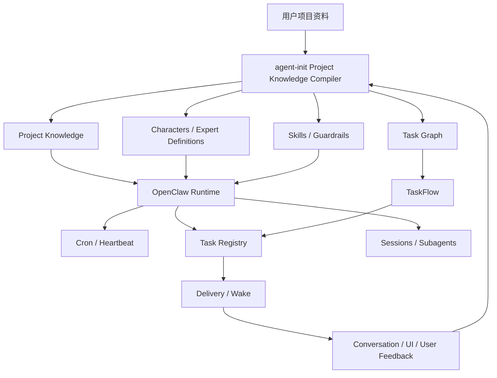

# agent-init 三张图与 OpenClaw Runtime 对比参考

## 文档目的

本文用于对比 `agent-init/prd/` 中三张概念图与 OpenClaw 的工程实现方式：

- `AGI.png`：用户目标、管理角色、执行角色、对话面板、结果与反馈。
- `Model.png`：任务/目标、短期记忆、长期记忆、规划/评估/反思、执行、Guardrails、输出回写。
- `Character.png`：角色内部的任务模型、优先级模型、执行模型、测试任务、短期记忆、长期记忆和外部信息闭环。

核心结论：

> agent-init 更像“智能体闭环的概念模型与项目初始化方法论”；OpenClaw 更像“让这个闭环长期、可靠、可恢复运行的 agent runtime”。

两者不是竞争关系，更适合组合：

```text
agent-init 负责生成清晰的项目智能体系统
OpenClaw 负责让这个系统长期运行、调度、恢复和投递
```

## 一、总体对比

| 维度 | agent-init 三张图 | OpenClaw |
| --- | --- | --- |
| 核心定位 | 智能体闭环模型、项目初始化脚手架、文档驱动生成系统 | 多会话、多任务、长期运行、调度、投递和恢复 runtime |
| 主要问题 | 一个项目如何生成自己的 AgentOS 闭环 | 一个 agent 系统如何可靠运行很久 |
| 表达方式 | 图、PRD、GOAL、Project Knowledge、Characters、Skills、Guardrails | Cron、Heartbeat、Task Registry、TaskFlow、Subagents、Sessions、Delivery |
| 智能结构 | 管理角色 + 执行角色 + 记忆 + 反馈 + 测试 | Main session + subagent sessions + task records + flow state + wake events |
| 任务模型 | TODO、Task Graph、任务模型、优先级模型 | Background Tasks、TaskFlow、cron run history |
| 记忆模型 | 短期记忆、长期记忆、Project Knowledge、learnings、logs | session transcript、bootstrap files、task registry、cron state、heartbeat state |
| 自主性来源 | Project Knowledge、Skills、Characters、Guardrails、self-improvement | durable state、scheduler、heartbeat wake、subagent completion delivery |
| 最大优势 | 目标、知识、角色、Skill 的生成顺序和概念边界清楚 | 长任务、后台任务、恢复、投递、并发和权限边界成熟 |

## 二、三张图到 OpenClaw 的映射

### 1. `AGI.png`：目标到执行角色的闭环

`AGI.png` 描述的是一个完整 agent 系统：

```text
用户输入目标
  -> 管理角色拆分任务
  -> 执行角色并行或分工执行
  -> 对话面板展示流程、进度、结果、Bug
  -> 输出结果
  -> 用户反馈修正
```

OpenClaw 中对应的工程实现：

| `AGI.png` 概念 | OpenClaw 对应 |
| --- | --- |
| 用户输入目标 | channel message、chat turn、cron event、webhook、system event |
| 管理角色 | main session、orchestrator prompt、session tools |
| 执行角色 | `sessions_spawn` subagent、ACP agent、isolated cron session |
| 任务列表 | background task records、TaskFlow state、cron run history |
| 对话面板 | session transcript、task status、delivery events、CLI/status |
| 提交执行结果 | subagent completion、task terminal update、agent final response |
| 根据测试结果提供新任务列表 | TaskFlow resume、heartbeat wake、new system event |
| 用户审视和中途修改 | interactive chat、approval、permission prompt、task cancel |
| 输出结果 | direct delivery、session queued event、message tool、fallback announce |

OpenClaw 的关键补充是：它把“管理角色等待执行角色结果”做成了事件驱动，而不是让管理角色一直轮询。

```text
subagent / cron / background run 完成
  -> task registry 更新状态
  -> delivery 或 heartbeat wake
  -> 父会话继续下一步
```

### 2. `Model.png`：模型内部闭环

`Model.png` 里的结构可以理解为：

```text
任务/目标 + 短期记忆 + 长期记忆
  -> 预测/规划
  -> LLM Prompt 元认知：自我评估、反思调整
  -> 执行
  -> Guardrails
  -> 输出结果
  -> 回写记忆
```

OpenClaw 的对应方式不是训练一个新的 RNN/Transformer 模块，而是把这些能力外化为 runtime 层：

| `Model.png` 概念 | OpenClaw 对应 |
| --- | --- |
| 任务、目标等数据 | user prompt、system event、cron payload、TaskFlow goal/currentStep |
| 短时记忆 | current session transcript、tool outputs、run state |
| 长时记忆 | workspace bootstrap files、session store、task registry、cron jobs/state、HEARTBEAT.md |
| RNN + Transformer 预测能力 | agent planning、model reasoning、system prompt policy |
| LLM Prompt 元认知 | system prompt、heartbeat prompt、subagent prompt、tool guidance |
| 执行 | tools、MCP、filesystem、browser、CLI、message delivery |
| Guardrails | sandbox、tool policy、approval、timeouts、channel allowlists、permission modes |
| 输出结果 | final assistant message、delivery payload、task summary |
| 输出回写 | task terminal record、flow state update、session transcript、memory/document edits |

agent-init 讲的是“模型内部应该有这些模块”；OpenClaw 的做法是“不要把所有模块塞进模型内部，而是让 runtime 承担状态、调度、权限和恢复”。

这点很关键：

```text
模型负责判断下一步
runtime 负责保存状态、控制边界、再次唤醒和交付结果
```

### 3. `Character.png`：角色内部任务循环

`Character.png` 是三张图里最接近今天 agent loop 的一张。

它描述了角色内部：

- 接收目标或任务列表。
- 任务模型拆解和记录目标。
- 查询长期记忆和外部信息。
- 任务优先级模型决定执行顺序。
- 执行模型处理任务。
- 生成测试任务。
- 测试不通过时把结果和 Bug 写入短期记忆。
- 成功后输出结果并保存经验。

这可以直接翻译成：

```text
Plan -> Retrieve -> Act -> Verify -> Reflect -> Persist
```

OpenClaw 对应的实现形态：

| `Character.png` 概念 | OpenClaw 对应 |
| --- | --- |
| 输入、修改目标或任务列表 | chat input、system event、cron trigger、TaskFlow resume |
| 任务模型 | orchestrator agent、TaskFlow currentStep/state |
| 任务优先级模型 | agent planning、TaskFlow step selection、cron schedule priority |
| 执行模型 | tools、subagent run、isolated cron run |
| 测试任务 | tests、review agent、verification step、manual approval |
| 短期记忆 | current session, run transcript, pending task state |
| 长期记忆 | Project Knowledge、workspace docs、session store、task history |
| 外部信息 | web、MCP、browser、filesystem、channels、APIs |
| 测试失败回写 | task error、flow blocked state、logs、system event |
| 全部完成输出 | task terminal update、flow finish、delivery |

## 三、相同点

### 1. 都把 agent 看成闭环系统

两者都不是“用户问一句，模型答一句”的简单聊天模型。

它们都包含：

- 目标输入。
- 任务拆解。
- 执行角色。
- 外部工具。
- 记忆。
- 验证。
- 反馈。
- 结果回写。

### 2. 都承认长期记忆不能只是上下文窗口

agent-init 把长期记忆拆成：

- `Project Knowledge/`
- `MEMORY.md`
- `memory/YYYY-MM-DD.md`
- `.learnings/`
- `.log/`

OpenClaw 把长期状态拆成：

- session transcript。
- cron job definitions。
- cron runtime state。
- background task registry。
- TaskFlow state。
- `HEARTBEAT.md`。
- workspace bootstrap files。

共同点是：长期性来自外部状态，而不是来自一次模型调用。

### 3. 都需要管理角色和执行角色

agent-init 的说法是：

```text
管理角色 -> 执行角色1 / 执行角色2 / ...
```

OpenClaw 的实现是：

```text
main session / orchestrator
  -> sessions_spawn
  -> subagent / ACP / isolated cron session
  -> completion delivery
```

### 4. 都强调 Guardrails

agent-init 偏文档和规则层：

- 来源边界。
- 生成边界。
- 确认边界。
- Agent/Skill 边界。
- 记忆与改进边界。

OpenClaw 偏 runtime 层：

- sandbox。
- tool allow/deny policy。
- approvals。
- timeout。
- delivery allowlists。
- session visibility。
- cancellation。

这两类 Guardrails 应该合并，而不是二选一。

## 四、关键差异

### 1. agent-init 是认知架构，OpenClaw 是运行时架构

agent-init 更关心：

- 项目知识如何编译。
- 角色如何设计。
- Skills 如何从角色和知识反推。
- Guardrails 如何从文档和经验提取。
- learning 如何提升为长期规则。

OpenClaw 更关心：

- 任务什么时候运行。
- 运行状态如何保存。
- 后台任务如何完成后通知。
- 子 agent 如何隔离运行。
- session 如何恢复。
- cron/heartbeat 如何避免重复和冲突。
- 权限和 sandbox 如何约束工具。

### 2. agent-init 的任务还偏文档，OpenClaw 的任务已经是账本

agent-init 里的任务主要落在：

- `TODO.md`
- Task Graph 设想。
- 角色任务模型。
- Skill requirement。

OpenClaw 里的任务是 durable record：

- task id。
- run id。
- status。
- runtime。
- requester。
- child session。
- delivery policy。
- terminal summary。
- cleanup time。

这意味着 OpenClaw 可以回答：

- 哪个后台任务正在跑？
- 哪个任务失败了？
- 是谁启动的？
- 结果投递了吗？
- 网关重启后这个任务是否丢失？

agent-init 如果要长期运行，应该补这个层。

### 3. agent-init 强调 Project Knowledge，OpenClaw 更强调 session/runtime

agent-init 的优势是“项目理解”：

```text
Project Knowledge/INDEX.md
Project Knowledge/KNOWLEDGE.md
Project Knowledge/GUARDRAILS.md
Project Knowledge/expert-definitions/
```

OpenClaw 的优势是“运行系统”：

```text
cron
heartbeat
tasks
taskflow
sessions
subagents
delivery
```

理想组合应该是：

```text
Project Knowledge 决定 agent 应该怎么做
OpenClaw Runtime 决定 agent 如何长期可靠地做
```

### 4. agent-init 的验证是概念一等公民，OpenClaw 的验证更多靠任务和工具组合

`Character.png` 很明确地把测试任务放进角色内部循环。

OpenClaw 有工具执行、测试命令、review 子任务和 TaskFlow step，但“Quality Guardian”不是一个默认顶层抽象。它可以从 agent-init 借鉴这一点，把验证步骤更产品化、更标准化。

## 五、agent-init 值得参考 OpenClaw 的地方

### 1. 引入 durable task registry

agent-init 的 `TODO.md` 和未来 Task Graph 不应该承担所有运行态。

建议增加类似结构：

```ts
type AgentTaskStatus =
  | 'queued'
  | 'running'
  | 'waiting'
  | 'succeeded'
  | 'failed'
  | 'timed_out'
  | 'cancelled'
  | 'lost'

interface AgentTaskRunRecord {
  taskId: string
  runId: string
  source: 'todo' | 'task-graph' | 'skill' | 'subagent' | 'heartbeat' | 'cron'
  owner: string
  title: string
  status: AgentTaskStatus
  currentStep?: string
  childSessionKey?: string
  parentFlowId?: string
  summary?: string
  error?: string
  createdAt: number
  startedAt?: number
  completedAt?: number
}
```

`TODO.md` 适合做人类可读的当前任务窗口；task registry 适合做机器可恢复的运行账本。

### 2. 区分 Cron 和 Heartbeat

agent-init 的自我优化、学习提升和持续检查，不应该全部塞进同一种“自动任务”。

可以拆成：

| 类型 | 适合做什么 |
| --- | --- |
| Cron | 固定时间、固定间隔、明确任务、一次性提醒 |
| Heartbeat | 常驻检查、轻量自检、发现需要推进的 flow |
| TaskFlow | 多步骤目标、等待、恢复、取消、子任务协调 |

### 3. 用 TaskFlow 承载宽泛目标

agent-init 的 Task Graph 可以参考 OpenClaw TaskFlow，增加运行态字段：

```ts
interface AgentTaskFlow {
  flowId: string
  goal: string
  status: 'running' | 'waiting' | 'blocked' | 'succeeded' | 'failed' | 'cancelled'
  currentStep?: string
  stateJson: string
  waitJson?: string
  childTaskIds: string[]
  revision: number
  cancelRequestedAt?: number
}
```

重点是：

- flow 保存目标和当前状态。
- task 保存每次具体执行。
- revision 防止并发更新互相覆盖。
- cancel intent 必须持久化。

### 4. 子任务完成后 push，不要让 Orchestrator 轮询

agent-init 的管理角色不应该一直问执行角色“你完成了吗”。

更好的方式：

```text
Orchestrator 创建子任务
  -> 子任务记录 runId
  -> Orchestrator yield / wait
  -> 子任务完成
  -> runtime 更新 task
  -> runtime 唤醒 Orchestrator
  -> Orchestrator 合并结果
```

这会让多角色协作更省 token，也更可靠。

### 5. Guardrails 要分成文档规则和运行时规则

agent-init 已经有很好的 `Project Knowledge/GUARDRAILS.md`。下一步可以增加“可执行 Guardrails”：

- 哪些路径只读。
- 哪些命令需要审批。
- 哪些文件不能自动改。
- 哪些任务超过失败次数要阻塞。
- 哪些输出必须先 review。
- 哪些外部投递必须用户确认。

## 六、OpenClaw 值得参考 agent-init 的地方

### 1. Project Knowledge Compiler

OpenClaw runtime 很强，但如果没有项目知识编译层，agent 仍然可能面对一堆散乱文档。

可以借鉴 agent-init 的结构：

```text
Project Knowledge/
  INDEX.md
  KNOWLEDGE.md
  GUARDRAILS.md
  expert-definitions/
```

其中：

- `INDEX.md` 说明来源、权威范围、读取策略和 Guided Decisions。
- `KNOWLEDGE.md` 保存稳定项目知识。
- `GUARDRAILS.md` 保存执行边界。
- `expert-definitions/` 给 subagent 提供专业判断上下文。

### 2. Expert definitions

OpenClaw 有 subagent，但 subagent 的质量依赖 prompt 和上下文。

agent-init 的 expert definition 规格值得借鉴：

- 专家定位。
- 必读上下文。
- 判断模型。
- 输出合同。
- Guardrails。
- Skill / Subagent 关系。
- 失败模式。

这可以让 subagent 从“被分配任务的模型”变成“有明确专业判断合同的执行角色”。

### 3. Memory 分层

agent-init 的记忆分层比很多 runtime 系统更清楚：

| 层 | 作用 |
| --- | --- |
| 短期记忆 | 当前任务过程 |
| Daily memory | 当天稳定进展 |
| Long-term memory | 长期稳定背景和决策 |
| Project Knowledge | 可审计项目知识 |
| Learning memory | 待提升经验和纠正 |
| Error log | 错误事实 |
| Task window | 当前执行窗口 |
| Task Graph | 任务网络和依赖 |

OpenClaw 可以参考这套分层，避免 session transcript、task record、长期记忆和错误复盘互相污染。

### 4. Quality Guardian 作为标准角色

OpenClaw 可以把验证角色产品化：

```text
Execution Task
  -> Quality Guardian Review
  -> if pass: finish flow
  -> if fail: create repair task / mark blocked
```

这和 `Character.png` 的“测试任务”非常一致。

### 5. 对话面板作为控制台

`AGI.png` 里的对话面板不是普通 chat，它显示：

- 流程。
- 进度。
- 结果。
- Bug。
- 用户中途修改。

OpenClaw 已经有 task、flow、session、delivery 数据，如果 UI 借鉴这个视角，可以从“聊天工具”更进一步变成“agent workflow cockpit”。

## 七、推荐融合架构

最合理的组合方式：



### agent-init 负责生成什么

- 项目目标和非目标。
- Project Knowledge。
- Guardrails。
- Expert definitions。
- Characters。
- Skill requirements。
- Task Graph。
- Learning / self-improvement 规则。

### OpenClaw 负责运行什么

- 定时任务。
- 后台任务账本。
- 多步骤 flow。
- subagent 隔离执行。
- heartbeat 常驻检查。
- completion delivery。
- 权限、sandbox、timeout、取消和恢复。

## 八、落地建议

### 对 agent-init 的下一步

1. 把 Task Graph 设计成可运行数据结构，而不是只停留在 TODO 文档。
2. 新增 task registry 概念，区分任务定义和任务运行记录。
3. 新增 flow state，承载宽泛目标的运行态。
4. 给 Characters 增加运行时字段：是否可并行、是否需要 approval、默认 timeout、输出合同。
5. 把 Guardrails 分成 semantic guardrails 和 executable guardrails。
6. 为 Quality Guardian 定义标准 flow step。

### 对 OpenClaw 的下一步

1. 增加 Project Knowledge 编译层，解决项目文档权威性和读取策略问题。
2. 给 subagent 增加 expert definition 模板和加载规则。
3. 引入 learning 分层：error fact、learning candidate、promoted memory 分开。
4. 在 TaskFlow 中标准化 verify/review step。
5. 在 UI/CLI 中把 task/flow/session 展示成更接近 `AGI.png` 的过程控制台。

## 九、一句话总结

agent-init 的三张图回答的是：

> 一个理想的闭环智能体系统应该由哪些认知与协作模块组成？

OpenClaw 回答的是：

> 这些模块如何在真实工程里长期、可靠、可恢复、可投递地运行？

因此，最好的方向不是让 agent-init 复制 OpenClaw，也不是让 OpenClaw 变成 agent-init，而是：

```text
agent-init 做项目智能体系统编译器
OpenClaw 做长期运行和多 agent 调度 runtime
```
