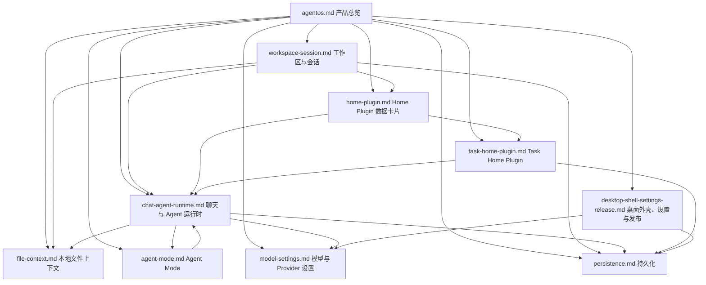

# PRD 文档索引

本目录按功能模块维护 AgentOS 的 PRD。每个功能文档都包含 `功能概述`、`核心功能列表`、`数据结构`、`业务逻辑`、`相关代码文件`、`关联PRD文档` 六个标准章节。

生成依据：2026-05-21 对当前仓库的 `src/`、`electron/`、`.agents/`、构建配置、README 与发布配置进行代码阅读后整理；2026-05-22 继续补充入口、i18n、安全区、Generative UI、自动更新轮询和 macOS Apple Speech 语音输入细节。

## 文档清单

| 文档 | 功能模块 | 说明 |
| --- | --- | --- |
| [agentos.md](./agentos.md) | 产品总览 | AgentOS 的定位、用户、模块边界和全局关系 |
| [workspace-session.md](./workspace-session.md) | 工作区与会话 | 项目、线程、侧栏、活动视图与项目首页入口 |
| [chat-agent-runtime.md](./chat-agent-runtime.md) | 聊天与 Agent 运行时 | 聊天提交、Claude Agent SDK、事件流、权限、diff、rewind、macOS 语音输入 |
| [file-context.md](./file-context.md) | 本地文件上下文 | 文件树、文件预览、附件、`@` 文件搜索和路径安全 |
| [agent-mode.md](./agent-mode.md) | Agent Mode | 项目人格、记忆文件、TODO 模式和运行时提示词注入 |
| [home-plugin.md](./home-plugin.md) | Home Plugin 数据卡片 | 项目首页数据卡片、A2UI 输出、卡片布局和沙箱运行 |
| [task-home-plugin.md](./task-home-plugin.md) | Task Home Plugin | 任务卡片、Agent/Skills 模式运行、定时和 runtime 状态 |
| [model-settings.md](./model-settings.md) | 模型与 Provider 设置 | Provider 预设、API 配置、模型能力、连接测试 |
| [persistence.md](./persistence.md) | 持久化 | localStorage、JSON、SQLite、JSONL 和迁移归一化 |
| [desktop-shell-settings-release.md](./desktop-shell-settings-release.md) | 桌面外壳、设置与发布 | Electron 窗口、托盘、设置、自动更新、macOS 原生 helper 和打包发布 |

## 模块关系图

## 维护规则

- 改动项目/线程/侧栏/工作台入口时，同步更新 [workspace-session.md](./workspace-session.md)。
- 改动聊天提交、SDK 事件、权限、工具调用、diff、回滚或 composer 语音输入时，同步更新 [chat-agent-runtime.md](./chat-agent-runtime.md)。
- 改动文件树、预览、附件或项目路径安全时，同步更新 [file-context.md](./file-context.md)。
- 改动 `AGENT.md`、`SOUL.md`、`MEMORY.md`、`TODO.md` 协议时，同步更新 [agent-mode.md](./agent-mode.md)。
- 改动 `.agents/home-plugins`、A2UI 卡片或卡片布局时，同步更新 [home-plugin.md](./home-plugin.md)。
- 改动任务卡片、定时运行或 Skills 编排时，同步更新 [task-home-plugin.md](./task-home-plugin.md)。
- 改动 Provider、模型、API Key、Base URL 或连接测试时，同步更新 [model-settings.md](./model-settings.md)。
- 改动工作区存储、会话索引、rollout 或数据迁移时，同步更新 [persistence.md](./persistence.md)。
- 改动 Electron 窗口、托盘、设置、更新、原生 helper、系统权限或发布配置时，同步更新 [desktop-shell-settings-release.md](./desktop-shell-settings-release.md)。
