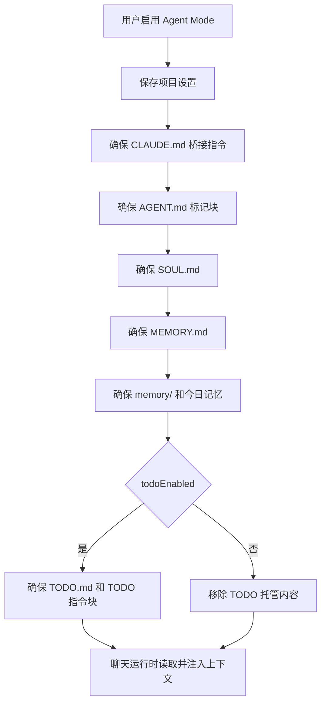

# Agent Mode PRD

## 功能概述

Agent Mode 为每个项目提供可长期沉淀的 Agent 身份、用户信息、项目灵魂、记忆和 TODO 协作协议。启用后，AgentOS 会在项目内维护 `CLAUDE.md`、`AGENT.md`、`SOUL.md`、`MEMORY.md`、`memory/` 和可选 `TODO.md`，并在 Agent 运行时注入这些上下文。

## 核心功能列表

| 优先级 | 功能 | 说明 |
| --- | --- | --- |
| P0 | 启用/停用 Agent Mode | 以项目路径为键保存状态 |
| P0 | 文件初始化 | 创建或更新 Agent Mode 所需文件，并生成 Claude 原生桥接指令 |
| P0 | 运行时注入 | 将用户身份、Agent 身份和记忆文件注入系统提示词 |
| P1 | TODO 模式 | 开启后维护 `TODO.md` 和 `AGENT.md` 内 TODO 指令块 |
| P1 | 近期记忆加载 | 自动确保今日记忆文件存在，运行时加载今天和昨天的每日记忆 |
| P1 | 设置页编辑 | 用户可编辑 user 和 identity 文本 |
| P1 | AppShell Agent 设置模态 | Agent Mode 开启后右上角入口切换为设置按钮，提供常规和卡片顺序 |
| P1 | USER/IDENTITY 回退 | 首次读取设置时可从项目根 `USER.md` 和 `IDENTITY.md` 回退初始化 |

## 数据结构

```ts
interface AgentModeProjectSettings {
  enabled: boolean
  todoEnabled: boolean
  user: string
  identity: string
}

type AgentModeRequiredFile =
  | 'CLAUDE.md'
  | 'AGENT.md'
  | 'SOUL.md'
  | 'MEMORY.md'
  | 'memory/YYYY-MM-DD.md'
  | 'TODO.md'

type AgentModeFileStatus = 'created' | 'updated' | 'exists'

interface AgentModeStatusResult {
  ok: boolean
  rootPath: string
  enabled?: boolean
  todoEnabled?: boolean
  instructionFile?: string
  missingFiles?: string[]
  message?: string
}

interface AgentModeFilesResult {
  ok: boolean
  rootPath: string
  instructionFile?: string
  files?: Array<{
    relativePath: string
    path: string
    status: AgentModeFileStatus
  }>
  message?: string
}

type AgentSettingsPanelId = 'card-order' | 'general'
```

## 业务逻辑



业务规则：

- 文件维护必须幂等，不能覆盖用户在标记块外的内容。
- AppShell 右上角 Agent Mode 未开启时显示 Switch；开启成功后自动打开 Agent 设置模态，并把入口切换为设置 icon。
- Agent 设置模态左侧设置项顺序为“卡片顺序”在上、“常规”在下；模态本身不提供统一 footer。
- “常规”项只包含关闭 Agent Mode 的入口；关闭前必须弹出确认，确认后调用项目级 Agent Mode 状态更新。
- “卡片顺序”项复用项目首页卡片排序能力，确认/取消按钮只出现在该设置项内容底部。
- Agent 设置模态只承载项目首页运行态设置，不承接 USER/IDENTITY；USER/IDENTITY 继续由全局设置页的 Agent Mode 页面编辑。
- `CLAUDE.md` 必须随 Agent Mode 自动创建；中文环境生成中文桥接指令，英文环境生成英文桥接指令。
- `CLAUDE.md` 内应明确要求 Claude 读取 `AGENT.md`、`SOUL.md`、`MEMORY.md` 和 `memory/`。
- TODO 模式关闭时，只移除 AgentOS 管理的 TODO 标记块和 `TODO.md`。
- Agent Mode 设置优先读取 userData 中按项目路径保存的配置，缺省时可从项目 `USER.md` 和 `IDENTITY.md` 回退。
- 聊天运行时在 Agent Mode 未显式关闭时加载相关 instruction files。
- `USER` 与 `IDENTITY` 由宿主应用通过 system prompt 注入，不作为 AgentOS 必须维护的项目 Markdown 文件。
- `AGENT.md` 使用 `<!-- AgentOS Agent Mode: start/end -->` 标记块，TODO 使用 `<!-- AgentOS TODO Mode: start/end -->` 标记块。
- 当 Agent Mode 被显式关闭时，运行时会从 `AGENT.md`/`AGENTS.md` 中剥离 Agent Mode 和 TODO 标记块再注入；当仅关闭 TODO 时只剥离 TODO 标记块。
- Agent Mode 模板文案只支持当前主进程规范化语言 `zh`/`en`。

## 相关代码文件

### 核心页面组件

- `src/components/setting/AgentModeSettingsPage.tsx`
- `src/components/AppShellWorkspace.tsx`
- `src/components/chat/ProjectHomeSurface.tsx`

### 功能组件/UI组件

- `src/components/AgentModeControls.tsx`
- `src/components/AgentModeMenu.tsx`
- `src/components/chat/ChatStartView.tsx`

### 数据管理

- `src/desktop-types.ts`
- `src/claude-chat-types.ts`
- `src/components/types.ts`

### 业务逻辑工具/工具类

- `electron/agent-mode-files.ts`
- `electron/agent-mode-settings-store.ts`
- `electron/agent-context.ts`
- `electron/main.ts`

### Hooks/其他

- `src/components/useWorkspaceAgentMode.ts`

## 关联PRD文档

### 直接关联

- `prd/chat-agent-runtime.md`：Agent Mode 上下文进入 SDK 运行。
- `prd/workspace-session.md`：Agent Mode 设置绑定项目。
- `prd/home-plugin.md`：Agent 设置模态的卡片顺序项管理项目首页卡片布局。

### 间接关联

- `prd/file-context.md`：文件创建和读取依赖项目路径安全。
- `prd/task-home-plugin.md`：任务运行可覆盖 `todoEnabled`。

### 功能关联/支撑系统

- `prd/persistence.md`：项目设置保存在 Electron userData。
