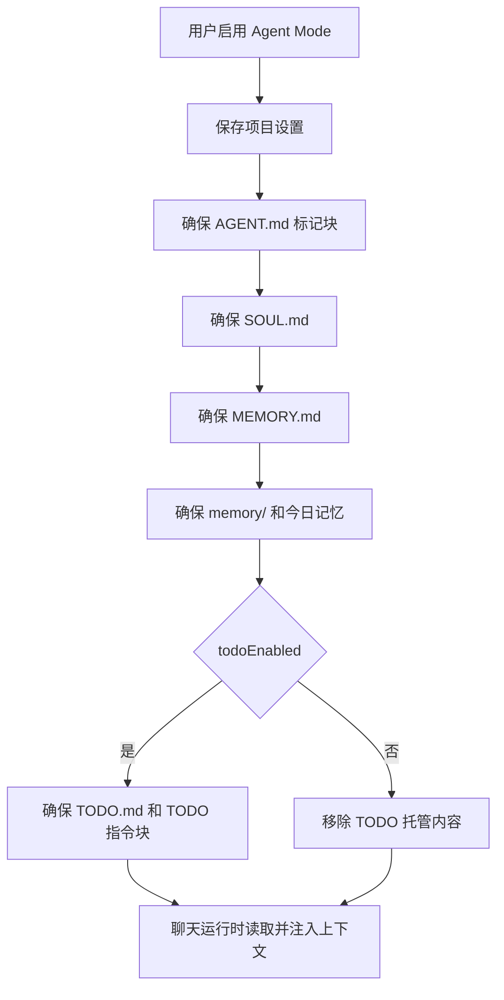

# Agent Mode PRD

## 功能概述

Agent Mode 为每个项目提供可长期沉淀的 Agent 身份、用户信息、项目灵魂、记忆和 TODO 协作协议。启用后，AgentOS 会在项目内维护 `AGENT.md`、`SOUL.md`、`MEMORY.md`、`memory/` 和可选 `TODO.md`，并在 Agent 运行时注入这些上下文。

## 核心功能列表

| 优先级 | 功能 | 说明 |
| --- | --- | --- |
| P0 | 启用/停用 Agent Mode | 以项目路径为键保存状态 |
| P0 | 文件初始化 | 创建或更新 Agent Mode 所需文件 |
| P0 | 运行时注入 | 将用户身份、Agent 身份和记忆文件注入系统提示词 |
| P1 | TODO 模式 | 开启后维护 `TODO.md` 和 `AGENT.md` 内 TODO 指令块 |
| P1 | 今日记忆 | 自动确保 `memory/` 下今日记忆文件存在 |
| P1 | 设置页编辑 | 用户可编辑 user 和 identity 文本 |

## 数据结构

```ts
interface AgentModeProjectSettings {
  enabled: boolean
  todoEnabled: boolean
  user: string
  identity: string
}

type AgentModeRequiredFile =
  | 'AGENT.md'
  | 'SOUL.md'
  | 'MEMORY.md'
  | 'memory/YYYY-MM-DD.md'
  | 'TODO.md'
```

## 业务逻辑



业务规则：

- 文件维护必须幂等，不能覆盖用户在标记块外的内容。
- TODO 模式关闭时，只移除 AgentOS 管理的 TODO 标记块和 `TODO.md`。
- Agent Mode 设置优先读取持久化配置，缺省时可从项目文件回退。
- 聊天运行时在 Agent Mode 未显式关闭时加载相关 instruction files。

## 相关代码文件

### 核心页面组件

- `src/components/AgentModeSettingsPage.tsx`
- `src/components/AppShellWorkspace.tsx`

### 功能组件/UI组件

- `src/components/AgentModeControls.tsx`
- `src/components/AgentModeMenu.tsx`

### 数据管理

- `src/desktop-types.ts`
- `src/claude-chat-types.ts`

### 业务逻辑工具/工具类

- `electron/agent-mode-files.ts`
- `electron/agent-mode-settings-store.ts`
- `electron/agent-context.ts`
- `electron/main.ts`

### Hooks/其他

- `src/components/useWorkspaceAgentMode.ts`

## 关联PRD文档

### 直接关联

- `prd/chat-agent-runtime.md`：Agent Mode 上下文进入 SDK 运行。
- `prd/workspace-session.md`：Agent Mode 设置绑定项目。

### 间接关联

- `prd/file-context.md`：文件创建和读取依赖项目路径安全。
- `prd/task-home-plugin.md`：任务运行可覆盖 `todoEnabled`。

### 功能关联/支撑系统

- `prd/persistence.md`：项目设置保存在 Electron userData。

