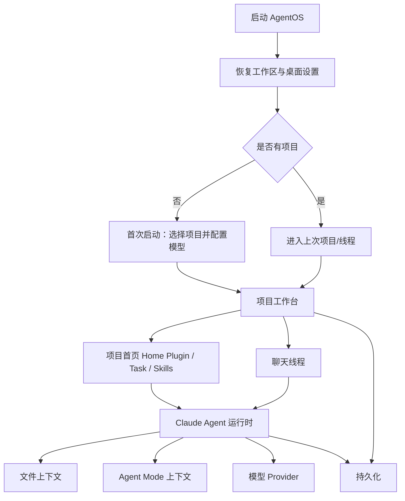

# AgentOS 产品总览 PRD

## 功能概述

AgentOS 是一个面向本地项目与长期任务的桌面 Agent 工作台。它把本地项目、长期会话、Claude Agent 运行、项目文件上下文、Agent Mode、Home Plugin 卡片、任务卡片、模型 Provider 设置、macOS 语音输入和桌面系统能力组织在一个 Electron 应用内。

本总览文档只描述产品整体定位和模块边界；具体功能需求拆分在同目录的功能 PRD 中维护。

## 核心功能列表

| 优先级 | 功能模块 | PRD |
| --- | --- | --- |
| P0 | 项目工作区、多会话、侧栏和项目首页入口 | `prd/workspace-session.md` |
| P0 | Claude Agent 聊天运行、事件流、权限、diff、rewind、composer 输入 | `prd/chat-agent-runtime.md` |
| P0 | 本地文件树、文件预览、附件和路径安全 | `prd/file-context.md` |
| P0 | 模型 Provider、API Key、Base URL、模型能力、线程级模型选择 | `prd/model-settings.md` |
| P0 | 工作区、线程和会话持久化 | `prd/persistence.md` |
| P1 | Agent Mode 项目人格、记忆和 TODO 模式 | `prd/agent-mode.md` |
| P1 | Home Plugin 项目首页数据卡片 | `prd/home-plugin.md` |
| P1 | Task Home Plugin 长期任务卡片 | `prd/task-home-plugin.md` |
| P1 | 桌面托盘、设置、macOS 原生 helper、自动更新和发布 | `prd/desktop-shell-settings-release.md` |

## 数据结构

产品级数据由各模块组合而成：

```ts
type AgentOSProductState = {
  workspace: ChatWorkspaceState
  activeProject?: WorkspaceProject
  activeThread?: WorkspaceThread
  modelSettings: ClaudeAgentSettingsSnapshot
  desktopPreferences: DesktopPreferences
  agentMode?: AgentModeProjectSettings
  homePlugins?: HomePluginRunItem[]
  taskPlugins?: HomePluginTaskRuntime[]
}
```

关键数据归属：

- `ChatWorkspaceState`：见 `prd/workspace-session.md` 与 `prd/persistence.md`。
- `ClaudeChatSubmitPayload` / `ClaudeChatEvent`：见 `prd/chat-agent-runtime.md`。
- `FileTreeResult` / `ProjectFilePreviewResult`：见 `prd/file-context.md`。
- `AgentModeProjectSettings`：见 `prd/agent-mode.md`。
- `HomePluginManifest` / `HomePluginRunItem`：见 `prd/home-plugin.md`。
- `HomePluginTaskConfig` / `HomePluginTaskRuntime`：见 `prd/task-home-plugin.md`。
- `ClaudeAgentModelProvider`：见 `prd/model-settings.md`。
- `DesktopPreferences` / `AppUpdaterState` / `SpeechRecognitionEvent`：见 `prd/desktop-shell-settings-release.md`。

## 业务逻辑



全局规则：

- 应用以本地项目路径为主组织单位。
- 会话、Home Plugin、任务卡片和 Agent Mode 都必须归属某个项目。
- React 入口只负责挂载 `AppShell`、注入初始 i18n Context、写入窗口 chrome dataset 和安装安全区/外链拦截等全局副作用。
- 侧边栏底部全局设置入口使用与搜索入口一致的图标加文字按钮；项目首页右上角 Agent Mode 未开启时显示 Switch，开启后显示设置按钮并打开 Agent 模式设置模态。
- Agent 模式设置模态只承载项目首页运行态设置（常规、卡片顺序、Skills 模型覆盖）；全局设置页仍承载模型 Provider、Project Skills 开关、Agent Mode USER/IDENTITY、更新和开发者设置。
- 全局设置页和 Agent 模式设置模态共用设置界面视觉规范：设置项导航与内容区分离，内容复用分区、分组行、说明文案、焦点态和确认弹窗样式。
- 每个聊天线程可以独立保存当前使用的模型选择；composer 模型按钮显示活动线程的模型，线程没有有效模型时回退全局 Provider 设置中的当前可用模型。
- Project Skill 从项目首页或侧栏运行时会创建 `skill-run` 线程，并优先使用 Agent 模式 Skills 面板中按 `skill.path` 保存的模型覆盖；Skill 或模型配置失效时回退 composer/default 模型。
- About 面板、设置页和发布元数据统一读取 `APP_METADATA`，避免产品名、作者、仓库、License 等信息在多处漂移。
- Agent 运行必须通过主进程统一处理，渲染层只通过 preload 暴露的安全 API 访问。
- 文件读取、预览和插件运行都必须限制在项目根目录内。
- 当前 UI 与主进程模板语言只规范化为 `zh` 和 `en`。
- 打包应用以应用内 Provider 设置为权威配置来源；开发环境才允许 env 来源。
- `src/counter.ts` 是未接入产品流程的 Vite 模板遗留示例，不应被当作 AgentOS 功能入口。
- 文档以功能模块 PRD 为准，总览只维护跨模块关系。

## 相关代码文件

### 核心页面组件

- `src/components/AppShell.tsx`：产品级应用状态和工作台总控。
- `src/components/AppShellWorkspace.tsx`：项目首页、聊天、文档、设置的视图组合。
- `src/components/AppShellSidebar.tsx`：项目、线程和设置入口。
- `src/main.tsx`：React 挂载、I18nProvider、窗口安全区和外链处理入口。

### 功能组件/UI组件

- `src/components/chat/ProjectHomeSurface.tsx`：项目首页入口。
- `src/components/chat/ChatPage.tsx`：聊天运行入口。
- `src/components/DocsPage.tsx`：主导航 Docs 占位视图。
- `src/components/setting/SettingsPage.tsx`：设置入口。

### 数据管理

- `src/components/types.ts`
- `src/claude-chat-types.ts`
- `src/desktop-types.ts`
- `src/chat-workspace-persistence.ts`
- `src/app-metadata.ts`
- `src/model-pick.ts`

### 业务逻辑工具/工具类

- `electron/main.ts`
- `electron/preload.ts`
- `electron/claude-agent-runner.ts`
- `electron/speech-recognition.ts`
- `electron/agent-context.ts`
- `electron/home-plugin-runner.ts`
- `electron/task-home-plugin-manager.ts`
- `electron/claude-agent-settings.ts`
- `electron/chat-workspace-store.ts`
- `electron/agent-mode-settings-store.ts`

### Hooks/其他

- `package.json`
- `vite.config.ts`
- `electron-builder.config.cjs`
- `electron-builder.json5`
- `src/counter.ts`
- `README.md`
- `README_EN.md`

## 关联PRD文档

### 直接关联

- `prd/workspace-session.md`
- `prd/chat-agent-runtime.md`
- `prd/file-context.md`
- `prd/model-settings.md`
- `prd/persistence.md`

### 间接关联

- `prd/agent-mode.md`
- `prd/home-plugin.md`
- `prd/task-home-plugin.md`

### 功能关联/支撑系统

- `prd/desktop-shell-settings-release.md`
