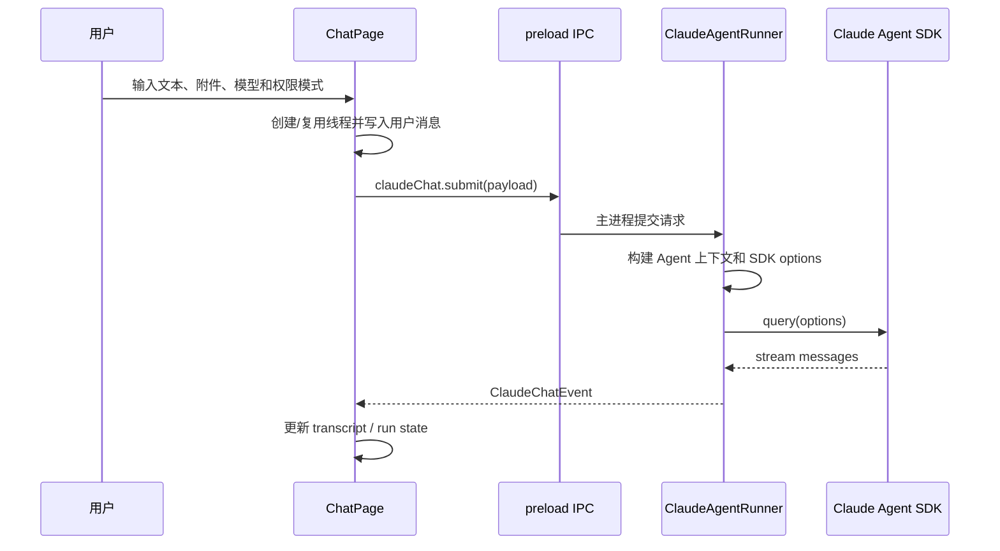

# 聊天与 Agent 运行时 PRD

## 功能概述

聊天与 Agent 运行时模块负责把用户输入、附件、上下文、权限模式和模型配置转换为 Claude Agent SDK 运行，并将 SDK 事件标准化为可渲染的聊天记录、工具过程、权限请求、文件 diff 和最终结果。

## 核心功能列表

| 优先级 | 功能 | 说明 |
| --- | --- | --- |
| P0 | 聊天提交 | 文本、附件、线程、项目 cwd、权限模式组成提交载荷 |
| P0 | 事件流渲染 | assistant、thinking、tool、activity、result、error、cancelled 事件实时写入 transcript |
| P0 | 权限请求 | 工具执行前可向用户请求允许或拒绝 |
| P0 | Agent 提问 | `AskUserQuestion` 转为用户输入弹窗 |
| P0 | 运行取消 | 支持按线程取消活跃请求 |
| P0 | 文件 diff | 从 SDK checkpoint 和工具结果生成文件变更卡片 |
| P1 | 文件回滚 | 支持 active query 或 resume session 执行 rewind |
| P1 | Session 续接 | 使用 thread `sessionId` 续接，失效时自动重试一次 |
| P1 | Slash command 展开 | 显式命令和 Home Plugin 强制命令进入运行上下文 |

## 数据结构

```ts
interface ClaudeChatSubmitPayload {
  text: string
  attachments?: ClaudeChatAttachment[]
  threadId?: string
  promptMode?: 'home-plugin-customization' | 'home-plugin-card-customization' | 'home-plugin-task-run'
  agentModeSettingsOverride?: AgentModeProjectSettings
  sessionId?: string
  cwd?: string
  permissionMode?: ClaudePermissionMode
}

type ClaudePermissionMode =
  | 'plan'
  | 'auto'
  | 'default'
  | 'acceptEdits'
  | 'bypassPermissions'

interface ThreadRunState {
  requestId: string
  status: 'running' | 'waiting'
  startedAt?: number
  updatedAt: number
}

type TranscriptItem =
  | ChatMessageItem
  | ChatToolItem
  | ChatThinkingItem
  | ChatActivityItem
  | ChatFileDiffItem
```

## 业务逻辑



运行规则：

- 同一线程已有请求时，新请求会取消旧请求。
- `text` 为空且没有附件时不应提交。
- 图片附件必须由当前模型显式支持。
- SDK resume 失败且未输出内容时，清空 `sessionId` 后重试一次。
- 运行完成后清理 pending permission 和 active request。
- 文件回滚结果必须作为事件回传给当前线程展示。

## 相关代码文件

### 核心页面组件

- `src/components/ChatPage.tsx`
- `src/components/ChatThreadView.tsx`

### 功能组件/UI组件

- `src/components/Composer.tsx`
- `src/components/Transcript.tsx`
- `src/components/AgentInputPromptModal.tsx`
- `src/components/RichCodeBlock.tsx`
- `src/components/AttachmentThumb.tsx`

### 数据管理

- `src/claude-chat-types.ts`
- `src/components/types.ts`
- `src/components/local-types.ts`

### 业务逻辑工具/工具类

- `electron/claude-agent-runner.ts`
- `electron/claude-agent-runner/config.ts`
- `electron/claude-agent-runner/input.ts`
- `electron/claude-agent-runner/sdk-message-router.ts`
- `electron/claude-agent-runner/event-coalescer.ts`
- `electron/claude-agent-runner/file-diff.ts`
- `electron/claude-agent-runner/value-formatters.ts`
- `electron/claude-agent-runner/executable.ts`
- `electron/agent-context.ts`

### Hooks/其他

- `src/components/markdown.ts`
- `src/components/clipboard.ts`
- `src/components/format.ts`

## 关联PRD文档

### 直接关联

- `prd/workspace-session.md`：聊天运行绑定项目和线程。
- `prd/model-settings.md`：运行时读取模型 Provider 配置。
- `prd/file-context.md`：附件、文件搜索和文件 diff 依赖项目文件能力。

### 间接关联

- `prd/agent-mode.md`：运行时注入 Agent Mode 上下文。
- `prd/home-plugin.md`：卡片定制线程复用聊天运行时。
- `prd/task-home-plugin.md`：任务卡片后台运行复用聊天运行时。

### 功能关联/支撑系统

- `prd/persistence.md`：聊天 transcript、sessionId 和 rollout 持久化。

