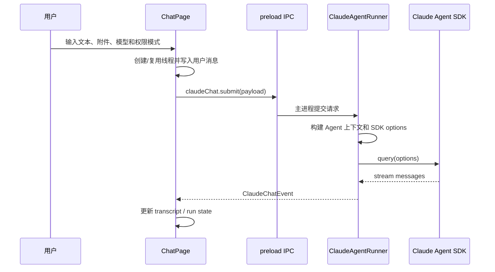
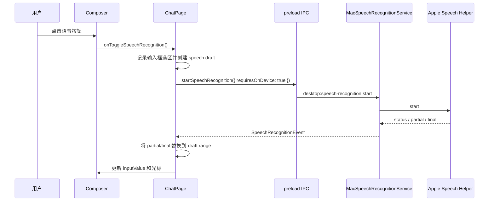

# 聊天与 Agent 运行时 PRD

## 功能概述

聊天与 Agent 运行时模块负责把用户输入、附件、上下文、权限模式和模型配置转换为 Claude Agent SDK 运行，并将 SDK 事件标准化为可渲染的聊天记录、工具过程、权限请求、文件 diff 和最终结果。

## 核心功能列表

| 优先级 | 功能 | 说明 |
| --- | --- | --- |
| P0 | 聊天提交 | 文本、附件、线程、项目 cwd、权限模式组成提交载荷 |
| P0 | 事件流渲染 | assistant、thinking、tool、activity、result、error、cancelled 事件实时写入 transcript |
| P0 | 权限请求 | 工具执行前可向用户请求允许或拒绝 |
| P0 | Agent 提问 | `AskUserQuestion` 转为用户输入弹窗 |
| P0 | 运行取消 | 支持按线程取消活跃请求 |
| P0 | 文件 diff | 从 SDK checkpoint 和工具结果生成文件变更卡片 |
| P1 | 文件回滚 | 支持 active query 或 resume session 执行 rewind |
| P1 | Session 续接 | 使用 thread `sessionId` 续接，失效时自动重试一次 |
| P1 | Slash command 展开 | 显式命令和 Home Plugin 强制命令进入运行上下文 |
| P1 | Composer 联想 | 支持行首 slash 命令、`@` 文件、`@agent-*` 子 Agent 联想 |
| P1 | macOS Composer 语音输入 | macOS 客户端通过 Apple Speech helper 把听写 partial/final 写入 composer 输入框 |
| P1 | 内置命令入口 | 内置 `/compact`、`/status`、`/help` 三个命令提示 |
| P1 | 权限模式持久化 | 权限模式保存在 localStorage，默认 `auto` |
| P1 | Generative UI | 支持 `show-widget` Markdown fence 渲染沙箱交互组件 |

## 数据结构

```ts
interface ClaudeChatSubmitPayload {
  text: string
  attachments?: ClaudeChatAttachment[]
  threadId?: string
  promptMode?: 'home-plugin-customization' | 'home-plugin-card-customization' | 'home-plugin-task-run'
  agentModeSettingsOverride?: AgentModeProjectSettings
  sessionId?: string
  cwd?: string
  permissionMode?: ClaudePermissionMode
}

type ClaudePermissionMode =
  | 'plan'
  | 'auto'
  | 'default'
  | 'acceptEdits'
  | 'bypassPermissions'

interface ThreadRunState {
  requestId: string
  status: 'running' | 'waiting'
  startedAt?: number
  updatedAt: number
}

type TranscriptItem =
  | ChatMessageItem
  | ChatToolItem
  | ChatThinkingItem
  | ChatActivityItem
  | ChatFileDiffItem

interface AgentContextSlashItem {
  kind: 'skill' | 'command'
  name: string
  command: string
  title: string
  description: string
  argumentHint: string
  path: string
  relativePath: string
  scope: 'user' | 'project'
  source: 'claude' | 'agent' | 'agents' | 'cursor'
  native: boolean
}

interface AgentContextAgentItem {
  kind: 'agent'
  name: string
  description: string
  path: string
  relativePath: string
  scope: 'user' | 'project'
  source: 'claude' | 'agent' | 'agents' | 'cursor'
  native: boolean
  model?: string
  tools: string[]
}

type SpeechRecognitionStatus =
  | 'unsupported'
  | 'idle'
  | 'starting'
  | 'requesting_permission'
  | 'listening'
  | 'transcribing'
  | 'error'

type SpeechRecognitionEvent =
  | {
      type: 'status'
      status: SpeechRecognitionStatus
      locale?: string
      supportsOnDevice?: boolean
      requiresOnDevice?: boolean
    }
  | {
      type: 'partial'
      text: string
    }
  | {
      type: 'final'
      text: string
    }
  | {
      type: 'error'
      code: string
      message: string
    }

interface SpeechDraftRange {
  start: number
  end: number
  committedText: string
  liveText: string
}

interface ClaudeChatSessionStartEvent {
  type: 'session_start'
  requestId: string
  sessionId: string
  model: string
  cwd: string
  tools: string[]
  skills: string[]
  slashCommands: string[]
  agents: string[]
  mcpServers: { name: string; status: string }[]
  permissionMode: string
  plugins: string[]
}

interface ClaudeFileRewindPayload {
  requestId?: string
  threadId?: string
  changeSetId?: string
  checkpointId: string
  cwd?: string
}
```

## 业务逻辑



Composer 语音输入流程：



运行规则：

- 同一线程已有请求时，新请求会取消旧请求。
- `text` 为空且没有附件时不应提交。
- 图片附件必须由当前模型显式支持。
- SDK resume 失败且未输出内容时，清空 `sessionId` 后重试一次。
- 运行完成后清理 pending permission 和 active request。
- 文件回滚结果必须作为事件回传给当前线程展示。
- `allowedTools` 默认只放行 `Read`、`Glob`、`Grep`、`ListMcpResources`、`ReadMcpResource` 这类只读工具；其它工具通过 `canUseTool` 进入权限请求。
- `bypassPermissions` 会映射为 SDK 的 `allowDangerouslySkipPermissions`。
- 每次运行会生成配置指纹；Provider、模型或图片能力变化时，旧线程的 SDK session 会失效并重新开始。
- `AskUserQuestion` 必须至少包含 2 个选项，否则直接允许原输入继续；有效问题会转成用户输入弹窗。
- Slash 展开支持 `$ARGUMENTS` 和 `$1`、`$2` 等参数替换。
- Home Plugin 定制线程会强制注入 `/a2ui-project-home-panel` Skill，并追加对应系统提示词。
- 每次聊天上下文都会追加 Generative UI 能力提示，指导模型用 `show-widget` fence 输出紧凑的 HTML/SVG/CSS/JS 小组件。
- `show-widget` 渲染在 sandbox iframe 中完成，禁止网络和表单；组件可通过 `window.__widgetSendMessage()` 触发后续用户消息。

Composer 语音输入规则：

- 语音按钮只在 `window.desktop.platform === 'darwin'` 且 preload 暴露语音 API 时显示，非 macOS 状态为 `unsupported`。
- `idle/error` 点击开始；`starting/requesting_permission/transcribing` 点击取消；`listening` 点击停止并等待 final。
- 开始听写时记录 composer 当前光标和选区，创建 `SpeechDraftRange`；partial 到来时只替换该 draft range，不直接追加到输入框尾部。
- Apple Speech 的 partial 可能修正当前短语，也可能在停顿后重新返回一段短文本；renderer 使用 `committedText + liveText` 合并策略，避免停顿后覆盖前文。
- final 有文本时做最后一次替换并清空 draft；final 为空但 draft 已有文本时保留已写入内容；完全无文本时提示 no speech。
- 每次由语音写入输入框后记录 `lastSpeechAppliedValueRef`，用于区分语音写入和用户手动编辑。
- 用户在听写中手动编辑或删除 composer 内容时，立即清空 speech draft；如果仍处于 `listening`，先忽略旧 partial/final，再 `cancel` 当前 helper task 并重新 `start` 新识别段。
- 收到新一轮 `listening` 状态后才重新接收 partial/final，避免旧识别任务残留文本把用户删掉的内容写回来。

## 相关代码文件

### 核心页面组件

- `src/components/chat/ChatPage.tsx`
- `src/components/chat/ChatThreadView.tsx`
- `src/components/chat/ChatStartView.tsx`

### 功能组件/UI组件

- `src/components/chat/Composer.tsx`
- `src/components/chat/Transcript.tsx`
- `src/components/chat/AgentInputPromptModal.tsx`
- `src/components/chat/RichCodeBlock.tsx`
- `src/components/chat/AttachmentThumb.tsx`
- `src/components/chat/GenerativeWidget.tsx`

### 数据管理

- `src/claude-chat-types.ts`
- `src/components/types.ts`
- `src/components/chat/local-types.ts`
- `src/desktop-types.ts`

### 业务逻辑工具/工具类

- `electron/claude-agent-runner.ts`
- `electron/speech-recognition.ts`
- `electron/main.ts`
- `electron/preload.ts`
- `electron/claude-agent-runner/config.ts`
- `electron/claude-agent-runner/input.ts`
- `electron/claude-agent-runner/sdk-message-router.ts`
- `electron/claude-agent-runner/event-coalescer.ts`
- `electron/claude-agent-runner/file-diff.ts`
- `electron/claude-agent-runner/value-formatters.ts`
- `electron/claude-agent-runner/executable.ts`
- `electron/agent-context.ts`
- `electron/generative-ui-prompt.ts`
- `electron/home-plugin-customization-prompt.ts`

### Hooks/其他

- `src/components/chat/markdown.ts`
- `src/components/chat/clipboard.ts`
- `src/components/chat/format.ts`
- `src/components/chat/generative-ui.ts`
- `native/speech-cli/SpeechCLI.swift`

## 关联PRD文档

### 直接关联

- `prd/workspace-session.md`：聊天运行绑定项目和线程。
- `prd/model-settings.md`：运行时读取模型 Provider 配置。
- `prd/file-context.md`：附件、文件搜索和文件 diff 依赖项目文件能力。
- `prd/desktop-shell-settings-release.md`：macOS 原生语音 helper、preload API、权限与打包资源由桌面外壳提供。

### 间接关联

- `prd/agent-mode.md`：运行时注入 Agent Mode 上下文。
- `prd/home-plugin.md`：卡片定制线程复用聊天运行时。
- `prd/task-home-plugin.md`：任务卡片后台运行复用聊天运行时。

### 功能关联/支撑系统

- `prd/persistence.md`：聊天 transcript、sessionId 和 rollout 持久化。
