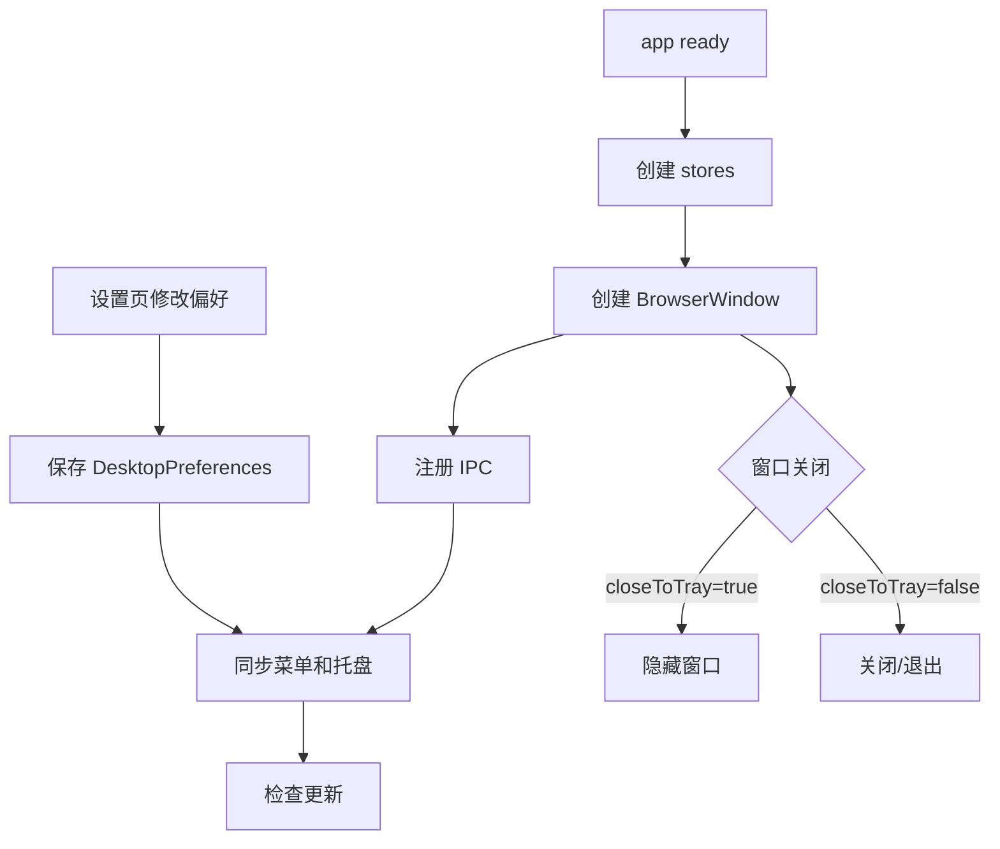

# 桌面外壳、设置与发布 PRD

## 功能概述

桌面外壳、设置与发布模块负责 AgentOS 的 Electron 应用生命周期、窗口、托盘、菜单、桌面偏好、语言设置、自动更新和跨平台打包发布。它为所有业务模块提供桌面宿主能力。

## 核心功能列表

| 优先级 | 功能 | 说明 |
| --- | --- | --- |
| P0 | Electron 窗口 | 创建 BrowserWindow，配置尺寸、标题栏、外部链接处理 |
| P0 | Preload API | 暴露安全的 `window.desktop` 和 `window.claudeChat` |
| P0 | 设置页路由 | 管理模型、偏好、更新、Agent Mode、开发者设置入口 |
| P0 | 桌面偏好 | close-to-tray、open-at-login、locale |
| P1 | 托盘 | 隐藏到托盘、显示窗口、新建会话、打开项目、退出 |
| P1 | 自动更新 | 检查、下载、安装并推送更新状态 |
| P1 | 国际化 | 中文、英文、日文、韩文文案切换 |
| P1 | 打包发布 | macOS、Windows、Linux 构建与 GitHub 发布配置 |

## 数据结构

```ts
interface DesktopPreferences {
  closeToTray: boolean
  openAtLogin: boolean
  locale?: 'zh-CN' | 'en' | 'ja' | 'ko'
}

interface AppUpdaterState {
  phase: 'idle' | 'checking' | 'available' | 'not-available' | 'downloading' | 'downloaded' | 'error'
  version?: string
  progress?: number
  error?: string
}

interface DesktopApi {
  pickProjectDirectory(): Promise<string | null>
  getDesktopPreferences(): Promise<DesktopPreferences>
  saveDesktopPreferences(prefs: Partial<DesktopPreferences>): Promise<DesktopPreferences>
  checkForUpdates(): Promise<AppUpdaterState>
}
```

## 业务逻辑



发布规则：

- macOS 使用 hardened runtime、entitlements 和可选 notarization。
- Apple 凭据存在但缺少 Team ID 时禁用 notarization 并警告。
- asar 启用，但 Claude Agent SDK 相关包需要 unpack。
- 打包产物包括 `dist`、`dist-electron` 和内置 `.agents/skills/a2ui-project-home-panel`。
- GitHub 发布目标为 `xue160709/AgentOS`。

## 相关代码文件

### 核心页面组件

- `src/components/SettingsPage.tsx`
- `src/components/ProjectSkillsSettingsPage.tsx`
- `src/components/AppUpdateSettingsPage.tsx`
- `src/components/DeveloperSettingsPage.tsx`

### 功能组件/UI组件

- `src/components/AppUpdateSection.tsx`
- `src/components/AboutSection.tsx`
- `src/components/icons.tsx`

### 数据管理

- `src/desktop-types.ts`
- `src/i18n/locales.ts`
- `src/app-events.ts`

### 业务逻辑工具/工具类

- `electron/main.ts`
- `electron/preload.ts`
- `electron/desktop-preferences-store.ts`
- `electron/app-updater.ts`
- `electron/app-menu.ts`
- `electron/about-panel.ts`
- `electron/window-chrome.ts`
- `electron/ui-locale.ts`
- `electron/safe-console.ts`

### Hooks/其他

- `package.json`
- `vite.config.ts`
- `electron-builder.config.cjs`
- `electron-builder.json5`
- `docs/RELEASE.md`
- `scripts/`
- `src/style.css`
- `src/theme/tokens.css`

## 关联PRD文档

### 直接关联

- `prd/model-settings.md`：设置页承载 Provider 配置。
- `prd/workspace-session.md`：窗口、托盘和导航操作影响工作区入口。

### 间接关联

- `prd/persistence.md`：桌面偏好和设置使用主进程存储。
- `prd/agent-mode.md`：设置页包含 Agent Mode 编辑入口。

### 功能关联/支撑系统

- `prd/chat-agent-runtime.md`：preload API 暴露聊天运行能力。

