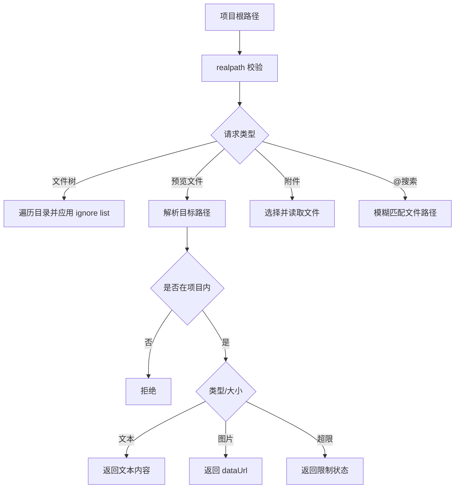

# 本地文件上下文 PRD

## 功能概述

本地文件上下文模块负责把项目目录中的文件安全地提供给用户和 AgentOS UI，包括文件树、文件预览、附件选择、`@` 文件搜索和路径存在性校验。

## 核心功能列表

| 优先级 | 功能 | 说明 |
| --- | --- | --- |
| P0 | 文件树 | 展示项目内目录和文件，忽略大型生成目录 |
| P0 | 文件预览 | 支持文本、Markdown、JSON 和图片预览 |
| P0 | 路径安全 | 所有文件读取必须限制在项目根目录内 |
| P0 | 附件选择 | 支持文本和图片附件，限制数量和大小 |
| P1 | `@` 文件搜索 | 在聊天输入中按项目文件名模糊搜索 |
| P1 | 项目路径检测 | 检查相对路径是否存在且不逃逸项目 |
| P1 | 图片能力校验 | 图片附件与模型图片能力联动 |
| P1 | 文本类型推断 | 对常见配置文件、lock 文件和无扩展文本文件进行采样判断 |
| P1 | 剪贴板辅助 | Mermaid 导出使用桌面端 PNG/SVG 剪贴板能力 |

## 数据结构

```ts
interface FileTreeNode {
  name: string
  path: string
  relativePath: string
  type: 'file' | 'directory'
  children?: FileTreeNode[]
}

interface FileTreeResult {
  rootPath: string
  rootName: string
  nodes: FileTreeNode[]
  truncated: boolean
}

interface ProjectFilePreviewResult {
  ok: boolean
  rootPath: string
  path: string
  relativePath?: string
  name: string
  kind?: 'markdown' | 'json' | 'text' | 'image'
  mimeType?: string
  size?: number
  content?: string
  dataUrl?: string
  message?: string
}

interface ProjectFileSearchItem {
  label: string
  path: string
  relativePath: string
  type: 'directory' | 'file'
}
```

## 业务逻辑



约束规则：

- 附件最多 8 个。
- 文本附件最大 512 KB。
- 图片附件最大 10 MB。
- 项目文件预览文本最大 5 MB，图片最大 10 MB。
- 常见忽略目录包括 `.git`、`node_modules`、`dist`、`coverage`、`.next`、`.vite` 等。
- `pathExistsUnderProject` 必须阻止 `..` 逃逸路径。
- 文件搜索最多遍历 5000 个条目、深度 10 层、返回 24 条结果，并按文件名/相对路径命中程度排序。
- 文件预览先对项目根和目标文件做 realpath 校验，符号链接最终目标也不能逃逸项目根。
- Markdown 支持 `.md`、`.markdown`、`.mdx`；JSON 支持 `.json`、`.jsonc`、`.json5`；`.env.*`、`*rc`、`.lock` 等会按文本尝试预览。
- SVG 剪贴板复制会用隐藏 BrowserWindow 渲染成图片后写入系统剪贴板，最大尺寸限制为 4096。

## 相关代码文件

### 核心页面组件

- `src/components/AppShellWorkspace.tsx`：挂载文件侧栏和预览覆盖层。

### 功能组件/UI组件

- `src/components/AppFileTreePane.tsx`
- `src/components/AppWorkspaceSidePanel.tsx`
- `src/components/ProjectFilePreviewOverlay.tsx`
- `src/components/chat/Composer.tsx`
- `src/components/chat/AttachmentThumb.tsx`

### 数据管理

- `src/components/types.ts`
- `src/claude-chat-types.ts`
- `src/desktop-types.ts`

### 业务逻辑工具/工具类

- `electron/main.ts`：文件树、文件预览、附件选择、路径校验 IPC。
- `electron/project-path.ts`
- `electron/claude-agent-runner/input.ts`
- `electron/agent-context.ts`
- `electron/preload.ts`

### Hooks/其他

- `src/components/chat/format.ts`
- `src/components/chat/RichCodeBlock.tsx`

## 关联PRD文档

### 直接关联

- `prd/workspace-session.md`：文件能力以活动项目为根目录。
- `prd/chat-agent-runtime.md`：聊天附件和文件引用进入 Agent 运行。

### 间接关联

- `prd/home-plugin.md`：Home Plugin 沙箱读取项目文件。
- `prd/agent-mode.md`：Agent Mode 文件创建和读取依赖项目路径。

### 功能关联/支撑系统

- `prd/model-settings.md`：图片附件需要模型能力支持。
