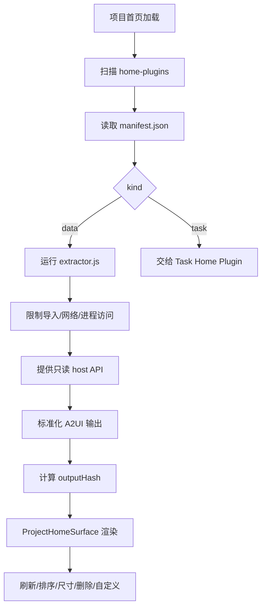

# Home Plugin 数据卡片 PRD

## 功能概述

Home Plugin 数据卡片模块负责把项目内 `.agents/home-plugins/<slug>` 定义的只读数据提取器渲染到项目首页。它用于展示项目状态、摘要、指标、文档信息或由 Agent 生成的 A2UI 卡片。

## 核心功能列表

| 优先级 | 功能 | 说明 |
| --- | --- | --- |
| P0 | 插件扫描 | 扫描项目 `.agents/home-plugins` 下的卡片目录 |
| P0 | Manifest 读取 | 读取并标准化 `manifest.json` |
| P0 | 只读执行 | 在受限 VM 中运行 `extractor.js` |
| P0 | A2UI 渲染 | 将输出标准化为 A2UI messages、variants 或组件树 |
| P1 | 输出缓存 | 根据 output hash 判断 unchanged |
| P1 | 卡片布局 | 支持 small、medium、large 尺寸和排序 |
| P1 | 卡片操作 | 支持刷新、编辑、删除、自定义、打开文件等 action |
| P1 | 项目 Skills 卡片 | 将扫描到的 Skills 作为项目首页操作卡片展示 |

## 数据结构

```ts
interface HomePluginManifest {
  id: string
  name: string
  version: string
  description: string
  entry: string
  outputFormat: string
  kind: 'data' | 'task'
  preferredSize: 'small' | 'medium' | 'large'
  threadId?: string
  createdAt?: string
  updatedAt?: string
  order?: number
}

interface HomePluginRunItem {
  slug: string
  rootPath: string
  pluginPath: string
  manifest: HomePluginManifest
  status: 'empty' | 'ready' | 'unchanged'
  outputHash?: string
  messages?: unknown[]
  variants?: Record<string, unknown>
  diagnostics?: string[]
}
```

## 业务逻辑



沙箱规则：

- extractor 源码不得包含 `import`、`require`、`process`、`fetch`、`XMLHttpRequest`、`WebSocket`。
- host API 只允许项目内路径读取。
- 单文件读取、总读取、SQLite 查询输出和执行时间都有上限。
- SQLite 只允许只读查询。
- 卡片删除应同步更新布局顺序文件。

## 相关代码文件

### 核心页面组件

- `src/components/ProjectHomeSurface.tsx`

### 功能组件/UI组件

- `src/components/GenerativeWidget.tsx`
- `src/components/RichCodeBlock.tsx`

### 数据管理

- `src/desktop-types.ts`
- `src/components/types.ts`

### 业务逻辑工具/工具类

- `electron/home-plugin-runner.ts`
- `electron/main.ts`
- `electron/agent-context.ts`

### Hooks/其他

- `src/components/generative-ui.ts`
- `.agents/skills/a2ui-project-home-panel/`

## 关联PRD文档

### 直接关联

- `prd/workspace-session.md`：Home Plugin 渲染在项目首页。
- `prd/task-home-plugin.md`：task 类型卡片由任务模块管理。
- `prd/file-context.md`：插件只读访问项目文件。

### 间接关联

- `prd/chat-agent-runtime.md`：卡片自定义通过 Agent 线程完成。
- `prd/persistence.md`：卡片布局和任务状态需要持久化。

### 功能关联/支撑系统

- `prd/agent-mode.md`：卡片定制 Agent 可读取项目 Agent Mode 上下文。

