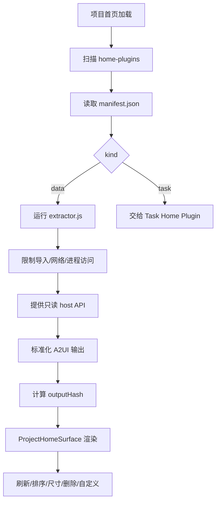

# Home Plugin 数据卡片 PRD

## 功能概述

Home Plugin 数据卡片模块负责把项目内 `.agents/home-plugins/<slug>` 定义的只读数据提取器渲染到项目首页。它用于展示项目状态、摘要、指标、文档信息或由 Agent 生成的 A2UI 卡片。

## 核心功能列表

| 优先级 | 功能 | 说明 |
| --- | --- | --- |
| P0 | 插件扫描 | 扫描项目 `.agents/home-plugins` 下的卡片目录 |
| P0 | Manifest 读取 | 读取并标准化 `manifest.json` |
| P0 | 只读执行 | 在受限 VM 中运行 `extractor.js` |
| P0 | A2UI 渲染 | 将输出标准化为 A2UI messages、variants 或组件树 |
| P1 | 输出缓存 | 根据 output hash 判断 unchanged |
| P1 | 卡片布局 | 支持 small、medium、large 尺寸和排序 |
| P1 | 卡片操作 | 支持刷新、编辑、删除、自定义、打开文件等 action |
| P1 | 项目 Skills 卡片 | 将扫描到的 Skills 作为项目首页操作卡片展示 |
| P1 | 多尺寸输出 | 支持 extractor 为 small、medium、large 分别返回 variants |
| P1 | 简化组件归一化 | 支持简化组件树、扁平组件、data binding 和 A2UI 标准消息混合输出 |

## 数据结构

```ts
interface HomePluginManifest {
  id: string
  name: string
  version: string
  description: string
  entry: string
  outputFormat: string
  kind: 'data' | 'task'
  preferredSize: 'small' | 'medium' | 'large'
  threadId?: string
  createdAt?: string
  updatedAt?: string
  order?: number
}

interface HomePluginRunItem {
  slug: string
  rootPath: string
  pluginPath: string
  manifest: HomePluginManifest
  status: 'empty' | 'ready' | 'unchanged'
  outputHash?: string
  messages?: unknown[]
  variants?: Partial<Record<'small' | 'medium' | 'large', unknown[]>>
  diagnostics?: string[]
}

interface HomePluginRunOptions {
  knownOutputHash?: string
  knownOutputHashes?: Record<string, string>
}

interface HomePluginCardLayoutItem {
  slug: string
  preferredSize: 'small' | 'medium' | 'large'
}
```

## 业务逻辑



沙箱规则：

- extractor 源码不得包含 `import`、`require`、`process`、`fetch`、`XMLHttpRequest`、`WebSocket`。
- host API 只允许项目内路径读取。
- 单文件读取、总读取、SQLite 查询输出和执行时间都有上限。
- SQLite 只允许只读查询。
- 卡片删除应同步更新布局顺序文件。
- `extractor.js` 必须定义 `async function run(host)`，返回 JSON object。
- host API 包括 `projectRoot`、`today`、`listFiles`、`readText`、`readJson`、`querySqlite`、`exists`、`stat`。
- `listFiles` 默认最多 400 条，可在 1 到 1200 内调整；递归深度最大 8。
- 单文件读取上限 256 KB，单次插件总读取上限 2 MB，SQLite 最多 100 行且输出不超过 512 KB。
- A2UI 输出若缺少 `createSurface`，运行器会自动注入 `surfaceId: "project-home"` 和 basic catalog。
- 支持 action：`customize_home`、`edit_home_card`、`refresh_home`、`task_run`、`task_stop`、`open_file`。
- `open_file` action 会把 `context.path` 归一化为 `filePath`，渲染层再次过滤 `..` 后才调用桌面打开文件。
- 卡片布局同时写入项目内 `order.json`、各卡片 `manifest.json` 的 `preferredSize/order/updatedAt`，并在渲染层 localStorage 保存 Skill 卡片混排顺序。
- 项目首页卡片自定义依赖 `/a2ui-project-home-panel` Skill 名称和定制提示词；仓库当前构建配置引用该内置 Skill 目录，但目录本身未随当前代码树出现，`test:home-plugin` 通过 `--allow-missing` 容忍缺失。

模态蒙层设计规范：

- 项目首页内的任务卡片创建、卡片排序等模态窗口统一使用搜索弹窗的蒙层风格。
- 蒙层定位基于右侧工作区居中，不把左侧侧边栏计入水平居中范围。
- 蒙层背景使用主表面色与透明混合，不叠加黑色半透明遮罩。
- 支持 `backdrop-filter` 时启用 10px 高斯模糊；不支持时仅保留透明主表面色兜底。
- 蒙层只负责弱化后景，内容面板自身仍使用明确边框、主表面背景和阴影来建立层级。

## 相关代码文件

### 核心页面组件

- `src/components/chat/ProjectHomeSurface.tsx`

### 功能组件/UI组件

- `src/components/chat/GenerativeWidget.tsx`
- `src/components/chat/RichCodeBlock.tsx`
- `src/components/chat/ProjectHomeSurface.tsx`

### 数据管理

- `src/desktop-types.ts`
- `src/components/types.ts`

### 业务逻辑工具/工具类

- `electron/home-plugin-runner.ts`
- `electron/main.ts`
- `electron/agent-context.ts`
- `electron/home-plugin-customization-prompt.ts`

### Hooks/其他

- `src/components/chat/generative-ui.ts`
- `package.json`
- `electron-builder.json5`

## 关联PRD文档

### 直接关联

- `prd/workspace-session.md`：Home Plugin 渲染在项目首页。
- `prd/task-home-plugin.md`：task 类型卡片由任务模块管理。
- `prd/file-context.md`：插件只读访问项目文件。

### 间接关联

- `prd/chat-agent-runtime.md`：卡片自定义通过 Agent 线程完成。
- `prd/persistence.md`：卡片布局和任务状态需要持久化。

### 功能关联/支撑系统

- `prd/agent-mode.md`：卡片定制 Agent 可读取项目 Agent Mode 上下文。
