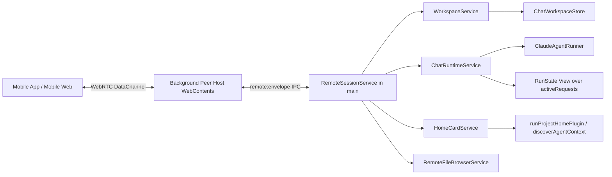
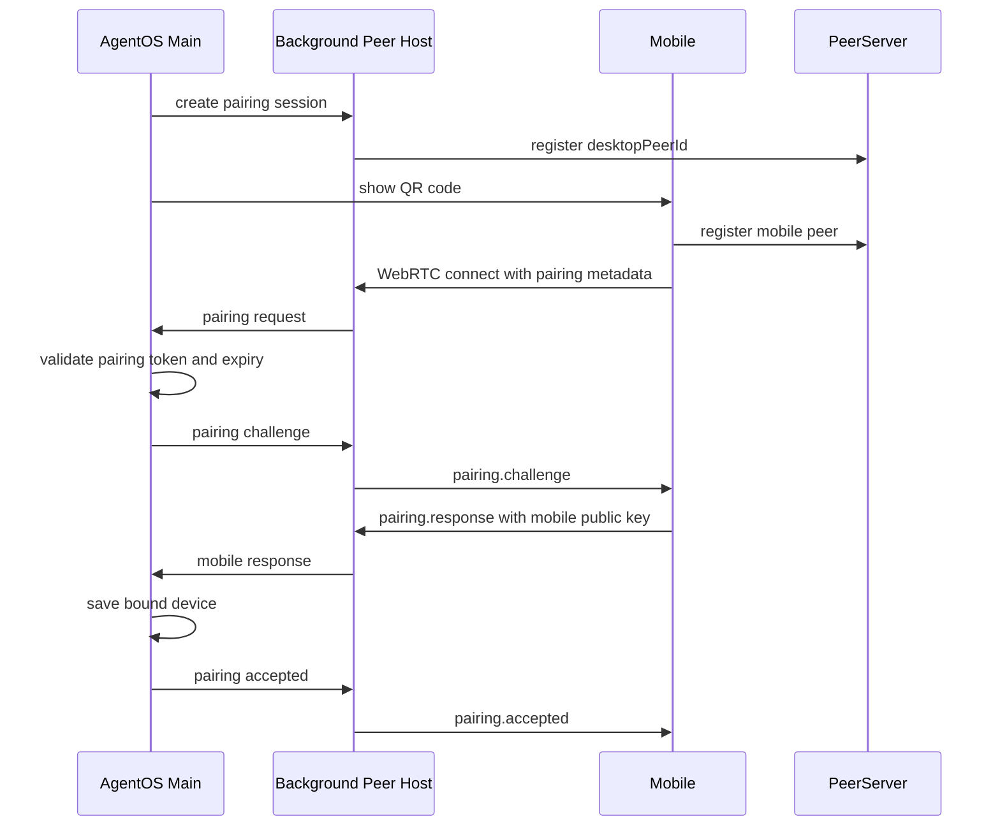
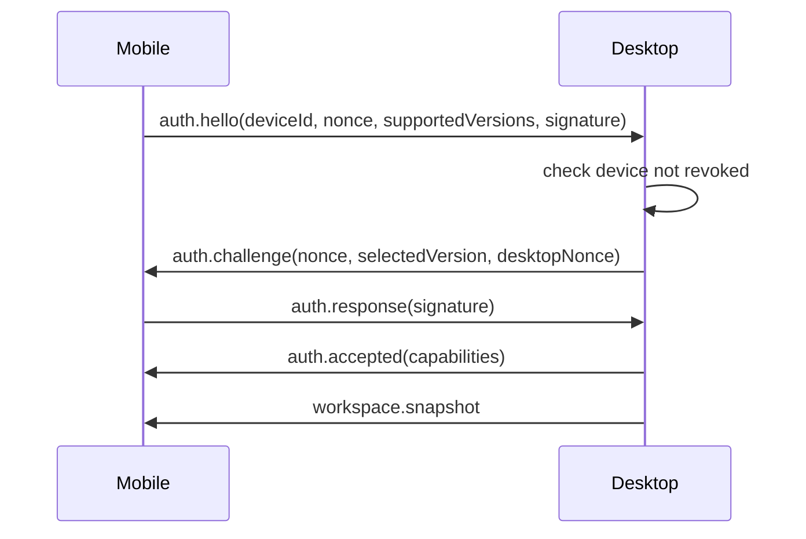

# AgentOS 移动端 PeerJS 远程连接方案 v2

## 核心判断

移动端不是桌面 UI 的遥控器，而是 AgentOS 的第二个客户端。为了避免后续被前端内存态卡住，工作区、运行态、Chat transcript 和项目卡片都应逐步以 Electron 主进程服务为权威源。

PeerJS/WebRTC 仍然适合作为手机和当前 AgentOS 的实时链路，但 PeerJS Host 不应该放在 `ChatPage` 或当前主窗口 React 树里。推荐形态是：

- PeerJS 跑在一个后台 WebContents 中，例如 hidden `BrowserWindow` 或专用不可见 renderer entry。
- Electron main 不直接跑 PeerJS，也不依赖 `wrtc`。
- main 进程负责 RemoteSessionService、WorkspaceService、ChatRuntimeService、HomeCardService、RemoteFileBrowserService。
- 后台 WebContents 只负责 WebRTC/PeerJS 连接、认证前置和 envelope 转发。

原因：PeerJS 依赖 Chromium 的 WebRTC API，例如 `RTCPeerConnection`。Electron main 的 Node 环境没有这些浏览器 API；强行使用 `wrtc` 会带来 Electron 30 原生模块编译、prebuild、维护状态和跨平台发布风险。hidden WebContents 才是 Electron 里更稳的“后台 Peer Host”。

## 目标

让手机 App 或移动网页通过扫码绑定当前这台电脑上的 AgentOS。绑定后，移动端可以在桌面端在线时自动重连，并完成以下操作：

- 查看 AgentOS 中的项目列表。
- 查看每个项目已有 Chat 线程。
- 选择任意 Chat 继续对话。
- 查看哪些 Chat 当前正在运行。
- 查看项目首页卡片，包括 Home Plugin 卡片、Task 卡片和 Project Skill 卡片。
- 在手机上浏览并选择当前电脑里的文件夹，用于添加项目或重新定位缺失项目路径。

本方案以 PeerJS/WebRTC DataChannel 作为移动端与桌面端之间的实时链路。PeerServer 只做 signaling，不承载业务消息；业务数据在 WebRTC DataChannel 中传输。

## 非目标

- 不在本阶段实现云端离线消息。
- 不把项目文件、模型配置、API Key 同步到第三方服务器。
- 不让移动端直接访问 Electron IPC。
- 不把 `peerId` 当成身份认证。
- 不在手机上远程弹出桌面系统目录选择框；手机端使用受控目录浏览器选择路径。

## 当前代码现状

### 已有能力

- 工作区状态由 `ChatWorkspaceStore` 持久化：
  - SQLite 索引：`chat-workspace.sqlite`
  - 线程 rollout：`chat-sessions/**/*.jsonl`
  - 兼容快照：`chat-workspace.json`
- 渲染进程通过 IPC 调用：
  - `chat-workspace:get`
  - `chat-workspace:save`
  - `claude-chat:submit`
  - `claude-chat:cancel`
  - `claude-chat:new-thread`
  - `claude-chat:answer-permission-request`
  - `desktop:list-project-files`
  - `desktop:read-project-file`
  - `desktop:run-home-plugin`
  - `desktop:list-agent-context`
- Chat 消息流由 `ClaudeAgentRunner` 产生，事件通过 `claude-chat:event` 推给渲染进程。
- 项目卡片由 `ProjectHomeSurface` 触发 `runHomePlugin` 和 `listAgentContext` 后在前端渲染。
- 当前运行态 `threadRunStates` 保存在 `AppShell`/`ChatPage` 的 React 内存中。
- `TaskHomePluginManager` 已经是主进程长驻运行、直接调用 `ClaudeAgentRunner` 且不依赖渲染层的成功先例。它应作为 `ChatRuntimeService` 的参考模板，而不是从零设计一套后台任务模型。

### 当前架构对移动端的阻碍

移动端不能只调用 `ClaudeAgentRunner.submit()`，因为现在完整 Chat 状态的组装主要发生在渲染进程：

- 用户消息的乐观插入在 `ChatPage.submitPrompt`。
- assistant/tool/thinking/file diff 等 transcript item 的归并在 `ChatPage.handleClaudeEvent`。
- pending request id 与真实 request id 的对齐也在渲染层。
- session resume 失败、`No conversation found with session ID` 恢复、编辑用户消息后 branch + resubmit 都在 `ChatPage` 内。
- 线程运行态 `threadRunStates` 是前端内存态。
- 项目卡片缓存也在 `ProjectHomeSurface` 内存态。

如果手机端绕过桌面 UI 直接向主进程提交消息，桌面 UI 不打开或当前线程不匹配时，Chat transcript 可能不会被正确写入 `ChatWorkspaceStore`。因此需要先把 Chat 运行编排从 React 组件中抽出来，形成主进程里的共享服务。

## 推荐架构



### 进程边界

| 层 | 建议位置 | 职责 |
| --- | --- | --- |
| Background Peer Host | hidden BrowserWindow / hidden renderer entry | PeerJS、WebRTC、DataChannel、基础握手、envelope 收发 |
| RemoteSessionService | Electron main | 设备认证、权限校验、消息路由、连接状态 |
| WorkspaceService | Electron main | 项目/线程读写、DTO、路径校验 |
| ChatRuntimeService | Electron main | submit、transcript 归并、持久化、事件广播 |
| HomeCardService | Electron main | Home Plugin、Task、Skill 卡片聚合 |
| RemoteFileBrowserService | Electron main | 受控目录浏览、项目路径选择 |
| Desktop React UI | visible renderer | 展示主进程权威状态的 view model、保留乐观 UI |

### 关键原则

- 桌面端是权威执行端：所有项目文件访问、Agent 执行、Chat 持久化都留在电脑本机。
- 手机端是远程客户端：只发送命令和展示状态，不直接操作本地文件系统。
- 主进程成为单一业务入口：移动端和桌面端都通过同一组服务读写工作区和 Chat。
- PeerJS 只负责建立 DataChannel：业务认证、授权、协议版本、设备撤销都由 AgentOS 自己实现。

## PeerJS 后台 Host 设计

### 为什么不能直接放 main

Electron main 是 Node 环境，没有浏览器原生 `RTCPeerConnection`。直接把 PeerJS 放 main 会引入以下问题：

- 需要 `wrtc` 或替代 WebRTC native module。
- 原生模块在 Electron 30 上经常需要重新编译。
- macOS/Windows/Linux 打包发布复杂度上升。
- WebRTC 行为与 Chromium renderer 不完全一致。

因此“放后台”的含义应是放进一个不可见的 WebContents，而不是放进 Node main。

### hidden WebContents 方案

新增一个远程连接入口，例如：

```text
src/remote-peer-host/main.ts
src/remote-peer-host/peer-host.ts
electron/remote-peer-window.ts
```

主进程在用户开启移动端连接时创建 hidden BrowserWindow：

```text
show: false
webPreferences:
  contextIsolation: true
  nodeIntegration: false
  preload: remote-peer-preload
```

后台 WebContents 与 main 之间使用专用 IPC：

| IPC | 方向 | 说明 |
| --- | --- | --- |
| `remote-peer:ready` | Peer Host -> main | WebRTC host 已加载 |
| `remote-peer:status` | Peer Host -> main | PeerServer 连接状态 |
| `remote-peer:inbound-envelope` | Peer Host -> main | 收到手机业务 envelope |
| `remote-peer:outbound-envelope` | main -> Peer Host | 发给手机业务 envelope |
| `remote-peer:create-pairing` | main -> Peer Host | 创建配对码 |
| `remote-peer:disconnect-device` | main -> Peer Host | 断开某设备 |

后台 WebContents 不接触项目文件、不调用 Claude、不持久化 Chat。它只把已建立的 DataChannel 变成 main 可消费的 envelope 流。

## PeerJS 连接模型

### 桌面端 Peer

AgentOS 首次启用移动连接时生成稳定安装 ID：

```ts
desktopInstallId = randomUUID()
desktopPeerId = `agentos-${desktopInstallId}`
```

这个 ID 保存到用户数据目录，例如：

```text
remote-access.json
```

建议字段：

```ts
interface RemoteAccessStore {
  schemaVersion: 1
  enabled: boolean
  desktopInstallId: string
  desktopPeerId: string
  desktopKeyPair: {
    publicKey: string
    encryptedPrivateKey: string
    storage: 'safeStorage' | 'file-dev-only'
  }
  peerServer: {
    host: string
    port: number
    secure: boolean
    path?: string
  }
  iceServers: Array<{
    urls: string | string[]
    username?: string
    credential?: string
  }>
  boundDevices: BoundDevice[]
  activePairing?: ActivePairing
}
```

桌面私钥建议使用 Electron `safeStorage` 加密后落盘。macOS 对应 Keychain，Windows 对应 DPAPI，Linux 依赖 libsecret。开发环境可允许明文或文件加密，但必须在 UI 上标记 dev-only。

重装语义：如果 `remote-access.json` 丢失，旧手机绑定全部失效。若未来需要跨重装恢复，需要把桌面 identity 迁移到系统凭据库或用户账号体系。本阶段默认“重装即解绑”。

### 手机端 Peer

手机端可以使用随机 peer id，也可以生成稳定 device peer id：

```ts
mobilePeerId = `agentos-mobile-${deviceId}`
```

手机端长期保存：

```ts
interface MobileBinding {
  schemaVersion: 1
  desktopPeerId: string
  desktopPublicKey: string
  deviceId: string
  deviceName: string
  mobilePublicKey: string
  encryptedMobilePrivateKey: string
  createdAt: number
  protocolVersion: number
}
```

私钥存储：

- iOS App：Keychain / Secure Enclave。
- Android App：Android Keystore。
- PWA：IndexedDB + WebCrypto；安全性弱于原生 App，必须在产品说明中标记风险。

## 扫码绑定流程

### 二维码内容

二维码不应该只放 `desktopPeerId`，而应包含一次性配对信息：

```json
{
  "v": 1,
  "app": "agentos",
  "desktopPeerId": "agentos-xxx",
  "desktopPublicKey": "...",
  "pairingId": "pair_xxx",
  "pairingToken": "one-time-secret",
  "expiresAt": 1760000000000,
  "peerServer": {
    "host": "peer.example.cn",
    "port": 443,
    "secure": true
  },
  "iceProfile": "cn-turns-443"
}
```

`iceProfile` 用于提示手机端选择本地 ICE 预设。如果移动端只信任二维码内的 `peerServer`，则应删除该字段，避免语义不清。

移动网页场景下，二维码可以是：

```text
https://mobile.agentos.app/pair#payload=base64url(...)
```

该页面必须是 HTTPS secure context。推荐做成 PWA，并在 Vite 中增加移动端多入口构建，而不是复用桌面 renderer 入口。

### 配对约束

- 默认同一桌面同一时间只允许一个 active pairing。
- pairing token 有效期建议 2 分钟。
- pairing 成功后 token 立即作废。
- pairing 失败超过阈值后短暂锁定，例如 5 次失败锁定 60 秒。
- 默认最多绑定 5 台设备。
- 桌面端应在配对成功前显示待绑定设备名并允许确认。

### 配对步骤



连接 metadata：

```ts
interface PairingMetadata {
  kind: 'agentos-pairing'
  version: 1
  pairingId: string
  pairingToken: string
  deviceName: string
  mobilePublicKey: string
  supportedProtocolVersions: number[]
}
```

桌面端保存设备：

```ts
interface BoundDevice {
  schemaVersion: 1
  deviceId: string
  name: string
  publicKey: string
  peerId?: string
  createdAt: number
  lastSeenAt?: number
  revokedAt?: number
  permissionsVersion: 1
  permissions: {
    readWorkspace: boolean
    readThreads: boolean
    submitChat: boolean
    browseFolders: boolean
    readProjectFiles: boolean
    approveReadOnlyPermissions: boolean
    approveWritePermissions: boolean
  }
}
```

## 握手安全

### 身份认证

PeerJS 的 `peerId` 只用于寻址，不用于授权。真正授权依赖设备密钥、签名和桌面端撤销列表。

绑定后，每次 DataChannel 建立都必须执行认证：



### 协议版本协商

从 Phase 0 起支持版本协商：

- 手机上报 `supportedProtocolVersions`。
- 桌面选择最高公共版本。
- 无公共版本时返回明确错误 `protocol_version_unsupported`。
- 所有 envelope 都带 `version` 字段。

### PeerServer MITM 防护

PeerServer 只做 signaling，但恶意 signaling 服务仍可能尝试替换 SDP/ICE 相关信息。需要把 DataChannel 的 WebRTC 层身份绑定到 AgentOS 设备身份上：

- 二维码中携带 `desktopPublicKey`。
- 桌面在 `auth.challenge` 中签名本次连接的 DTLS fingerprint、desktop peer id、mobile peer id、nonce。
- 手机读取本地 PeerConnection 的远端证书 fingerprint，与桌面签名中的 fingerprint 比对。
- 比对失败则断开，错误码 `dtls_fingerprint_mismatch`。

如果浏览器 API 无法稳定读取需要的 fingerprint，则必须把该限制记录为安全风险，并使用自控 PeerServer + TURNS 作为最低部署基线。

### 权限批准

默认不允许手机批准高风险权限。

建议权限分档：

- 只读权限：可以在手机上批准，例如读取文件、列目录。
- 写入权限：默认要求桌面端批准。
- bypass/accept edits 类高风险权限：禁止手机批准，或首次开启时必须桌面端二次确认。

## 长期绑定与自动重连

绑定是长期关系，DataChannel 是临时连接。

绑定后，只要不解绑：

- 手机保存 `desktopPeerId` 和设备密钥。
- 桌面端保存设备公钥和权限。
- 手机每次打开 App/网页时自动连接 `desktopPeerId`。
- 连接建立后执行挑战签名认证。
- 断线后指数退避重连。

移动网页限制：

- iOS PWA 后台超过短时间后可能挂起 `RTCPeerConnection`。
- 自动重连主要是“前台重新打开后重连”，不是后台永久在线。
- Agent 完成提醒不能依赖手机后台实时收到，桌面端仍应保留本地通知。

## 远程消息协议

所有 DataChannel 消息使用统一 envelope。`id` 表示帧 id，响应使用 `inReplyTo` 引用原帧。

```ts
type RemoteMessageType =
  | 'workspace.get'
  | 'workspace.snapshot'
  | 'thread.read'
  | 'thread.submit'
  | 'thread.item.appended'
  | 'homeCards.get'
  | 'folder.list'
  | 'error'

interface RemoteEnvelope<T = unknown> {
  id: string
  type: RemoteMessageType
  version: number
  ts: number
  deviceId?: string
  payload: T
}

interface RemoteResponse<T = unknown> {
  id: string
  type: 'response'
  version: number
  ts: number
  inReplyTo: string
  ok: boolean
  payload?: T
  error?: {
    code: string
    message: string
  }
}
```

建议在 `src/remote-types.ts` 中定义严格 TS 联合类型，而不是散落字符串。

### 移动端请求

| type | 说明 |
| --- | --- |
| `workspace.get` | 获取项目、线程、运行态摘要 |
| `project.list` | 获取项目列表 |
| `project.createFromFolder` | 用手机选中的桌面文件夹创建项目 |
| `project.relinkFolder` | 为缺失项目重新定位路径 |
| `thread.list` | 获取某项目线程列表 |
| `thread.read` | 读取某个 Chat 的 transcript，支持分页和 `sinceVersion` |
| `thread.create` | 在项目中创建新 Chat |
| `thread.submit` | 向某 Chat 继续发消息 |
| `thread.archive` | 归档 Chat |
| `run.cancel` | 取消正在运行的 Chat |
| `permission.answer` | 回答 Agent 权限请求 |
| `homeCards.get` | 获取项目首页卡片，支持分页或 size limit |
| `homeCards.action` | 执行卡片 action，例如 task_run/task_stop/refresh |
| `folder.roots` | 获取可浏览的桌面目录根 |
| `folder.list` | 列出某个目录的子目录 |
| `folder.select` | 选择目录作为项目路径 |
| `file.preview` | 预览项目内文件 |

### 桌面端推送

| type | 说明 |
| --- | --- |
| `workspace.snapshot` | 工作区完整摘要 |
| `workspace.updated` | 项目或线程列表变化 |
| `thread.snapshot` | 单线程 transcript 快照 |
| `thread.item.appended` | Chat 新增 transcript item |
| `thread.item.updated` | Chat 流式 item 更新 |
| `run.started` | 某线程开始运行 |
| `run.updated` | 运行态变化 |
| `run.finished` | 某线程结束运行 |
| `permission.request` | Agent 请求授权或用户输入 |
| `homeCards.updated` | 项目卡片刷新 |
| `folder.result` | 目录浏览结果 |
| `error` | 协议或权限错误 |

### 增量同步

增量同步必须从移动续聊阶段开始支持，不能推迟到产品化阶段。

最低要求：

```ts
interface VersionedThreadSnapshot {
  threadId: string
  version: number
  items: TranscriptItem[]
  hasMoreBefore: boolean
}

interface ThreadReadRequest {
  threadId: string
  sinceVersion?: number
  beforeItemId?: string
  limit?: number
}

interface ThreadItemPatch {
  threadId: string
  version: number
  item: TranscriptItem
}
```

规则：

- 每个 thread 维护单调递增 `version`。
- `thread.item.appended` 和 `thread.item.updated` 都带 version。
- 手机断线重连后用 `sinceVersion` 拉差量。
- 长线程默认分页读取，不一次性全量发送。

### 大对象和分块

DataChannel 单帧不应承载超大 payload。

规则：

- 单个 envelope 建议控制在 16 KB 到 64 KB。
- `thread.read` 使用分页。
- `homeCards.get` 对 A2UI messages 设置大小上限。
- `file.preview` 拒绝二进制大文件和超过上限的文本文件。
- 必要时新增 `chunk.start`、`chunk.part`、`chunk.end`，但优先用分页减少复杂度。

## 移动端视图设计

### 项目列表

```ts
interface RemoteProjectSummary {
  id: string
  name: string
  pathLabel: string
  pathMissing: boolean
  updatedAt: number
  pinnedAt?: number
  visibleThreadCount: number
  runningThreadCount: number
}
```

`pathLabel` 可以只显示尾部路径，例如：

```text
~/Github/CodeX-UI-Template
```

完整绝对路径可以在详情页按需展示。

### Chat 列表

```ts
interface RemoteThreadSummary {
  id: string
  projectId: string
  title: string
  purpose?: string
  updatedAt: number
  pinnedAt?: number
  archivedAt?: number
  messageCount: number
  preview: string
  version: number
  running?: RemoteRunState
}
```

运行中的 Chat 在列表上显示：

- running
- waiting for permission
- cancelling
- failed

### Chat 详情

移动端读取 `thread.read` 后展示 transcript。建议支持这些 item：

- user / assistant message
- tool call
- thinking
- activity
- file diff 摘要
- permission request

第一版移动端可以把 file diff 展示为摘要，不必做桌面端同等复杂的 diff UI。

### 当前运行

运行态不应重复实现一个并行 Map，而应扩展 `ClaudeAgentRunner` 内部 `activeRequests` 的可观察视图，再由 `ChatRuntimeService` 和 `TaskHomePluginManager` 标注业务来源。

```ts
interface RemoteRunState {
  threadId: string
  requestId: string
  projectId: string
  status: 'running' | 'waiting' | 'cancelling'
  startedAt?: number
  updatedAt: number
  source: 'desktop' | `mobile:${string}` | 'task' | 'skill'
  ownerDeviceId?: string
  permissionRequestId?: string
}
```

多设备规则：

- 默认只能取消自己发起的 mobile run。
- 桌面端可以取消所有 run。
- 管理员权限设备可取消所有 mobile run。
- `permission.answer` 需要携带 `deviceId`，谁先回答谁生效，后续回答返回 `permission_already_resolved`。

### 项目卡片

移动端通过 `homeCards.get` 获取项目卡片：

```ts
interface RemoteHomeCard {
  cardId: string
  kind: 'plugin' | 'task' | 'skill'
  title: string
  subtitle?: string
  size: 'small' | 'medium' | 'large'
  status: 'ready' | 'empty' | 'unchanged' | 'error'
  messages?: unknown[]
  variants?: Partial<Record<'small' | 'medium' | 'large', unknown[]>>
  actions: RemoteHomeCardAction[]
}
```

如果移动端使用 React，可以复用 `@a2ui/react` 渲染 A2UI messages。否则第一版可以做降级渲染：

- markdown/text 直接渲染。
- metric/list/table 做简单移动端组件。
- unknown component 显示 JSON 摘要或提示“请在桌面端查看”。

项目 Skills 卡片也应通过同一接口返回，移动端可以执行：

- run skill
- stop running skill
- open related thread

## 远程选择电脑文件夹

移动端不能直接调用桌面系统的 `dialog.showOpenDialog`。应新增受控目录浏览服务。

### 目录根

`folder.roots` 返回允许浏览的根目录：

```ts
interface RemoteFolderRoot {
  id: string
  label: string
  path: string
  kind: 'home' | 'desktop' | 'documents' | 'downloads' | 'projects' | 'existing-parent' | 'volume'
}
```

默认根：

- 用户 Home
- Desktop
- Documents
- Downloads
- `~/Projects`
- 已有项目的父目录
- macOS 可选列出 `/Volumes` 下的外接磁盘

### 列目录

```ts
interface FolderListRequest {
  rootId: string
  path: string
  includeHidden?: boolean
}

interface FolderListResult {
  path: string
  parentPath?: string
  items: Array<{
    name: string
    path: string
    kind: 'directory'
    readable: boolean
    packageHint?: 'node' | 'python' | 'git' | 'xcode' | 'unknown'
  }>
}
```

安全规则：

- 只列目录，不列文件内容。
- 路径必须在允许 root 下。
- 所有路径先 `realpath`，再校验真实路径仍落在允许 root 内，防止 symlink 穿透。
- 默认隐藏 dot directories。
- 限制单次返回数量，例如最多 300 个目录。
- 创建项目前要求桌面端可选弹出确认，显示手机选择的完整路径。

高风险路径至少包括：

- `/`
- `~`
- `~/Library`
- `/System`
- `/Volumes/*` 根目录
- `~/.ssh`
- `~/.aws`
- `~/Library/Application Support`

高风险路径默认不可选，或必须桌面端二次确认。

`file.preview` 必须拒绝：

- 非项目根目录内路径。
- 二进制大文件。
- 超过上限的文本文件。
- 图片以外的大型媒体文件。

## 需要重构的模块

### 1. Transcript Merger

先把 `ChatPage.handleClaudeEvent` 抽成纯函数模块，再谈主进程 ChatRuntimeService。

建议位置：

```text
src/lib/transcript-merger.ts
```

输入：

```ts
interface TranscriptMergeInput {
  chatState: ChatState
  event: ClaudeChatEvent
  requestState: TranscriptRequestState
}
```

输出：

```ts
interface TranscriptMergeResult {
  chatState: ChatState
  requestState: TranscriptRequestState
  effects: TranscriptMergeEffect[]
}
```

`effects` 描述副作用，例如：

- request finished
- request waiting for permission
- session id updated
- should retry without stale session
- should scroll to bottom
- should show status text

迁移路径：

1. React 中先改为调用纯函数，行为不变。
2. 增加单元测试覆盖 session_start、assistant_delta、thinking、tool、file_diff、permission_request、ask_user_question、result、error、cancelled。
3. 主进程 `ChatRuntimeService` 复用同一纯函数。
4. 进入双写期：主进程归并并写 `ChatWorkspaceStore`，渲染层仍维持现有内存 view model，对比一致性。
5. 一致后，渲染层不再作为持久化写入源，只订阅主进程权威状态。

### 2. ChatRuntimeService

新增主进程服务，统一处理 Chat 提交、事件归并、运行态和持久化。

职责：

- 创建用户消息 item。
- 调用 `ClaudeAgentRunner.submit()`。
- 监听 `ClaudeChatEvent`。
- 调用 `Transcript Merger` 把事件归并成 `TranscriptItem`。
- 更新 `ChatWorkspaceStore`。
- 维护 thread version。
- 广播给桌面 renderer 和移动端连接。

重构后：

```text
Desktop ChatPage submit
        |
        v
ChatRuntimeService.submitTurn()
        |
        v
ClaudeAgentRunner.submit()
```

移动端也是同一路径：

```text
Mobile thread.submit
        |
        v
RemoteSessionService
        |
        v
ChatRuntimeService.submitTurn()
```

桌面 UI 仍保留 view model：

- 用户输入时可以本地乐观插入。
- 主进程回包真实 request id 后，前端用 pending id 对齐。
- 持久化以主进程为准。
- 桌面端自动滚动、输入框清空、编辑态等 UI 行为仍在 React 内处理。

### 3. WorkspaceService

把工作区变更从 `AppShell` 中抽成共享服务。

职责：

- 读取、保存、归一化 `ChatWorkspaceState`。
- 创建项目。
- 创建线程。
- 归档线程。
- 置顶、排序。
- 项目路径缺失标记和重新定位。
- 生成移动端 DTO。

### 4. Run State View

不要重复实现一个与 `ClaudeAgentRunner.activeRequests` 并行的 Map。应扩展现有 runner 暴露只读运行态视图，并由 `ChatRuntimeService` 维护业务 metadata。

职责：

- 支持按 project/thread 查询。
- 记录来源：desktop、mobile device、task、skill。
- 记录等待权限的 request。
- 支持移动端取消运行。
- 在桌面 UI 启动或重载后恢复“正在运行”视图。

### 5. HomeCardService

封装项目卡片读取：

- 调用 `runProjectHomePlugin(rootPath, options)`。
- 调用 `discoverAgentContext(rootPath)` 获取 Project Skills。
- 合并 Home Plugin、Task、Skill 卡片。
- 复用现有 layout 规则。
- 输出移动端友好的 `RemoteHomeCard[]`。
- 卡片 action 经过权限校验后转发到现有 task/home-plugin 操作。

### 6. RemoteFileBrowserService

新增目录浏览服务，替代远程系统文件选择框。

职责：

- 提供可浏览根目录。
- 列出子目录。
- 校验选择路径。
- 创建项目或重新定位项目。

### 7. RemoteAccessStore

新增设备与 Peer 配置持久化。

职责：

- 保存桌面安装 ID。
- 保存桌面密钥。
- 保存 PeerServer/ICE 配置。
- 保存已绑定设备和撤销状态。
- 记录最近连接时间。

## 桌面端 UI 需要新增的设置

建议在 Settings 中新增“移动端连接”区域：

- 开启/关闭移动端连接。
- 显示当前连接状态。
- 显示二维码。
- 刷新一次性配对码。
- 已绑定设备列表。
- 撤销设备。
- PeerServer 配置。
- STUN/TURN 配置。
- ICE 诊断：
  - candidate 类型：host / srflx / relay
  - 当前是否走 TURN
  - 最近 RTT
  - 最近断开原因
- 权限开关：
  - 允许读取项目和 Chat。
  - 允许发送消息。
  - 允许浏览文件夹。
  - 允许预览项目文件。
  - 允许在手机上批准只读 Agent 权限请求。
  - 允许在手机上批准写入类 Agent 权限请求。

需要同步补充 zh/en 文案。

## 网络配置建议

### 开发验证

可以使用 PeerJS Cloud 做快速 spike：

```ts
new Peer(desktopPeerId, {
  host: '0.peerjs.com',
  port: 443,
  secure: true,
})
```

但 PeerJS Cloud 只适合 dev-only 或 fallback，不建议作为中国大陆生产依赖。

### 中国大陆生产

Phase 0 起就建议准备自控网络组件：

- 自建 PeerServer signaling。
- 国内可访问 STUN。
- 国内可访问 TURN。
- 至少提供 `turns:` over TCP 443。

示例：

```ts
const peer = new Peer(desktopPeerId, {
  host: 'peer.example.cn',
  port: 443,
  secure: true,
  config: {
    iceServers: [
      { urls: 'stun:stun.example.cn:3478' },
      {
        urls: 'turns:turn.example.cn:443?transport=tcp',
        username: '...',
        credential: '...',
      },
    ],
  },
})
```

原因：

- PeerServer 只负责 signaling。
- WebRTC 真实连通率取决于 NAT 类型、UDP 可用性、STUN/TURN 可达性。
- 国内严格 NAT 或运营商封 UDP 时，UDP TURN 通过率不足以支撑产品体验。
- TURNS over TCP 443 是更现实的最低可用基线。

## 分阶段落地

### Phase A: Transcript Merger 与 ChatRuntimeService

目标：先获得纯桌面收益，把 Chat 运行时从 React 内存态中解耦。

- 抽出 `src/lib/transcript-merger.ts`。
- 为关键事件归并加测试。
- 新增 `ChatRuntimeService`。
- 主进程开始维护 thread version。
- 桌面端进入双写对比期。

验收：

- 桌面端现有 Chat 行为不变。
- 主进程能独立归并并写入 workspace。
- 双写结果一致。

### Phase B: HomeCardService

目标：把项目卡片计算从 `ProjectHomeSurface` 提升到主进程服务。

- 新增 `HomeCardService`。
- 合并 Home Plugin、Task、Skill 卡片。
- 建立卡片缓存和刷新事件。

验收：

- 桌面项目首页仍正常展示卡片。
- 主进程能输出移动端 DTO。

### Phase C: PeerJS 后台 Host + Pairing Spike

目标：证明手机可以扫码连上 AgentOS。

- 新增 hidden Peer Host WebContents。
- 新增 `RemoteAccessStore`。
- 新增 pairing session。
- 完成 DataChannel ping/pong。
- 完成协议版本协商。
- 输出 ICE 诊断基础信息。

验收：

- 手机扫码后桌面端显示新设备连接。
- 断开后前台可自动重连。
- 桌面端可撤销设备。

### Phase D: 只读移动端

目标：手机可看项目、Chat、运行态。

- 新增 `workspace.get`、`thread.list`、`thread.read`。
- 支持 `sinceVersion`。
- 支持 transcript 分页。
- 移动端展示项目列表、线程列表、线程详情。

验收：

- 手机能看到所有项目。
- 手机能看到已有 Chat。
- 手机能看到当前运行中的线程。
- 断线重连后只拉差量。

### Phase E: 移动端续聊

目标：手机能选择 Chat 继续发消息。

- 实现 `thread.submit`、`run.cancel`、`permission.answer`。
- 手机 submit 走 `ChatRuntimeService.submitTurn()`。
- 主进程向手机和桌面同时广播 transcript patch。

验收：

- 手机在已有 Chat 中发送消息。
- 桌面端 UI 同步看到新消息。
- 手机能看到 assistant 流式输出。
- 手机能取消允许范围内的运行。

### Phase F: 项目卡片 + 远程文件夹

目标：手机能看项目首页卡片，并隔空选择电脑文件夹。

- 实现 `homeCards.get` 和 `homeCards.action`。
- 实现 `folder.roots`、`folder.list`、`folder.select`。
- 支持创建项目和重新定位缺失项目。
- 高风险路径要求桌面端确认。

验收：

- 手机进入项目后能看到项目卡片。
- 任务卡运行状态和 Chat 运行态一致。
- 手机能浏览允许 roots 下的目录。
- 手机选择目录后 AgentOS 新增项目。
- 手机不能越权浏览不允许路径。

### Phase G: 产品化

目标：可长期使用。

- 移动端 PWA 或原生 App。
- Vite 多入口构建。
- 设备管理 UI。
- 权限设置 UI。
- 国内 PeerServer/STUN/TURN 配置。
- 完整连接质量诊断。
- 协议版本兼容策略。
- 更完善的断线恢复和缓存清理。

## 建议文件组织

新增或重构的模块建议：

```text
electron/remote-access-store.ts
electron/remote-peer-window.ts
electron/remote-session-service.ts
electron/workspace-service.ts
electron/chat-runtime-service.ts
electron/home-card-service.ts
electron/remote-file-browser-service.ts
src/remote-types.ts
src/lib/transcript-merger.ts
src/remote-peer-host/main.ts
src/remote-peer-host/peer-host.ts
src/components/setting/MobileAccessSettingsPage.tsx
src/mobile/
```

如果移动端网页与桌面端共用仓库：

```text
src/mobile/main.tsx
src/mobile/App.tsx
src/mobile/peer-client.ts
src/mobile/views/ProjectsView.tsx
src/mobile/views/ThreadsView.tsx
src/mobile/views/ChatView.tsx
src/mobile/views/HomeCardsView.tsx
src/mobile/views/FolderPickerView.tsx
```

构建层需要补：

- `vite.config.ts` 多入口。
- `tsconfig.json` include。
- 移动端静态资源输出路径。
- Electron dev server 下 hidden Peer Host 的加载 URL。

## 关键验收清单

- 手机扫码能绑定当前 AgentOS。
- 绑定后关闭手机页面再打开，可以前台自动重连。
- 桌面端能撤销手机设备。
- 被撤销设备再次连接会收到明确错误码。
- 手机能看到项目列表。
- 手机能看到每个项目已有 Chat。
- 手机能选择已有 Chat 继续对话。
- 手机能看到运行中的 Chat。
- 手机能取消自己或允许范围内的运行。
- 手机能看到项目首页卡片。
- 手机能触发允许的卡片操作。
- 手机能浏览并选择当前电脑里的文件夹。
- 手机不能访问未授权目录。
- 桌面端和手机端对同一 Chat 的 transcript 保持一致。
- 断线重连后使用 `sinceVersion` 增量恢复。
- ICE 诊断能显示是否走 relay/TURN。

## 最大风险

- WebRTC 在中国大陆公网环境下不稳定，尤其是没有 TURNS over TCP 443 的情况下。
- 当前 Chat transcript 归并在 React 组件内，移动端能力会倒逼主进程服务化重构。
- 移动网页后台运行会被系统限制，长期在线体验不如原生 App。
- 项目卡片依赖 A2UI 输出，移动端要么复用 A2UI 渲染器，要么做降级渲染。
- 远程文件夹浏览必须非常克制，否则容易把本机文件系统暴露过大。
- DTLS fingerprint 绑定在浏览器 API 层可能存在实现难度，需要 spike 验证。

## 推荐决策

推荐按 `Phase A -> Phase B -> Phase C` 开始，而不是先急着做手机 UI：

1. 先把 transcript merger 抽纯函数，降低 ChatRuntimeService 风险。
2. 再把主进程 ChatRuntimeService 做出来，让桌面端先受益。
3. PeerJS Host 使用 hidden WebContents 做后台，不进入当前 UI React 树，也不进入 Node main。
4. 从第一版就支持协议版本、增量同步、设备撤销和 ICE 诊断。
5. 中国大陆场景不要依赖 PeerJS Cloud；自建 PeerServer + TURNS over TCP 443 是产品化最低基线。
