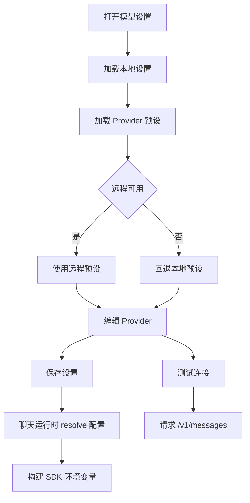

# 模型与 Provider 设置 PRD

## 功能概述

模型与 Provider 设置模块负责管理 Claude Agent 运行所需的 API Key、Auth Token、Base URL、模型名称、层级模型和图片能力。用户可以选择内置 Provider 预设，也可以添加兼容 Anthropic API 的自定义 Provider。

## 核心功能列表

| 优先级 | 功能 | 说明 |
| --- | --- | --- |
| P0 | Provider 管理 | 新增、编辑、删除、选择活跃 Provider |
| P0 | 凭据配置 | 支持 API Key 和 Auth Token 两种认证模式 |
| P0 | Base URL 配置 | 支持 Anthropic 与兼容服务地址 |
| P0 | 模型选择 | 支持主模型和 Haiku/Sonnet/Opus 层级模型 |
| P0 | 图片能力 | Provider 和模型可声明是否支持图片 |
| P1 | Provider 预设 | 从远程预设加载，失败时回退本地预设 |
| P1 | 连接测试 | 发送测试请求验证配置 |
| P1 | 聊天模型选择 | 聊天页可设置当前 active chat pick |

## 数据结构

```ts
interface ClaudeAgentModelProvider {
  id: string
  presetId?: string
  name: string
  apiKeyUrl?: string
  authMode: 'api-key' | 'auth-token'
  apiKey?: string
  authToken?: string
  baseUrl?: string
  model?: string
  modelSupportsImages?: boolean
  defaultHaikuModel?: string
  defaultSonnetModel?: string
  defaultOpusModel?: string
}

interface ClaudeAgentSettingsSnapshot {
  providers: ClaudeAgentModelProvider[]
  activeProviderId?: string
  activeChatModel?: string
  activeChatModelSupportsImages?: boolean
  configSource: 'settings' | 'env'
}
```

## 业务逻辑



业务规则：

- 打包版本配置来源固定为 settings。
- 开发环境可以按配置读取 env 来源。
- Base URL 若未包含 `/v1`，测试连接时自动拼接 `/v1/messages`。
- 模型图片能力影响聊天附件提交。
- 第三方 Anthropic 兼容服务通过环境变量传递模型名。

## 相关代码文件

### 核心页面组件

- `src/components/ClaudeAgentSettingsPage.tsx`
- `src/components/SettingsPage.tsx`

### 功能组件/UI组件

- `src/components/Composer.tsx`

### 数据管理

- `src/claude-chat-types.ts`
- `src/model-provider-presets.json`
- `src/desktop-types.ts`

### 业务逻辑工具/工具类

- `electron/claude-agent-settings.ts`
- `electron/claude-agent-runner/config.ts`
- `electron/main.ts`

### Hooks/其他

- `electron/env-loader.ts`

## 关联PRD文档

### 直接关联

- `prd/chat-agent-runtime.md`：聊天运行依赖模型配置。
- `prd/file-context.md`：图片附件依赖模型图片能力。

### 间接关联

- `prd/task-home-plugin.md`：任务后台运行依赖模型配置。
- `prd/desktop-shell-settings-release.md`：设置页承载模型配置入口。

### 功能关联/支撑系统

- `prd/persistence.md`：Provider 设置保存在 Electron userData。

