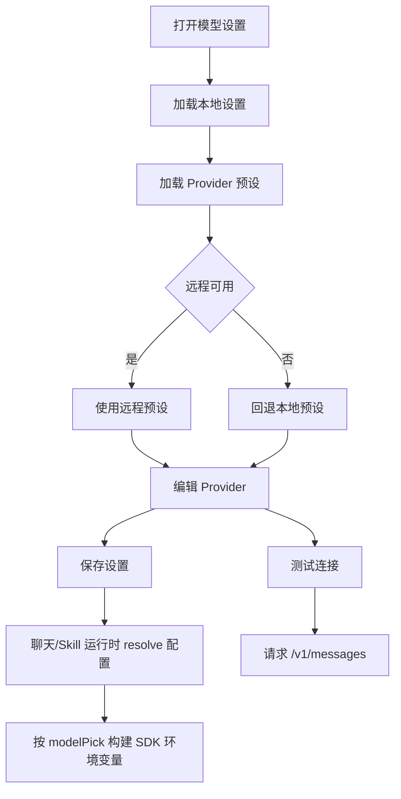

# 模型与 Provider 设置 PRD

## 功能概述

模型与 Provider 设置模块负责管理 Claude Agent 运行所需的 API Key、Auth Token、Base URL、模型名称、层级模型、图片能力和 thread/Skill 使用的实际模型选择。用户可以选择内置 Provider 预设，也可以添加兼容 Anthropic API 的自定义 Provider。

## 核心功能列表

| 优先级 | 功能 | 说明 |
| --- | --- | --- |
| P0 | Provider 管理 | 新增、编辑、删除、选择活跃 Provider |
| P0 | 凭据配置 | 支持 API Key 和 Auth Token 两种认证模式 |
| P0 | Base URL 配置 | 支持 Anthropic 与兼容服务地址 |
| P0 | 模型选择 | 支持主模型和 Haiku/Sonnet/Opus 层级模型 |
| P0 | 图片能力 | Provider 和模型可声明是否支持图片 |
| P1 | Provider 预设 | 从远程预设加载，失败时回退本地预设 |
| P1 | 连接测试 | 发送测试请求验证配置 |
| P1 | 聊天模型选择 | 聊天页可为当前 thread 设置 provider/model |
| P1 | 项目默认模型 | Agent 设置“项目”面板可为当前项目设置新建对话默认模型 |
| P1 | Skill 模型选项 | Agent 设置 Skills 面板复用同一聚合模型列表 |
| P1 | 首次启动配置 | 空工作区引导中可直接写入当前 active Provider |
| P1 | 环境变量模式 | 开发环境可选择 env 来源，打包环境强制 settings |

## 数据结构

```ts
interface ClaudeAgentModelProvider {
  id: string
  presetId: string
  name: string
  apiKeyUrl: string
  authMode: 'apiKey' | 'authToken'
  apiKey: string
  authToken: string
  baseUrl: string
  model: string
  modelSupportsImages: boolean
  defaultHaikuModel: string
  defaultHaikuSupportsImages: boolean
  defaultSonnetModel: string
  defaultSonnetSupportsImages: boolean
  defaultOpusModel: string
  defaultOpusSupportsImages: boolean
}

interface ClaudeAgentSettings {
  configSource: 'settings' | 'env'
  activeProviderId: string
  activeAnthropicModel: string
  providers: ClaudeAgentModelProvider[]
}

interface ClaudeAgentSettingsSnapshot {
  settings: ClaudeAgentSettings
  env: {
    hasApiKey: boolean
    hasAuthToken: boolean
    baseUrl: string
    model: string
    supportsImages: boolean
    defaultHaikuModel: string
    defaultOpusModel: string
    defaultSonnetModel: string
  }
}

interface ChatModelPick {
  providerId: string
  anthropicModel: string
}

interface ModelPickMenuRow {
  pickKey: string
  providerId: string
  anthropicModelId: string
  useOverlayPick: boolean
  supportsImages: boolean
  headline: string
  metaLine: string
}
```

## 业务逻辑



业务规则：

- 打包版本配置来源固定为 settings。
- 开发环境可以按配置读取 env 来源。
- Base URL 若未包含 `/v1`，测试连接时自动拼接 `/v1/messages`。
- 模型图片能力影响聊天附件提交。
- 第三方 Anthropic 兼容服务通过环境变量传递模型名。
- `activeAnthropicModel` 只允许匹配当前 Provider 的主模型或 Haiku/Sonnet/Opus 映射；等于主模型时归并为空字符串。
- composer 和 Agent 设置 Skills 面板使用 `buildModelPickRows` 聚合模型选项；每个 Provider 的主模型、Haiku、Sonnet、Opus 映射都会生成可选项，重复模型名在同一 Provider 内去重。
- `ChatModelPick` 是实际运行模型的最小闭包，只保存 `providerId` 和 `anthropicModel`；它可被 thread、项目默认模型、Project Skill 覆盖和文件回滚请求复用。
- 活动 thread 存在时，聊天模型选择只更新该 thread 的 `chatState.modelPick` 并清空不匹配的 `sessionId`；没有活动 thread 时才更新全局 `activeProviderId/activeAnthropicModel`。
- 项目设置存在有效 `projectModelPick` 时，项目首页 composer 初始显示该模型；之后用户在项目首页 composer 中切换模型会写入当前项目的内存态草稿模型，下一次新建普通对话会继承该草稿模型并随即清空，后续新建对话重新回到项目默认模型。
- Project Skill 手动运行会按 Skill 覆盖、显式 Skill 模型、项目首页草稿模型、项目默认模型、同项目活动 thread 模型、全局默认模型的顺序解析；每一层都必须通过 Provider/model 有效性校验，失效时跳过。
- 全局 `activeProviderId/activeAnthropicModel` 是无项目默认模型、无效模型覆盖和无活动 thread 场景的 fallback；如果当前全局模型被删除，则自动选择当前 Provider 的第一个有效模型，仍无有效模型时遍历其它 Provider。
- `ClaudeAgentSettingsStore.resolve(modelPick)` 会优先校验并使用请求携带的 provider/model，构造本次 SDK 的 `ANTHROPIC_*` env；校验失败时回退原有 settings/env resolve 逻辑。
- Provider id 会去重；重复 id 会追加序号后缀。
- `authToken` 模式在测试请求中使用 `Authorization: Bearer`，`apiKey` 模式使用 `x-api-key`。
- env 来源读取 `ANTHROPIC_API_KEY`、`ANTHROPIC_AUTH_TOKEN`、`ANTHROPIC_BASE_URL`、`ANTHROPIC_MODEL`/`CLAUDE_MODEL`、`ANTHROPIC_DEFAULT_*_MODEL` 和 `ANTHROPIC_SUPPORTS_IMAGES`。
- 连接测试超时为 20 秒，成功时验证一个可用模型；失败时尽量读取厂商返回的错误体。

## 相关代码文件

### 核心页面组件

- `src/components/setting/ClaudeAgentSettingsPage.tsx`
- `src/components/setting/SettingsPage.tsx`
- `src/components/chat/ChatPage.tsx`

### 功能组件/UI组件

- `src/components/chat/Composer.tsx`

### 数据管理

- `src/claude-chat-types.ts`
- `src/model-provider-presets.ts`
- `src/model-provider-presets.json`
- `src/desktop-types.ts`
- `src/model-pick.ts`

### 业务逻辑工具/工具类

- `electron/claude-agent-settings.ts`
- `electron/claude-agent-runner.ts`
- `electron/claude-agent-runner/config.ts`
- `electron/main.ts`

### Hooks/其他

- `electron/env-loader.ts`

## 关联PRD文档

### 直接关联

- `prd/chat-agent-runtime.md`：聊天运行依赖模型配置。
- `prd/agent-mode.md`：Project Skill 模型覆盖引用 Provider/model 选项并做有效性校验。
- `prd/file-context.md`：图片附件依赖模型图片能力。

### 间接关联

- `prd/task-home-plugin.md`：任务后台运行依赖模型配置。
- `prd/desktop-shell-settings-release.md`：设置页承载模型配置入口。

### 功能关联/支撑系统

- `prd/persistence.md`：Provider 设置保存在 Electron userData。
