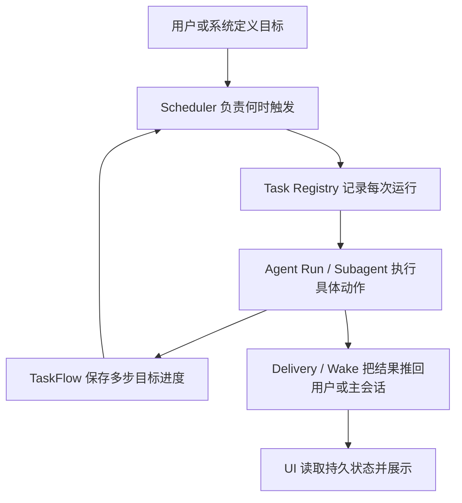

# OpenClaw 长任务机制对 CodeX-UI-Template 的启发

## 文档目的

这份文档把 OpenClaw 的长期任务、后台任务、心跳唤醒和多步任务流机制翻译成对 CodeX-UI-Template 有指导意义的设计建议。

CodeX-UI-Template 现在已经有几个很接近的基础：

- `Task Home Plugin`：项目首页任务卡、定时运行、运行态展示。
- `Agent Mode`：项目级 `AGENT.md`、`SOUL.md`、`MEMORY.md`、`TODO.md` 等长期上下文。
- `Chat Agent Runtime`：Claude Agent SDK 的运行、事件流、取消、权限请求和 session resume。
- `Persistence`：工作区、线程、rollout、项目设置和 task/runtime 文件持久化。

OpenClaw 值得借鉴的地方不在于某一个具体 API，而在于它把长期任务拆成了几层清晰的系统：



核心结论：**长期运行不是让一个模型调用一直不结束，而是把任务变成一串可恢复、可检查、可唤醒的离散 agent turn。**

## 对 CodeX-UI-Template 的关键启发

### 1. 任务卡不是任务系统本身

当前 Template 的 `Task Home Plugin` 已经能创建任务卡、写 `task.json` / `runtime.json`，并用 Electron timer 触发运行。这个设计很适合做 UI 和项目内配置，但如果要走向 OpenClaw 式长期任务，需要把概念拆开：

| 层 | Template 当前对应 | 建议职责 |
| --- | --- | --- |
| Task Card | `.agents/home-plugins/<slug>/manifest.json`、`task.json`、`runtime.json` | 面向用户的卡片定义和 UI 缓存 |
| Scheduler | `TaskHomePluginManager.scheduleRecord()` | 只负责计算下一次运行并入队 |
| Task Registry | 当前缺少独立账本 | 记录每一次 run 的生命周期 |
| Agent Runner | `ClaudeAgentRunner.submit()` | 执行具体 agent turn，发出事件 |
| Task Flow | 当前缺少 | 管理宽泛目标、多步目标、等待和恢复 |
| Delivery / Wake | 当前主要靠 UI 事件 | 任务完成后主动推回线程、首页或通知 |

建议不要让 `runtime.json` 成为唯一事实来源。更稳的形状是：

- 项目内 `task.json` 仍然是用户可迁移的任务定义。
- 项目内 `runtime.json` 可以保留为首页卡片的快照缓存。
- Electron userData 或项目 `.agents/tasks/` 下新增一个任务账本，记录每一次 run。
- UI 从账本和快照恢复状态；账本不可用时再回退到 `runtime.json`。

### 2. 每次后台运行都应该有 Task Record

OpenClaw 的 `Background tasks` 不是调度器，而是活动账本。它记录“发生了什么、是否还在跑、最后怎么结束”。

Template 可以引入类似结构：

```ts
type AgentTaskStatus =
  | 'queued'
  | 'running'
  | 'waiting'
  | 'succeeded'
  | 'failed'
  | 'timed_out'
  | 'cancelled'
  | 'lost'

interface AgentTaskRunRecord {
  taskId: string
  runId: string
  projectId: string
  projectPath: string
  source: 'home-plugin-task' | 'skill-run' | 'manual' | 'heartbeat'
  slug?: string
  threadId?: string
  sessionId?: string
  requestId?: string
  status: AgentTaskStatus
  title: string
  summary?: string
  error?: string
  createdAt: number
  startedAt?: number
  completedAt?: number
  lastEventAt?: number
  cleanupAfter?: number
  notifyPolicy: 'silent' | 'done_only' | 'state_changes'
}
```

这会带来几个直接好处：

- 应用重启后可以区分 `queued/running` 是真的还活着，还是已经丢失。
- 任务卡可以展示“最近 5 次运行”和失败原因。
- 线程、任务卡、首页通知都能通过同一个 `taskId/runId` 串起来。
- 以后要做 CLI、外部触发、系统托盘通知时，不需要重写任务状态模型。

### 3. 宽泛目标需要 TaskFlow，而不是只靠 Prompt

如果目标是“每天帮我研究市场并持续优化报告”，单次任务记录不够。它需要知道：

- 当前目标是什么。
- 当前做到哪一步。
- 现在是在等待子任务、等待时间、等待用户，还是已经完成。
- 哪些子任务属于这个目标。
- 是否有取消意图。
- 多个事件同时更新时谁是新状态。

可以引入 `TaskFlow`：

```ts
type AgentTaskFlowStatus =
  | 'running'
  | 'waiting'
  | 'blocked'
  | 'succeeded'
  | 'failed'
  | 'cancelled'

interface AgentTaskFlowRecord {
  flowId: string
  projectId: string
  ownerThreadId?: string
  title: string
  goal: string
  status: AgentTaskFlowStatus
  currentStep?: string
  stateJson: string
  waitJson?: string
  childTaskIds: string[]
  revision: number
  cancelRequestedAt?: number
  createdAt: number
  updatedAt: number
}
```

`revision` 很重要。OpenClaw 的 TaskFlow 更新会带 expected revision，避免多个完成事件、心跳事件或用户操作同时推进同一个 flow 时互相覆盖。

对 Template 来说，TaskFlow 最适合服务这类能力：

- 一个任务卡背后有多步 Skills 编排。
- 一个宽泛目标需要持续几天、几周推进。
- 一个 agent 需要先收集信息，再生成文件，再等待用户确认，再发布。
- 一个任务运行时派生多个子任务，最终汇总成一条结果。

### 4. Heartbeat 适合“项目常驻意识”，Cron 适合“确定时间触发”

OpenClaw 把 Heartbeat 和 Cron 分得很清楚：

- Cron：确定时间、固定间隔、一次性提醒、周期性报告。
- Heartbeat：周期性唤醒 agent，让它查看 `HEARTBEAT.md`，决定是否有值得做的事。

Template 已经有 `Agent Mode` 文件体系，可以自然加入 `HEARTBEAT.md`：

```md
# HEARTBEAT.md

## 关注事项

- 如果有正在等待的长期任务，检查是否需要推进。
- 如果 TODO.md 有阻塞项，判断是否能继续处理。
- 如果最近一次任务失败，尝试整理失败原因并更新任务卡。

tasks:
  - name: refresh-project-summary
    every: 1d
    prompt: 更新项目首页摘要卡片，只在内容有变化时写入。
```

对 UI 的建议：

- Agent Mode 设置里增加 Heartbeat 开关和间隔。
- 项目首页显示下一次 heartbeat 时间和最近一次结果。
- Heartbeat 不应制造噪音；没有值得报告的变化时只更新内部状态。
- Heartbeat 运行不一定创建普通聊天消息，但可以创建 task record 方便审计。

### 5. 完成通知应该是 push-based，不要让 agent 自己轮询

OpenClaw 的一个重要原则是：子任务完成后由运行时把结果推回父会话或唤醒 heartbeat，而不是让父 agent 一直循环查状态。

Template 可以对应成：

- `ClaudeAgentRunner` 完成后发出统一的 terminal event。
- `TaskRegistry` 接住 event，更新 run record。
- 如果有 `threadId`，把完成摘要写入对应 task-run 线程。
- 如果有首页卡片，刷新 task card runtime cache。
- 如果有 flow，推进 flow 的下一步。
- 如果用户打开着项目首页，直接 IPC 推送 UI。

这样 agent 的自主性会更稳：它不是靠“我一直想”，而是靠“有状态变化时我被叫醒”。

## 推荐落地路线

### Phase 1：把 Task Home Plugin 升级成可审计后台任务

目标：保留现有任务卡体验，但新增独立任务账本。

建议新增文件：

- `electron/agent-task-registry.ts`
- `electron/agent-task-registry-store.ts`
- `electron/agent-task-maintenance.ts`

建议修改文件：

- `electron/task-home-plugin-manager.ts`：从直接管理所有运行态，逐步变成“任务卡定义 + 调度入口 + UI 快照写入”。
- `electron/claude-agent-runner.ts`：暴露更稳定的 run lifecycle event，例如 `queued/running/waiting/terminal`。
- `electron/main.ts`：增加 task list、task show、task cancel、task history IPC。
- `src/desktop-types.ts`：增加 `AgentTaskRunRecord`、`AgentTaskFlowRecord`、IPC payload 类型。
- `src/components/chat/ProjectHomeSurface.tsx`：任务卡从 registry 读取最近运行状态。
- `prd/task-home-plugin.md`、`prd/persistence.md`：更新任务账本与 runtime cache 的职责边界。

验收标准：

- 每次任务卡运行都会产生一个 `taskId` 和 `runId`。
- 运行中退出应用再打开，可以把不确定运行标记为 `lost` 或 `cancelled`，并保留历史记录。
- 同一任务卡不能重复启动同一轮运行。
- 用户能在任务卡或线程中看到最近一次失败原因。

### Phase 2：引入 TaskFlow 支撑宽泛目标

目标：让“做完一个宽泛目标”不再只依赖单次 prompt。

建议新增文件：

- `electron/agent-task-flow-registry.ts`
- `electron/agent-task-flow-store.ts`
- `electron/agent-task-flow-runner.ts`

建议 UI：

- 任务卡可切换为 `single-run` 或 `flow` 模式。
- Flow 卡片显示当前阶段、下一步、阻塞项、子任务数量、最近更新时间。
- Flow 详情页或线程里展示事件时间线。

验收标准：

- Flow 可以创建、等待、恢复、完成、失败、取消。
- Flow 每次更新都带 revision，避免并发覆盖。
- Flow 可以挂载多个 task run。
- Flow 的状态足以让 agent 下一次醒来后知道该继续什么。

### Phase 3：把 Heartbeat 纳入 Agent Mode

目标：让项目 agent 有轻量的“常驻检查能力”。

建议修改：

- `electron/agent-mode-files.ts`：可选创建 `HEARTBEAT.md`。
- `electron/agent-context.ts`：heartbeat run 注入轻量上下文，只读取必要文件。
- `electron/task-home-plugin-manager.ts` 或新 scheduler：支持 heartbeat interval。
- `src/components/setting/AgentModeSettingsPage.tsx`：增加 Heartbeat 设置。

验收标准：

- 没有 `HEARTBEAT.md` 或文件为空时，不浪费模型调用。
- 有 due task 时才运行具体检查。
- 应用忙、任务运行中或线程有请求时，heartbeat 延后。
- Heartbeat 发现实质变化时才通知用户或更新卡片。

### Phase 4：支持子任务和后台 agent 编排

目标：让一个宽泛目标能拆成多个子 agent run。

Template 不一定要完整复制 OpenClaw 的 `sessions_spawn`，可以先做轻量版：

- 每个子任务创建一个 `task-run` thread。
- 父 flow 记录 `childTaskIds`。
- 子任务完成后由 registry 推进父 flow。
- 父 flow 不轮询；它等待 terminal event。

验收标准：

- 父任务能启动多个子任务。
- 子任务结果自动回写父 flow。
- 用户可以取消父 flow，并级联取消未完成子任务。
- UI 能展示子任务运行中、完成、失败状态。

## OpenClaw 源码阅读地图

下面这些是最值得读的 OpenClaw 代码和架构文档。建议按顺序看，不要一开始陷进所有测试文件。

### 1. 先读架构文档，建立概念边界

| 主题 | 先看 | 重点理解 |
| --- | --- | --- |
| 自动化总览 | [OpenClaw Automation](../../openclaw-code/docs/automation/index.md) | 什么时候用 cron、task、heartbeat、taskflow |
| 定时任务 | [Cron Jobs](../../openclaw-code/docs/automation/cron-jobs.md) | scheduler 在 Gateway 内运行，不在模型里运行 |
| 后台任务 | [Background Tasks](../../openclaw-code/docs/automation/tasks.md) | task 是活动账本，不是调度器 |
| 多步任务流 | [Task Flow](../../openclaw-code/docs/automation/taskflow.md) | flow 管多步目标，task 管单次 detached work |
| 心跳唤醒 | [Heartbeat](../../openclaw-code/docs/gateway/heartbeat.md) | 什么时候该主动醒来，什么时候保持安静 |
| 子 agent 编排 | [Session Tools](../../openclaw-code/docs/concepts/session-tool.md) | `sessions_spawn`、`sessions_yield` 和 completion push |
| 系统提示 | [System Prompt](../../openclaw-code/docs/concepts/system-prompt.md) | prompt 如何约束 agent 使用长期任务工具 |

### 2. Scheduler：看 OpenClaw 如何让时间触发变可靠

优先看：

- [src/cron/service.ts](../../openclaw-code/src/cron/service.ts)
- [src/cron/service/timer.ts](../../openclaw-code/src/cron/service/timer.ts)
- [src/cron/store.ts](../../openclaw-code/src/cron/store.ts)
- [src/cron/active-jobs.ts](../../openclaw-code/src/cron/active-jobs.ts)

阅读重点：

- job definition 和 runtime state 分开保存。
- timer 不是无限循环模型调用，而是不断计算下一次 due job。
- 执行前标记 running，执行后写 run history，再计算 next run。
- timeout、abort、cleanup 都在 runtime 层处理。
- main session、isolated session、custom session 是不同执行形态。

对 Template 的启发：

- `TaskHomePluginManager` 里的 timer 应该逐渐变成 scheduler，而不是承载完整任务真相。
- schedule state 和 task run state 要分离。
- 定时触发应该入队创建 run record，再交给 runner。

### 3. Task Registry：看 OpenClaw 如何记录后台工作

优先看：

- [src/tasks/task-registry.ts](../../openclaw-code/src/tasks/task-registry.ts)
- [src/tasks/task-registry.store.sqlite.ts](../../openclaw-code/src/tasks/task-registry.store.sqlite.ts)
- [src/tasks/task-registry.maintenance.ts](../../openclaw-code/src/tasks/task-registry.maintenance.ts)
- [src/tasks/task-executor.ts](../../openclaw-code/src/tasks/task-executor.ts)

阅读重点：

- `createTaskRecord` 如何统一创建不同来源的后台任务。
- agent lifecycle event 如何把 task 从 queued/running 推到 terminal。
- terminal update 如何直接投递，或排队到 owner session。
- maintenance 如何处理 lost、prune、recovery。
- SQLite 表如何设计索引，保证任务列表和审计能长期跑。

对 Template 的启发：

- 新增 `AgentTaskRunRecord` 以后，所有后台运行都应该接入同一个 registry。
- 任务状态不要只存在 React state 或单个卡片 runtime 文件里。
- 任务完成后应该由 registry 负责推 UI 和更新线程，而不是散落在各个 runner 回调里。

### 4. TaskFlow：看 OpenClaw 如何处理宽泛目标

优先看：

- [src/tasks/task-flow-registry.ts](../../openclaw-code/src/tasks/task-flow-registry.ts)
- [src/tasks/task-flow-registry.store.sqlite.ts](../../openclaw-code/src/tasks/task-flow-registry.store.sqlite.ts)
- [src/tasks/task-flow-registry.maintenance.ts](../../openclaw-code/src/tasks/task-flow-registry.maintenance.ts)
- [skills/taskflow/SKILL.md](../../openclaw-code/skills/taskflow/SKILL.md)

阅读重点：

- `createManagedTaskFlow`、`setFlowWaiting`、`resumeFlow`、`finishFlow`、`failFlow` 的状态转移。
- `expectedRevision` 如何防止并发覆盖。
- managed flow 和 mirrored flow 的区别。
- cancel intent 为什么要持久化。

对 Template 的启发：

- 任务卡的 Skills 编排可以先变成一个 managed flow。
- 宽泛目标必须有 flow state，而不是只存在 prompt 里。
- Flow UI 应该展示 current step、wait reason、blocked task、child tasks。

### 5. Heartbeat：看 OpenClaw 如何做低噪音主动性

优先看：

- [src/infra/heartbeat-wake.ts](../../openclaw-code/src/infra/heartbeat-wake.ts)
- [src/infra/heartbeat-runner.ts](../../openclaw-code/src/infra/heartbeat-runner.ts)
- [src/agents/gpt5-prompt-overlay.ts](../../openclaw-code/src/agents/gpt5-prompt-overlay.ts)
- [docs/gateway/heartbeat.md](../../openclaw-code/docs/gateway/heartbeat.md)

阅读重点：

- `requestHeartbeat` 如何合并 wake 请求，避免重复唤醒。
- 忙碌时如何 defer，而不是并发打断。
- `HEARTBEAT.md` 为空或无 due task 时如何跳过模型调用。
- due task 的 last-run timestamp 存在哪里。
- prompt 如何要求 agent “有事做事，没事安静”。

对 Template 的启发：

- Agent Mode 很适合自然承载 `HEARTBEAT.md`。
- Heartbeat 应该先做轻量上下文，不要每次都塞完整聊天历史。
- 心跳结果应该优先更新 task/flow/card 状态，必要时再打扰用户。

### 6. Subagent / Session Tools：看 OpenClaw 如何避免父 agent 轮询

优先看：

- [src/agents/tools/sessions-spawn-tool.ts](../../openclaw-code/src/agents/tools/sessions-spawn-tool.ts)
- [src/agents/tools/sessions-yield-tool.ts](../../openclaw-code/src/agents/tools/sessions-yield-tool.ts)
- [src/agents/tools/subagents-tool.ts](../../openclaw-code/src/agents/tools/subagents-tool.ts)
- [src/agents/subagent-registry.ts](../../openclaw-code/src/agents/subagent-registry.ts)
- [src/agents/subagent-announce-delivery.ts](../../openclaw-code/src/agents/subagent-announce-delivery.ts)
- [docs/concepts/session-tool.md](../../openclaw-code/docs/concepts/session-tool.md)

阅读重点：

- spawn 后立即返回 `runId` 和 `childSessionKey`。
- 父 agent 用 `yield` 等完成事件，而不是循环 list。
- 子任务完成后由 announce/delivery 回到请求方。
- 子 agent 默认隔离上下文，必要时才 fork 当前上下文。

对 Template 的启发：

- 初期不用实现完整 cross-session tool，也可以用 task-run thread 模拟子任务。
- 父 flow 等待 child task terminal event，不要在 prompt 里写“每隔 10 秒检查一次”。
- 子任务上下文要明确：是 clean task，还是继承父线程摘要。

## CodeX-UI-Template 文件对照

这些是 Template 内最相关的文件，后续实现长期任务层时应该优先改这里：

| Template 文件 | 当前职责 | 建议演进 |
| --- | --- | --- |
| [electron/task-home-plugin-manager.ts](../electron/task-home-plugin-manager.ts) | 任务卡创建、调度、运行、runtime 写入 | 拆出 scheduler、registry、flow 后，保留卡片定义和调度入口 |
| [electron/claude-agent-runner.ts](../electron/claude-agent-runner.ts) | Claude SDK 运行和事件转换 | 输出统一 task lifecycle event |
| [electron/chat-workspace-store.ts](../electron/chat-workspace-store.ts) | 工作区和线程镜像 | 关联 task-run thread 与 task record |
| [electron/agent-mode-files.ts](../electron/agent-mode-files.ts) | Agent Mode 文件初始化 | 增加可选 `HEARTBEAT.md` |
| [electron/agent-context.ts](../electron/agent-context.ts) | Agent 上下文扫描和注入 | 区分普通 run、task run、heartbeat run 的上下文预算 |
| [electron/main.ts](../electron/main.ts) | IPC 聚合 | 增加 task/flow/heartbeat IPC |
| [src/desktop-types.ts](../src/desktop-types.ts) | preload 和主进程共享类型 | 增加任务、flow、heartbeat 类型 |
| [src/components/chat/ProjectHomeSurface.tsx](../src/components/chat/ProjectHomeSurface.tsx) | 项目首页和任务卡 UI | 展示 run history、flow progress、heartbeat 状态 |
| [src/components/chat/ChatPage.tsx](../src/components/chat/ChatPage.tsx) | 聊天线程运行入口 | task-run thread 与普通 thread 行为分层 |
| [src/components/setting/AgentModeSettingsPage.tsx](../src/components/setting/AgentModeSettingsPage.tsx) | Agent Mode 设置 | 加入 Heartbeat 设置和长期任务策略 |

相关 PRD：

- [task-home-plugin.md](task-home-plugin.md)
- [chat-agent-runtime.md](chat-agent-runtime.md)
- [agent-mode.md](agent-mode.md)
- [persistence.md](persistence.md)
- [workspace-session.md](workspace-session.md)
- [home-plugin.md](home-plugin.md)

## 建议的产品形态

### 项目首页

任务卡不只显示“运行/终止”，还可以显示：

- 当前状态：idle、queued、running、waiting、done、error、lost。
- 最近运行：成功/失败时间、耗时、摘要。
- 下一次运行：cron/interval/heartbeat 触发时间。
- Flow 进度：当前步骤、子任务数量、阻塞原因。
- 操作：运行、停止、查看日志、打开线程、查看历史。

### 线程视角

`task-run` thread 可以成为每次任务的可读运行记录：

- 第一条消息是任务目标和运行参数。
- 中间是 agent 工具调用、thinking、文件 diff。
- 最后一条是 registry 生成的 terminal summary。
- 如果 task 属于 flow，线程顶部显示所属 flow。

### 设置视角

Agent Mode 设置可加入：

- Heartbeat 开关。
- Heartbeat 间隔。
- 是否只在有 due task 时运行。
- 忙碌时是否延后。
- `HEARTBEAT.md` 编辑入口。

### 开发者视角

Developer Settings 可加入：

- Task registry 路径。
- Task/Flow audit。
- 清理 terminal run 历史。
- 导出任务历史 JSON。
- 强制将 stuck running 标记为 lost。

## 设计原则

1. **模型不负责计时，运行时负责计时。**
   Agent 可以决定下一步，但不应该用 sleep 或循环轮询来维持长期运行。

2. **UI 卡片不做唯一事实源。**
   卡片展示任务，registry 记录任务，flow 解释目标。

3. **宽泛目标必须落成状态机。**
   目标、当前步骤、等待原因、下一次唤醒、终止条件都要可持久化。

4. **完成事件要推送，不要轮询。**
   子任务完成后由 registry / delivery 唤醒父流程或更新 UI。

5. **长期自主需要边界。**
   每个长期任务都应该有成功标准、失败处理、通知策略和停止条件。

6. **安静也是能力。**
   Heartbeat 没有发现实质变化时，不应该制造聊天噪音。

## 最小可实施版本

如果只做一个小而稳的版本，建议范围是：

1. 新增 `AgentTaskRunRecord` 和本地 JSON/SQLite store。
2. `TaskHomePluginManager.runTask()` 每次运行先创建 task record。
3. `ClaudeAgentRunner` 事件更新 task 状态。
4. 任务卡展示最近一次 run 的 terminal status、summary、error。
5. 应用启动时把超过一定时间仍 running 的 task 标记为 `lost`。
6. 后续再引入 TaskFlow 和 Heartbeat。

这个版本已经能显著提升可靠性，而且不会推翻现有任务卡和聊天线程设计。

## 一句话总结

OpenClaw 的长期任务能力，本质是把 agent 从“一次聊天回复”升级成“由 scheduler 唤醒、由 registry 记账、由 flow 管目标、由 delivery 推结果的可恢复系统”。CodeX-UI-Template 已经有很好的 UI 和项目文件基础，下一步最值得补的是独立任务账本和多步 flow 状态。
