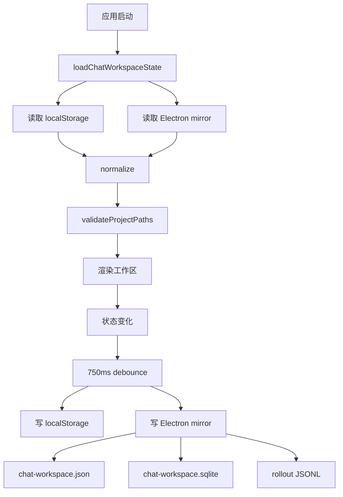

# 持久化 PRD

## 功能概述

持久化模块负责保存 AgentOS 的工作区、项目、线程、聊天状态、会话索引和 rollout 记录。它同时使用渲染层 localStorage 和 Electron 主进程文件存储，以兼顾快速恢复、长期记录和兼容回退。

## 核心功能列表

| 优先级 | 功能 | 说明 |
| --- | --- | --- |
| P0 | 工作区恢复 | 启动时恢复项目、线程、活动状态和聊天状态 |
| P0 | 防抖保存 | 渲染层状态变化后延迟保存 |
| P0 | 状态归一化 | 迁移旧字段、校验项目/线程结构 |
| P0 | Electron mirror | 主进程保存工作区镜像 |
| P1 | SQLite 索引 | 使用 sqlite3 CLI 时写入紧凑线程索引 |
| P1 | JSON 回退 | SQLite 不可用时仍保存 JSON |
| P1 | JSONL rollout | 按线程保存长期事件/消息记录 |
| P1 | 线程模型持久化 | 保存每个 thread 的 `modelPick`，用于恢复独立模型选择 |
| P1 | Agent Mode Skills 设置 | 保存项目级 Skill 到模型的覆盖映射 |
| P1 | 路径缺失标记 | 校验项目路径并保留缺失状态 |
| P1 | 开发者清理 | 开发者设置可清空工作区快照或模型设置 |
| P1 | 侧栏偏好保存 | 侧栏折叠、项目折叠和项目手动顺序随工作区保存 |

## 数据结构

```ts
interface ChatWorkspaceState {
  activeProjectId: string
  activeThreadId: string
  projects: WorkspaceProject[]
  threads: WorkspaceThread[]
  sidebarPrefs: {
    collapsed: boolean
    collapsedProjectIds: string[]
    projectOrderIds: string[]
  }
}

interface ChatState {
  sessionId?: string
  model: string
  modelPick?: ChatModelPick
  cwd?: string
  items: TranscriptItem[]
}

interface ChatModelPick {
  providerId: string
  anthropicModel: string
}

interface ChatWorkspaceStoreFiles {
  localStorageKey: 'CodeX-UI-Template-chat-workspace-v1'
  sidebarWidthKey: 'CodeX-UI-Template-sidebar-width-px'
  sidebarProjectSkillsKey: 'CodeX-UI-Template-sidebar-project-skills-v1'
  hiddenSkillsKey: 'CodeX-UI-Template-sidebar-hidden-skills-v1'
  permissionModeKey: 'codex-ui-template:claude-permission-mode'
  homeCardLayoutKey: 'agentos:project-home-card-layout:v1'
  localeKey: 'CodeX-UI-Template-locale-v1'
  workspaceJson: 'chat-workspace.json'
  workspaceSqlite: 'chat-workspace.sqlite*'
  rolloutJsonl: 'chat-sessions/YYYY/MM/DD/rollout-*.jsonl'
  claudeAgentSettingsJson: 'claude-agent-settings.json'
  agentModeSettingsJson: 'agent-mode-settings.json'
  desktopPreferencesJson: 'desktop-preferences.json'
}

type RolloutRecord =
  | {
      type: 'session_meta'
      payload: {
        id: string
        projectId: string
        title: string
        purpose?: WorkspaceThread['purpose']
        model: string
        modelPick?: ChatModelPick
        cwd?: string
        sessionId?: string
      }
    }
  | {
      type: 'thread_state'
      payload: Pick<ChatState, 'sessionId' | 'model' | 'modelPick' | 'cwd'>
    }
  | { type: 'response_item'; payload: TranscriptItem }
```

## 业务逻辑



业务规则：

- 保存前需要去除运行时临时字段。
- 活动项目或线程不存在时需要自动修正。
- 线程 transcript 应保留 sessionId、model、modelPick、cwd 和消息项。
- `modelPick` 必须同时写入渲染层 `ChatState`、SQLite `threads.model_pick_json`、rollout `session_meta/thread_state`，恢复时通过安全归一化丢弃无效结构。
- SQLite 不可用不能阻塞主流程。
- rollout 文件按日期分目录，便于长期归档。
- 渲染层保存使用 750ms 防抖；卸载时会尽力 flush 未保存状态。
- 主进程 `chat-workspace:save` 串行执行，保存后会刷新 Task Home Plugin Manager 对工作区项目的认知。
- `pathMissing` 是运行时标记，保存前会剥离；恢复后通过 `validateProjectPaths` 再补回。
- 工作区清理会删除 localStorage key、`chat-workspace.json`、`chat-workspace.sqlite*` 和 `chat-sessions/`，不会删除用户项目目录。
- Claude 设置清理只删除 `claude-agent-settings.json`，不会影响项目文件、工作区、Agent Mode 或桌面偏好。
- Agent Mode 设置、模型 Provider 设置、桌面偏好和 Home Plugin task/runtime 分别由独立 store 或项目文件保存，不写入 `ChatWorkspaceState`。
- `agent-mode-settings.json` 按项目根路径保存 `enabled`、`todoEnabled`、`user`、`identity` 和 `skillModelOverrides`；保存 USER/IDENTITY 或 Skills 面板时必须按字段局部合并，避免互相覆盖。
- `skillModelOverrides` 的 key 是 `skill.path`，value 是 `{ providerId, anthropicModel }`；读取时只做结构归一化，有效性由模型设置和运行时校验。
- UI 语言偏好由 i18n 模块独立保存在 `CodeX-UI-Template-locale-v1`，不随工作区清理一起删除。

## 相关代码文件

### 核心页面组件

- `src/components/AppShell.tsx`

### 功能组件/UI组件

- 无独立 UI 组件，主要支撑工作区和聊天模块。

### 数据管理

- `src/chat-workspace-persistence.ts`
- `src/components/types.ts`
- `src/claude-chat-types.ts`
- `src/app-events.ts`
- `src/model-pick.ts`

### 业务逻辑工具/工具类

- `electron/chat-workspace-store.ts`
- `electron/desktop-preferences-store.ts`
- `electron/agent-mode-settings-store.ts`
- `electron/claude-agent-settings.ts`
- `electron/main.ts`

### Hooks/其他

- `src/components/project-order.ts`
- `src/components/setting/DeveloperSettingsPage.tsx`

## 关联PRD文档

### 直接关联

- `prd/workspace-session.md`：项目和线程状态来源。
- `prd/chat-agent-runtime.md`：聊天记录、sessionId 和 rollout 来源。

### 间接关联

- `prd/agent-mode.md`：Agent Mode 设置独立持久化。
- `prd/model-settings.md`：Provider 设置独立持久化。
- `prd/task-home-plugin.md`：task/runtime 文件独立持久化。

### 功能关联/支撑系统

- `prd/desktop-shell-settings-release.md`：桌面偏好和更新状态由主进程管理。
