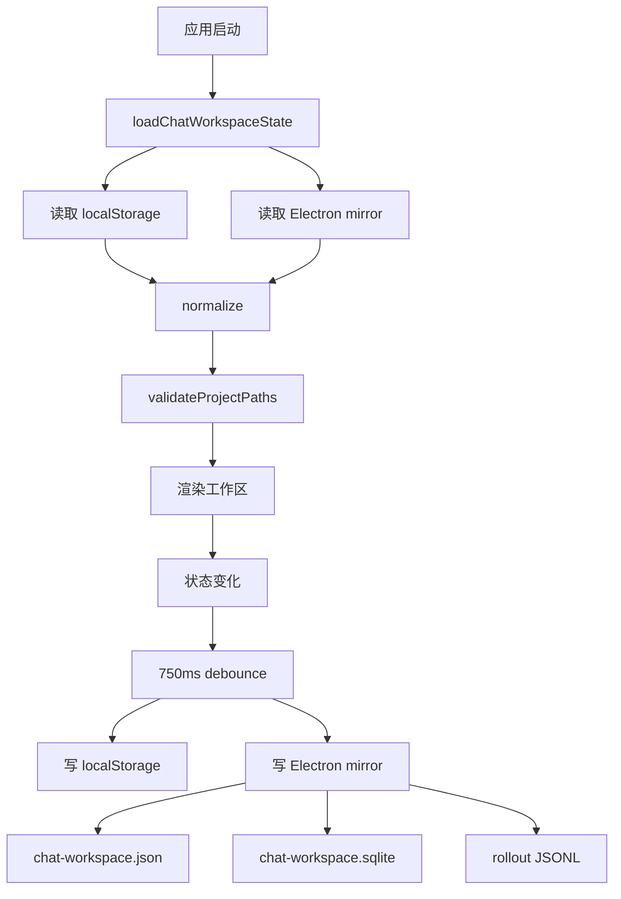

# 持久化 PRD

## 功能概述

持久化模块负责保存 AgentOS 的工作区、项目、线程、聊天状态、会话索引和 rollout 记录。它同时使用渲染层 localStorage 和 Electron 主进程文件存储，以兼顾快速恢复、长期记录和兼容回退。

## 核心功能列表

| 优先级 | 功能 | 说明 |
| --- | --- | --- |
| P0 | 工作区恢复 | 启动时恢复项目、线程、活动状态和聊天状态 |
| P0 | 防抖保存 | 渲染层状态变化后延迟保存 |
| P0 | 状态归一化 | 迁移旧字段、校验项目/线程结构 |
| P0 | Electron mirror | 主进程保存工作区镜像 |
| P1 | SQLite 索引 | 使用 sqlite3 CLI 时写入紧凑线程索引 |
| P1 | JSON 回退 | SQLite 不可用时仍保存 JSON |
| P1 | JSONL rollout | 按线程保存长期事件/消息记录 |
| P1 | 路径缺失标记 | 校验项目路径并保留缺失状态 |

## 数据结构

```ts
interface ChatWorkspaceState {
  projects: WorkspaceProject[]
  threads: WorkspaceThread[]
  activeProjectId?: string | null
  activeThreadId?: string | null
}

interface ChatWorkspaceStoreFiles {
  workspaceJson: 'chat-workspace.json'
  workspaceSqlite: 'chat-workspace.sqlite'
  rolloutJsonl: 'chat-sessions/YYYY/MM/DD/rollout-*.jsonl'
}

type RolloutRecord =
  | { type: 'session_meta'; threadId: string; sessionId?: string }
  | { type: 'thread_state'; thread: WorkspaceThread }
  | { type: 'response_item'; item: TranscriptItem }
```

## 业务逻辑



业务规则：

- 保存前需要去除运行时临时字段。
- 活动项目或线程不存在时需要自动修正。
- 线程 transcript 应保留 sessionId、model、cwd 和消息项。
- SQLite 不可用不能阻塞主流程。
- rollout 文件按日期分目录，便于长期归档。

## 相关代码文件

### 核心页面组件

- `src/components/AppShell.tsx`

### 功能组件/UI组件

- 无独立 UI 组件，主要支撑工作区和聊天模块。

### 数据管理

- `src/chat-workspace-persistence.ts`
- `src/components/types.ts`
- `src/claude-chat-types.ts`

### 业务逻辑工具/工具类

- `electron/chat-workspace-store.ts`
- `electron/desktop-preferences-store.ts`
- `electron/agent-mode-settings-store.ts`
- `electron/claude-agent-settings.ts`
- `electron/main.ts`

### Hooks/其他

- `src/components/project-order.ts`

## 关联PRD文档

### 直接关联

- `prd/workspace-session.md`：项目和线程状态来源。
- `prd/chat-agent-runtime.md`：聊天记录、sessionId 和 rollout 来源。

### 间接关联

- `prd/agent-mode.md`：Agent Mode 设置独立持久化。
- `prd/model-settings.md`：Provider 设置独立持久化。
- `prd/task-home-plugin.md`：task/runtime 文件独立持久化。

### 功能关联/支撑系统

- `prd/desktop-shell-settings-release.md`：桌面偏好和更新状态由主进程管理。

