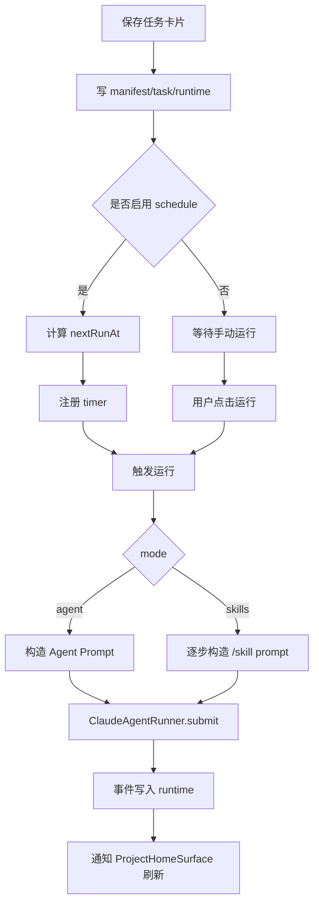

# Task Home Plugin PRD

## 功能概述

Task Home Plugin 模块将长期任务固化为项目首页卡片。用户可以创建任务卡片，选择 Agent 模式或 Skills 步骤模式，设置运行次数和定时策略，并在项目首页启动、停止和查看运行状态。

## 核心功能列表

| 优先级 | 功能 | 说明 |
| --- | --- | --- |
| P0 | 创建任务卡片 | 写入 manifest、task 配置和 runtime 状态 |
| P0 | Agent 模式运行 | 根据项目 `AGENT.md` 执行任务 |
| P0 | Skills 模式运行 | 按选定 Skill Steps 顺序执行 |
| P0 | 运行状态同步 | queued、running、waiting、done、error、cancelled 等状态推送 UI |
| P0 | 停止任务 | 取消关联 Claude Agent 请求 |
| P1 | 定时运行 | 支持指定时间和 interval 策略 |
| P1 | 运行次数 | 支持 1 到 100 次运行限制 |
| P1 | 独立任务线程 | 每次任务运行生成独立 task thread |

## 数据结构

```ts
interface HomePluginTaskConfig {
  version: 1
  slug: string
  title: string
  mode: 'agent' | 'skills'
  skillSteps: HomePluginTaskSkillStep[]
  todoEnabled: boolean
  runCount: number
  schedule: HomePluginTaskSchedule
  enabled: boolean
  createdAt: string
  updatedAt: string
}

interface HomePluginTaskSchedule {
  enabled: boolean
  hour: number
  minute: number
  interval: 'off' | '1h' | '2h' | '3h' | '6h' | '12h' | '1d'
}

interface HomePluginTaskRuntime {
  slug: string
  status: 'idle' | 'queued' | 'running' | 'waiting' | 'done' | 'error' | 'cancelled'
  threadId?: string
  requestId?: string
  currentRun?: number
  currentStep?: number
  lastStartedAt?: string
  lastCompletedAt?: string
  nextRunAt?: string
  error?: string
}
```

## 业务逻辑



业务规则：

- Skills 模式必须有至少一个有效步骤。
- 任务正在运行时不应重复启动同一 slug。
- `runCount` 最小 1，最大 100。
- 停止任务应取消 request 并把 runtime 置为 `cancelled`。
- interval 为 `off` 时只保留一次未来计划；interval 不为 `off` 时按完成时间或计划时间递推。

## 相关代码文件

### 核心页面组件

- `src/components/ProjectHomeSurface.tsx`

### 功能组件/UI组件

- `src/components/GenerativeWidget.tsx`

### 数据管理

- `src/desktop-types.ts`
- `src/components/types.ts`

### 业务逻辑工具/工具类

- `electron/task-home-plugin-manager.ts`
- `electron/home-plugin-runner.ts`
- `electron/claude-agent-runner.ts`
- `electron/main.ts`

### Hooks/其他

- `.agents/skills/a2ui-project-home-panel/`

## 关联PRD文档

### 直接关联

- `prd/home-plugin.md`：任务以 Home Plugin 卡片形式展示。
- `prd/chat-agent-runtime.md`：任务运行复用 Claude Agent 运行时。
- `prd/agent-mode.md`：任务运行可启用 TODO 模式上下文。

### 间接关联

- `prd/workspace-session.md`：任务线程归属项目。
- `prd/persistence.md`：task/runtime 文件和线程记录需要持久化。

### 功能关联/支撑系统

- `prd/model-settings.md`：后台运行依赖可用模型 Provider。

