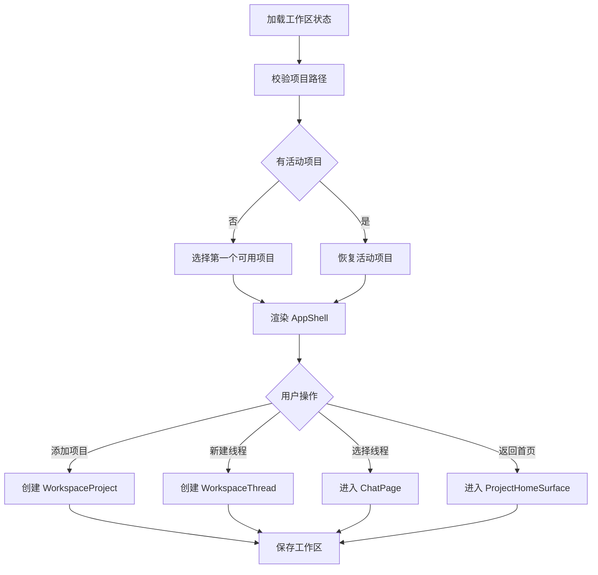

# 工作区与会话 PRD

## 功能概述

工作区与会话模块负责把 AgentOS 的所有工作组织到本地项目中。用户可以添加项目、选择项目、管理线程、切换视图，并从项目首页进入聊天、Home Plugin、Task 和 Skills。

## 核心功能列表

| 优先级 | 功能 | 说明 |
| --- | --- | --- |
| P0 | 项目添加 | 通过桌面目录选择器添加本地项目 |
| P0 | 项目选择 | 切换活动项目并恢复对应首页或线程 |
| P0 | 多线程管理 | 每个项目支持多条会话线程 |
| P0 | 线程生命周期 | 支持新建、选择、置顶、归档、移除和自动更新时间 |
| P0 | 工作区视图 | 支持 Home、Docs、Settings 和聊天线程 |
| P0 | 首次启动引导 | 空工作区时先选择项目目录，可选配置模型 Provider 后进入工作台 |
| P1 | 项目排序 | 支持置顶、拖拽排序和最近更新时间排序 |
| P1 | 缺失路径处理 | 项目路径不存在时保留记录并允许重新定位 |
| P1 | Project Skills 入口 | 在项目侧栏展示并运行扫描到的 Skills |
| P1 | Skill 运行线程 | Project Skill 运行时创建 `skill-run` thread，并继承或应用 Skill 模型覆盖 |
| P1 | 线程模型隔离 | 每个 thread 独立保存并恢复自己的模型选择 |
| P1 | 侧栏偏好 | 支持整栏收起、项目线程列表折叠、用户拖动宽度和按项目隐藏 Skill |
| P2 | Docs 占位页 | 主导航保留 Docs 视图，目前渲染本地化占位内容 |

## 数据结构

```ts
type AppViewId = 'home' | 'docs' | 'settings'

interface ChatWorkspaceState {
  activeProjectId: string
  activeThreadId: string
  projects: WorkspaceProject[]
  threads: WorkspaceThread[]
  sidebarPrefs: WorkspaceSidebarPrefs
}

interface WorkspaceSidebarPrefs {
  collapsed: boolean
  collapsedProjectIds: string[]
  projectOrderIds: string[]
}

interface WorkspaceProject {
  id: string
  name: string
  path: string
  createdAt: number
  updatedAt: number
  pinnedAt?: number
  pathMissing?: boolean
}

interface WorkspaceThread {
  id: string
  projectId: string
  title: string
  purpose?: 'home-plugin-customization' | 'home-plugin-card-customization' | 'task-run' | 'skill-run'
  homePluginSlug?: string
  skillPath?: string
  skillCommand?: string
  skillTitle?: string
  createdAt: number
  updatedAt: number
  pinnedAt?: number
  archivedAt?: number
  chatState: ChatState
}

interface ChatState {
  sessionId?: string
  model: string
  modelPick?: ChatModelPick
  cwd?: string
  items: TranscriptItem[]
}

interface ChatModelPick {
  providerId: string
  anthropicModel: string
}

interface ProjectSkillListState {
  path: string
  loading: boolean
  loaded: boolean
  skills: AgentContextSlashItem[]
  message?: string
}

interface ProjectSkillRunRequest extends AgentContextSlashItem {
  modelPick?: ChatModelPick
}
```

## 业务逻辑



业务规则：

- 线程必须绑定 `projectId`，不能跨项目复用。
- 活动线程为空时，活动项目展示项目首页。
- 归档线程不作为默认活跃线程展示。
- 项目移除只移除 AgentOS 工作区记录，不删除用户本地目录。
- 项目路径缺失时应保留项目和线程，避免用户历史会话丢失。
- 首次启动时 `projects.length === 0` 会展示项目选择和可选模型设置；模型设置为空或跳过时仍允许进入项目。
- “创建新项目”当前只创建工作区记录，路径按 `~/Projects/<name>` 生成，不负责真实创建目录。
- Hash 路由只把 `home`、`docs`、`settings` 识别为主视图；未知 hash 归一化为 `home`。
- Docs 视图当前是 `DocsPage` 占位面板，只展示本地化 eyebrow、heading 和 placeholder，不读取外部文档源。
- 侧栏项目 Skill 只展示 `scope === 'project'` 且 `kind === 'skill'` 的条目；隐藏的 Skill 路径按项目写入 localStorage。
- Project Skill 运行入口会优先读取当前项目 Agent Mode 设置中的 `skillModelOverrides[skill.path]`；覆盖模型有效时创建带 `modelPick` 的 `skill-run` thread，无效时回退当前活动 thread/composer/default 模型。
- `skill-run` thread 保留 `skillPath`、`skillCommand`、`skillTitle` 和 `chatState.modelPick`，因此运行后 composer 会显示本次 Skill 实际使用的模型，并可继续用该模型对话。
- 普通 thread 的模型切换只影响当前 thread；切换到其它 thread 时 composer 根据该 thread 的 `modelPick` 重新显示。
- 归档 `task-run` 线程时会尽力停止对应任务卡；归档 `skill-run` 线程时会尽力取消仍在运行的 request。
- 托盘动作 `new-thread` 和 `open-project` 会唤起主窗口，并复用工作区创建线程或添加项目流程。

## 相关代码文件

### 核心页面组件

- `src/components/AppShell.tsx`：工作区状态总控。
- `src/components/AppShellSidebar.tsx`：项目和线程列表。
- `src/components/AppShellWorkspace.tsx`：活动视图渲染。
- `src/components/DocsPage.tsx`：Docs 占位视图。
- `src/components/chat/ChatStartView.tsx`：聊天起始态。
- `src/components/chat/ChatThreadView.tsx`：线程聊天容器。
- `src/components/app-shell-constants.ts`：hash 路由、设置分类、侧栏存储键。

### 功能组件/UI组件

- `src/components/chat/ProjectHomeSurface.tsx`：项目首页。
- `src/components/AppWorkspaceSidePanel.tsx`：工作区侧面板。
- `src/components/setting/AppUpdateSection.tsx`：侧栏更新入口。

### 数据管理

- `src/components/types.ts`
- `src/chat-workspace-persistence.ts`
- `src/desktop-types.ts`
- `src/project-path.ts`
- `src/model-pick.ts`

### 业务逻辑工具/工具类

- `electron/main.ts`：项目选择、路径校验、打开项目目录 IPC。
- `electron/project-path.ts`：项目路径解析。
- `electron/chat-workspace-store.ts`：工作区镜像保存。

### Hooks/其他

- `src/components/project-order.ts`
- `src/components/app-shell-constants.ts`
- `src/window-safe-area.ts`
- `src/app-events.ts`

## 关联PRD文档

### 直接关联

- `prd/persistence.md`：工作区状态保存和恢复。
- `prd/chat-agent-runtime.md`：线程内聊天运行。
- `prd/home-plugin.md`：项目首页数据卡片。

### 间接关联

- `prd/file-context.md`：活动项目决定文件树和预览根目录。
- `prd/agent-mode.md`：Agent Mode 设置以项目路径为键。
- `prd/model-settings.md`：thread 和 Skill 运行依赖有效模型选择。

### 功能关联/支撑系统

- `prd/desktop-shell-settings-release.md`：窗口、托盘和导航入口。
